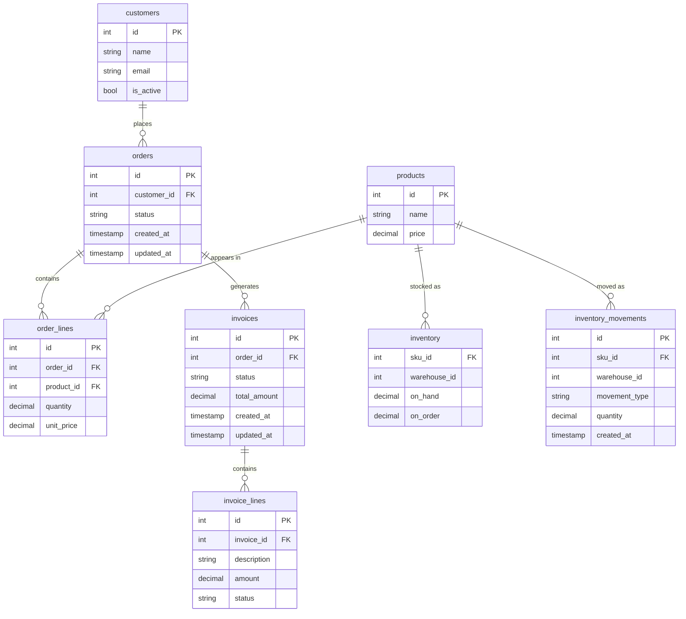

# Domain Model

Every SQL example in this book uses the same fictional schema. Same tables, same columns, same quirks -- so you can focus on the pattern, not on decoding a new schema every chapter.

The tables were chosen because each one represents a distinct extraction challenge. They're not arbitrary.

## Schema

The three standalone tables -- `events`, `sessions`, and `metrics_daily` -- have no foreign keys into the schema above. `inventory` and `inventory_movements` connect to `products` via `sku_id` but have no `warehouses` table -- `warehouse_id` is a plain integer key. They represent different source archetypes.

## The Tables and Why They're Here

| Table | ECL challenge |
|---|---|
| `orders` | Has `updated_at` but it's unreliable -- trigger only fires on UPDATE, not INSERT. The canonical example of a broken cursor. |
| `order_lines` | Detail table with no timestamp of its own. Must borrow the header's cursor for incremental extraction. |
| `customers` | Soft-delete via `is_active`. The flag works for normal application flows; back-office scripts bypass it. |
| `products` | Schema mutates -- new columns appear after deploys, `category` became `product_category` once. The schema drift case. |
| `invoices` | Open/closed document pattern. Open invoices get hard-deleted regularly. The hard delete case. |
| `invoice_lines` | Has its own `status` per line, hard-deleted independently -- not just cascade from the header. Complicates both delete detection and cursor borrowing. |
| `events` | Append-only, partitioned by date. The simplest extraction pattern. Nothing is ever updated or deleted. |
| `sessions` | Sessionized clickstream. Late-arriving events mean sessions can close hours after they open, creating the late-arriving data problem. |
| `metrics_daily` | Pre-aggregated daily metrics, overwritten on recompute. Partition-level replace is the natural fit. |
| `inventory` | Sparse cross-product of SKU x Warehouse. Most rows are zeros. Filtering zeros loses information -- a zero row and a missing row look identical in the destination. |
| `inventory_movements` | Append-only log of all stock changes: sales, adjustments, transfers, write-offs. The activity signal for activity-driven extraction. Covers changes that never flow through `order_lines`. |

## The Soft Rules Baked In

The domain model is designed so that every "always true" business rule is, in fact, a soft rule. None of them have a constraint enforcing them:

- `orders` -- "Always has at least one line." Until a UI bug creates an empty order.
- `orders` -- "Status goes `pending` → `confirmed` → `shipped`." Until support resets one manually.
- `order_lines` -- "Quantities are always positive." Until a return is entered as `-1`.
- `invoices` -- "Only open invoices get deleted." Until a year-end cleanup script runs.
- `invoice_lines` -- "Line status always matches the header." Until one line is disputed.
- `customers` -- "Emails are unique." Until the same customer registers twice and nobody added the unique index.
- `inventory` -- "`on_hand` is always >= 0." Until a write-off creates a negative balance.
- `inventory_movements` -- "Every stock change creates a movement." Until a bulk import script updates `inventory` directly without logging movements.

When a pattern depends on one of these holding -- or breaking -- it will say so explicitly. See [[01-foundations-and-archetypes/0106-hard-rules-soft-rules|0106-hard-rules-soft-rules]].
