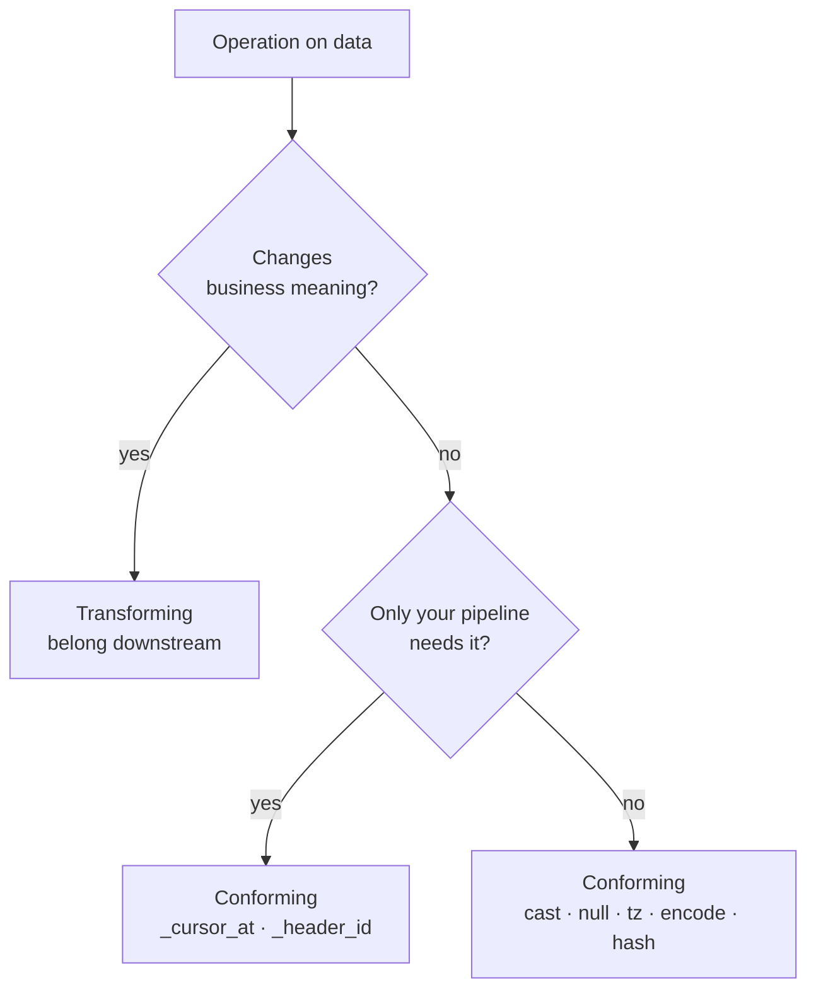

# What Is Conforming

> **One-liner:** Conforming is everything the data needs to survive the crossing. If it changes what the data means, it belongs somewhere else.
## The Line Between Conforming and Transforming

To know what should be done by you, you must answer the following question: does this operation change what the data *means*, or does it just make it land correctly?

- Casting a `DATETIME2` to `TIMESTAMP`? Conforming.
- Replacing `NULL` with `''` because BigQuery handles them differently in `GROUP BY`? Conforming.
- Converting `BIT` to `BOOLEAN`? Conforming.

None of these change the business meaning of the data. They just make it survive the crossing, and in counter example:
- Calculating `revenue = qty * price`? That's transforming.
- Filtering out inactive customers? Transforming.
- Joining `orders` with `customers` to denormalize a name? Transforming.

You're adding business meaning that wasn't in the original row.

But here's where it gets interesting. `order_lines` has no `updated_at`. If you want to extract incrementally, you *need* to join with `orders` to borrow its timestamp as your cursor. That join doesn't add business meaning -- it adds extraction metadata. You're not enriching `order_lines` with order data; you're giving yourself a `_cursor_at` so you know what to pull. That's conforming.

> [!warning] The join test
> If the join adds a column the business cares about, it's transforming. If it adds a column only your pipeline cares about (`_cursor_at`, `_header_updated_at`), it's conforming.

## The Conforming Checklist

These are the operations that belong in the **C**. Each one gets its own chapter in [[05-conforming-playbook/0501-metadata-column-injection|Part IV]], but here's the overview so you know what you're signing up for.

**Type casting.** Every engine has its own type system, and they don't agree on anything. SQL Server's `DATETIME2` has nanosecond precision; BigQuery's `TIMESTAMP` has microseconds. PostgreSQL's `NUMERIC(18,6)` is exact; BigQuery's `FLOAT64` is not. You will lose precision if you don't map these explicitly. See [[05-conforming-playbook/0503-type-casting-normalization|0503-type-casting-normalization]].

**Null handling.** `NULL`, empty string, `0`, `'N/A'` -- sources use all of them, and they're not the same thing. The ECL position: reflect the source as-is. If the source has NULL, land NULL. Don't COALESCE to a default value at extraction -- that's a business decision that belongs downstream. See [[05-conforming-playbook/0504-null-handling|0504-null-handling]].

**Timezone normalization.** Source says `2026-03-15 14:30:00` -- in what timezone? If the column is `DATETIME2` or `TIMESTAMP WITHOUT TIME ZONE`, you're looking at a naive timestamp. The ECL rule: TZ stays TZ, naive stays naive. Don't convert naive to UTC unless you're certain of the source timezone -- guessing wrong silently shifts every row. Know what you're landing and document the assumption. See [[05-conforming-playbook/0505-timezone-conforming|0505-timezone-conforming]].

**Charset and encoding.** Latin-1 source, UTF-8 destination. Most of the time you won't notice, until a customer name has an `ñ` or an `ü` and your load silently replaces it with `?` or fails entirely. This is especially common with older ERP systems and legacy OLTP sources (SAP, AS/400, Oracle SQL). See [[05-conforming-playbook/0506-charset-encoding|0506-charset-encoding]].

**Metadata injection.** Every row you land could carry `_extracted_at`, `_batch_id`, and ideally a `_source_hash`. These columns don't exist in the source. You add them during extraction so you can debug, reconcile, and reprocess later. Without them, when something goes wrong (and it will), you have no way to know which batch brought the bad data. But you have to weigh its benefits against the additional processing and eventual delays it could bring. See [[05-conforming-playbook/0501-metadata-column-injection|0501-metadata-column-injection]].

> [!warning] Metadata injection has a cost at scale
> Hashing every row for `_source_hash` adds compute on the source or in your pipeline. At scale -- 800 tables -- this can add 20 minutes to an already long extraction window. Evaluate per table: high-value mutable tables earn the overhead; stable config tables usually don't.

> [!tip] Can the analyst use your metadata?
> Sure. "When was this data pulled into our warehouse?" is a valid question, and `_extracted_at` answers exactly that. Be precise though: `_extracted_at` is when *your pipeline* pulled the row, not when the row was last modified in the source. That's `updated_at` (if it exists). A row updated 3 days ago and extracted today has `_extracted_at = today`. Don't let anyone confuse the two.

**Key synthesis.** The source table has no primary key. Or it has a composite key that's 5 columns wide. Or worse, it has an `id` that gets recycled when rows are deleted. You need something stable to MERGE on, and if the source doesn't give you one, you build it: hash the business key columns into a `_source_hash` or generate a surrogate. See [[05-conforming-playbook/0502-synthetic-keys|0502-synthetic-keys]].

**Boolean and decimal precision.** SQL Server `BIT`, MySQL `TINYINT(1)`, SAP B1 `'Y'`/`'N'` (or `'S'`/`'N'` depending on install language), PostgreSQL `BOOLEAN` -- every source has its own way of representing booleans. Similarly, `NUMERIC(18,6)` in PostgreSQL is exact while `FLOAT64` in BigQuery is not, and the rounding errors accumulate across millions of rows. Both of these are type casting concerns covered in [[05-conforming-playbook/0503-type-casting-normalization|0503-type-casting-normalization]].

**Nested data / JSON.** The source has a `details` column that's a JSON blob. Land it as-is -- `STRING`, `JSONB`, `VARIANT`, whatever the destination's native JSON type is. Flattening JSON into normalized tables is restructuring the data, which is transformation, not conforming. If a consumer can't query JSON, build a flattening view downstream. See [[05-conforming-playbook/0507-nested-data-and-json|0507-nested-data-and-json]].
