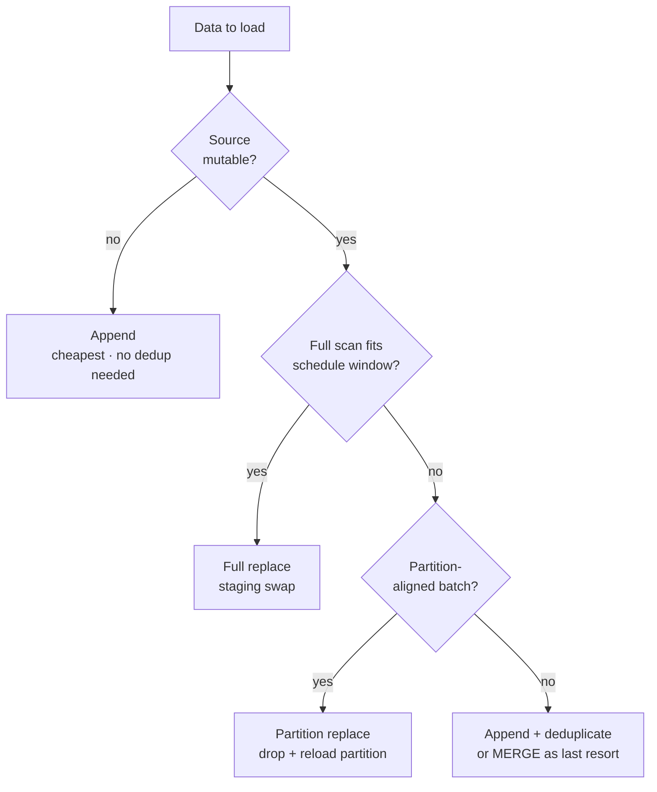

# Columnar Destinations

> **One-liner:** Append-optimized, partitioned, cost-per-query. The terrain when you're loading into an analytical engine.

## What Makes a Destination Columnar

These engines store data by column. Every value in `event_date` is packed together, compressed alongside every other `event_date` in the table. Scanning one column across a billion rows is fast. Aggregation -- `SUM`, `COUNT`, `GROUP BY` -- is what they were built for. The consumers sitting on top of them are dashboards, reports, ML pipelines, analysts running ad-hoc queries.

From an ECL perspective, three properties define the landing zone:

**Append-cheap, mutate-expensive.** Inserting new rows is fast and the engines optimize for it. Updating or deleting existing rows is a different story. BigQuery rewrites an entire partition on UPDATE. ClickHouse runs mutations as async background jobs with no completion guarantee. Snowflake handles it better than most, but every MERGE still costs warehouse time. Your load strategy should minimize mutations. Append first, deduplicate or materialize downstream.

**Partitioned by default.** Almost every table worth its storage is partitioned, usually by date. Partition pruning controls both query performance and cost for everyone downstream. If you load data without aligning to the partition scheme, every consumer pays the price on every query. The load engineer decides the partition strategy. Get it wrong and you're taxing every analyst and dashboard for the lifetime of the table.

**Cost lives in the query.** A transactional database costs you connections and CPU. A columnar destination costs you bytes scanned (BigQuery) or seconds of compute time (Snowflake, Redshift). A poorly partitioned table or a missing cluster key means every `SELECT` is more expensive than it needs to be. Your loading decisions have a direct, ongoing cost impact on everyone who reads from your tables.

## The Engines

### BigQuery
Serverless, slot-based. No cluster to manage, no warehouse to size. You load data and Google handles the rest. The pricing model is per-byte-scanned on queries, which means your table design directly affects what consumers pay.

Loading mechanics: `bq load` from cloud storage, streaming inserts, or `LOAD DATA` SQL. Parquet and JSONL are the most common formats, however AVRO is preferred. Streaming inserts are fast but newly streamed rows may be briefly invisible to `EXPORT DATA` and table copies -- typically minutes, in rare cases up to 90 minutes -- and streamed rows can't be modified or deleted until they flush.

DML concurrency is the constraint. BigQuery removed the daily per-table DML limit, but mutating statements (`UPDATE`, `DELETE`, `MERGE`) run at most 2 concurrently per table, with up to 20 queued. Stack too many rapid merges and the queue fills -- additional statements fail outright. Prefer append + deduplicate over in-place mutation.

Partitioning is mandatory for cost control. A table without a partition scheme forces a full scan on every query. `require_partition_filter = true` protects consumers from themselves -- it rejects any query that doesn't include the partition column in the `WHERE` clause.

```sql
-- engine: bigquery
-- table definition with partition, cluster, and cost protection
CREATE TABLE `project.dataset.events` (
  event_id STRING,
  event_type STRING,
  event_date DATE,
  payload JSON
)
PARTITION BY event_date
CLUSTER BY event_type
OPTIONS (require_partition_filter = true);
```

> [!warning] JSON columns and Parquet don't mix
> BigQuery **cannot** load JSON columns from Parquet files -- the job fails permanently. If your source data has JSON or semi-structured fields, load as JSONL. Or strip the JSON columns from the Parquet and load them separately. There's no workaround on the Parquet path.

### Snowflake
Warehouse-based compute. You pay for the time the warehouse runs, regardless of bytes scanned. More predictable for budgeting, harder to attribute per-query.

Loading goes through stages: internal (Snowflake-managed) or external (S3, GCS, Azure). `COPY INTO` is the bulk loader and it's fast. Snowpipe automates continuous loading from stage to table.

Snowflake's `VARIANT` type handles semi-structured data natively. JSON, Avro, nested Parquet -- it all lands in `VARIANT` and you query it with `:` path notation. But there's a catch: loading JSON from Parquet files converts `VARIANT` to a string. You need `PARSE_JSON` on the other side to get it back into a queryable structure.

Some loaders implement full replace via `CREATE TABLE ... CLONE` from staging -- a metadata-only operation, fast -- but permissions don't carry over on Snowflake. Ensure `FUTURE GRANTS` are set or your consumers lose access after every replace.

`PRIMARY KEY` and `UNIQUE` constraints exist in Snowflake's DDL but they're **not enforced**. They're metadata hints. If your pipeline relies on the destination rejecting duplicates, Snowflake won't help you. Deduplication is your problem.

```sql
-- engine: snowflake
-- bulk load from stage
COPY INTO events
FROM @my_stage/events/
FILE_FORMAT = (TYPE = 'PARQUET')
MATCH_BY_COLUMN_NAME = CASE_INSENSITIVE;
```

### ClickHouse
Built for speed on append-only analytical workloads. The MergeTree engine family is the backbone -- data lands in parts, and background merges compact them over time.

Fastest engine for raw insert throughput. The trade-off is significant: no ACID guarantees. A query during an active merge might see duplicates. `ReplacingMergeTree` deduplicates by a key, but only during merges -- until the merge runs, duplicates coexist. Queries with `FINAL` force deduplication at read time, at a performance cost.

Mutations (`ALTER TABLE ... UPDATE`, `ALTER TABLE ... DELETE`) are async. You fire the statement and it returns immediately. The actual work happens whenever the merge scheduler gets to it. Consumers querying between the mutation request and the merge see pre-mutation data.

For ECL, ClickHouse works best as an append-only destination. Load everything, let the engine merge, build materialized views for the latest state. Fighting the merge model with frequent updates leads to pain.

```sql
-- engine: clickhouse
-- table definition with merge-based deduplication
CREATE TABLE events (
  event_id String,
  event_type String,
  event_date Date,
  payload String
)
ENGINE = ReplacingMergeTree()
PARTITION BY toYYYYMM(event_date)
ORDER BY (event_date, event_id);
```

**Redshift.** PostgreSQL dialect, columnar storage underneath. Sort keys and dist keys determine how data is physically laid out and how queries perform. Get them right and range queries fly. Get them wrong and every query shuffles data across all nodes.

Loading goes through `COPY` from S3. This is the fast path. Row-by-row `INSERT` is painfully slow compared to `COPY` -- orders of magnitude slower on any meaningful volume. If your pipeline isn't using `COPY`, fix that first.

VACUUM is still a thing. Deleted rows don't free space until VACUUM runs. If your pipeline does heavy deletes (hard delete detection, merge patterns), VACUUM becomes an operational concern. Dead rows inflate scan time and storage until they're cleaned up.

Column additions are cheap. Type changes require recreating the table. A `VARCHAR(100)` that should have been `VARCHAR(500)` means a full table rebuild later. Plan your types carefully on initial load.

### Engine Cheat Sheet

| Engine     | Load Method                         | Partition Mechanism                | Mutation Cost            | Key Gotcha                                             |
| ---------- | ----------------------------------- | ---------------------------------- | ------------------------ | ------------------------------------------------------ |
| BigQuery   | `bq load` / `LOAD DATA` / streaming | Date/integer/ingestion-time        | Entire partition rewrite | DML quotas; JSON + Parquet = failure                   |
| Snowflake  | `COPY INTO` from stage              | Micro-partitions + clustering keys | Warehouse time per merge | `VARIANT` -> string in Parquet; PK/unique not enforced |
| ClickHouse | `INSERT INTO` (batch)               | Partition by expression            | Async, no ACID           | Duplicates until merge; `FINAL` is expensive           |
| Redshift   | `COPY` from S3                      | Sort key + dist key                | Delete + VACUUM cycle    | Row-by-row INSERT is orders of magnitude slower        |

## Type Mapping: Where Conforming Happens

When data crosses from a transactional source to a columnar destination, types don't translate cleanly. This is the core of the C in ECL -- and every engine has its own version of the problem.

**Timestamps.** PostgreSQL's `TIMESTAMP WITHOUT TIME ZONE` landing in BigQuery becomes `TIMESTAMP`, which is always UTC. If the source stored local times without timezone info, BigQuery now treats them as UTC and every downstream consumer gets the wrong time. Snowflake distinguishes `TIMESTAMP_TZ` from `TIMESTAMP_NTZ`, so you have a choice -- but you have to make it explicitly. See [[05-conforming-playbook/0505-timezone-conforming|0505-timezone-conforming]].

| Source Type | BigQuery | Snowflake | ClickHouse | Redshift |
|---|---|---|---|---|
| `TIMESTAMP` (naive) | `TIMESTAMP` (forced UTC) | `TIMESTAMP_NTZ` | `DateTime` | `TIMESTAMP` |
| `TIMESTAMPTZ` | `TIMESTAMP` | `TIMESTAMP_TZ` | `DateTime64` with tz | `TIMESTAMPTZ` |
| `DATETIME2(7)` (SQL Server) | Truncated to microseconds | `TIMESTAMP_NTZ(9)` | `DateTime64(7)` | Truncated to microseconds |

> [!warning] BigQuery does not support naive datetimes
> Every `TIMESTAMP` in BigQuery is timezone-aware. If your source has naive timestamps, BigQuery treats them as UTC. If they were actually in `America/Santiago` or `Europe/Berlin`, every value is wrong from the moment it lands. You must conform timezone info during load.

**Decimals.** `NUMERIC(18,6)` in PostgreSQL has fixed precision. BigQuery's `NUMERIC` supports up to `NUMERIC(38,9)`. Snowflake offers `NUMBER(p,s)` with configurable precision, or `DECFLOAT` for unbound decimals -- but DECFLOAT only works with JSONL and CSV loads. Parquet doesn't support it. If your loader converts to `FLOAT64` anywhere in the pipeline, you lose precision. Financial data loaded as floating point is a bug waiting to surface. See [[05-conforming-playbook/0503-type-casting-normalization|0503-type-casting-normalization]].

**JSON and nested data.** JSON columns from a transactional source need special handling at every destination:

| Destination | JSON Handling | Gotcha |
|---|---|---|
| BigQuery | `JSON` type (native) | Cannot load from Parquet. Use JSONL. |
| Snowflake | `VARIANT` type | Parquet loads produce string, needs `PARSE_JSON` |
| ClickHouse | `String` (parse with JSON functions) | No native JSON type in older versions |
| Redshift | `SUPER` type | Semi-structured queries use PartiQL syntax |

See [[05-conforming-playbook/0507-nested-data-and-json|0507-nested-data-and-json]] for detailed engine mappings.

## Load Formats

Parquet is the fastest and most type-safe bulk load format. But BigQuery's JSON column type is not supported when loading from Parquet -- use JSONL or Avro instead. Parquet also produces strings for Snowflake's VARIANT and doesn't support DECFLOAT (Snowflake). Avro is BigQuery's preferred format -- it handles JSON natively, preserves schema, and sidesteps the Parquet-JSON limitation entirely. Snowflake and ClickHouse also support Avro loads, though Snowflake still lands complex types into VARIANT. Redshift supports Avro through `COPY` but has a 4 MB max block size limit -- Avro blocks larger than that fail the job. JSONL is slower but handles everything on every engine. CSV loses type information entirely.

| Format  | Speed  | Type Safety                | JSON Support                          | Gotcha                                                                          |
| ------- | ------ | -------------------------- | ------------------------------------- | ------------------------------------------------------------------------------- |
| Parquet | Fast   | High (schema embedded)     | BigQuery: JSON columns unsupported, use JSONL/Avro. Snowflake: string. | Decimal edge cases per engine                                                   |
| Avro    | Fast   | High (schema embedded)     | BigQuery: native. Snowflake: VARIANT. | Redshift: 4 MB max block size. ClickHouse needs schema registry or embedded schema. |
| JSONL   | Medium | Medium (inferred)          | Full support everywhere               | Slower on large volumes                                                         |
| CSV     | Varies | Low (everything is string) | Must quote/escape                     | Type inference can surprise you                                                 |

> [!tip] Default format recommendation
> BigQuery → Avro.
> Every other columnar destination with no JSON columns → Parquet.
> When you hit edge cases (JSON columns on BigQuery, Snowflake DECFLOAT, Redshift Avro block size limit) → JSONL.
> **Avoid CSV like the plague** unless your destination gives you no other choice.

## Loading Strategies

Your write disposition determines how data lands. The choice affects cost, complexity, and correctness. When in doubt, append -- it's the cheapest operation on every engine and you can always deduplicate or materialize downstream. Reach for MERGE only when you've confirmed append + deduplicate won't work for your case, or your storage is much more expensive.



**Append.** The cheapest and simplest. New rows land at the end of the table. No deduplication, no mutation, no DML quota concerns. Works perfectly for `events` and other immutable sources. **For mutable sources**, you append every version and deduplicate downstream with a view or materialized table. See [[04-load-strategies/0404-append-and-materialize|0404-append-and-materialize]].

**Replace (partition-level).** Drop and reload an entire partition. Atomic in most engines. The go-to for `metrics_daily` and other partition-aligned data that gets overwritten on a schedule. See [[02-full-replace-patterns/0202-partition-swap|0202-partition-swap]].

**Replace (Full).** Use this whenever the data you're loading isn't deserving of upserts or partitioning. Great for dimensions and anything under 10k rows. Resist the temptation to overengineer these kinds of tables. Fully replace it and relax knowing your data is exactly the same on source.

**Merge / Upsert.** Match on a key, update if exists, insert if new. The most expensive and complex disposition in columnar engines because it requires reading existing data, comparing, and mutating. Every engine implements MERGE differently, but the cost is always higher than a pure append. See [[04-load-strategies/0403-merge-upsert|0403-merge-upsert]] for the full pattern.

> [!tip] There are ways to avoid paying full MERGE cost
> Append + deduplicate, conditional inserts filtered by hash, periodic source consolidation -- columnar engines offer a lot of room to optimize how you land mutable data. These strategies have trade-offs that depend on your data volume, mutation frequency, and engine. We cover them in depth in [[04-load-strategies/0404-append-and-materialize|0404-append-and-materialize]] and [[07-serving-the-destination/0702-partitioning-for-consumers|0702-partitioning-clustering-and-pruning]].

## Schema Evolution

New columns appear in the source. What happens when they land?

**BigQuery.** Column additions via `ALTER TABLE ADD COLUMN` are instant. If you're loading Avro or Parquet, schema auto-detection can add new columns automatically. Type widening is allowed for compatible pairs (`INT64` → `NUMERIC`, `DATE` → `TIMESTAMP`). Incompatible changes require recreating the table. `DROP COLUMN` exists but is destructive -- any downstream `SELECT *` query will silently return fewer columns after the drop.

**Snowflake.** `ALTER TABLE ADD COLUMN` is a fast metadata operation. VARCHAR width increases work (`VARCHAR(100)` → `VARCHAR(500)`). Incompatible type changes -- anything that requires rewriting data -- require a full table recreation. The CLONE-based replace pattern picks up new columns automatically if your staging query produces them.

**ClickHouse.** `ALTER TABLE ADD COLUMN` is metadata-only for MergeTree -- existing parts don't change physically, the column just gets its default value when read. Fast. `MODIFY COLUMN` supports some widening but heavy type changes require table recreation. The `ORDER BY` key is fixed at creation and cannot be changed without recreating the table.

**Redshift.** Adding columns to the end of a table is a metadata operation and cheap. Changing a type requires creating a new table, copying all data, and swapping -- a full rebuild. Sort keys and dist keys are also fixed at creation; changing them means the same full rebuild. There's a hard limit of 1600 columns per table, which makes wide sources with lots of sparse columns less viable.

Every loader needs a **schema policy** for when new columns arrive from the source: add them automatically (`evolve`), reject the load (`freeze`), or drop the affected rows (`discard_row`). This applies regardless of destination. Default to `evolve` -- starting with `freeze` means your pipeline breaks on every new source column, which is more disruptive than a new nullable column appearing in the destination. Tighten the policy once you know which/if tables are stable. See [[06-operating-the-pipeline/0609-data-contracts|0609-data-contracts]].

> [!danger] Naming convention lock-in
> Identifier normalization at load time is a conforming operation with permanent consequences. If your loader converts `OrderID` to `order_id` (snake_case), that's the column name forever. Changing the convention later re-normalizes already-normalized identifiers, causing failures. Choose your naming convention on day one and never look back.

## What Will Bite You

**DML concurrency (BigQuery).** BigQuery removed the daily per-table DML limit, but mutating statements run at most 2 concurrently per table with up to 20 queued. Flood it with rapid-fire merges and the queue fills -- additional statements fail outright. Batch your loads and buffer in a staging table to keep the queue clear.

**Partition misalignment.** On BigQuery, every DML statement (`MERGE`, `UPDATE`, `DELETE`) rewrites the entire partition it touches -- not just the affected rows. If your batch contains data spread across 30 dates, that's 30 full partition rewrites per load run. Costs multiply fast. Keep your load batches as aligned to partition boundaries as possible: one run = one partition. If you can't control the source data spread, stage everything first and then execute one DML statement per partition.

**Unique constraints that aren't.** Snowflake and BigQuery both accept `PRIMARY KEY` and `UNIQUE` in DDL but neither enforces them -- they're optimizer hints, not guarantees. ClickHouse has no unique constraint mechanism outside of `ReplacingMergeTree` (which deduplicates eventually, during merges). If your pipeline assumes the destination rejects duplicates, it won't. Deduplication is your responsibility, always. See [[06-operating-the-pipeline/0613-duplicate-detection|0613-duplicate-detection]].

**Partition limits.** BigQuery caps date-partitioned tables at 10,000 partitions -- and a single job (load or query) can only touch 4,000 of them. Partition by day on a table running for 27+ years and you hit the first wall. Try to MERGE or load a batch spanning more than 4,000 dates and BigQuery rejects the job outright. The fix is partitioning by month or year instead of day, but that's a table rebuild. ClickHouse has a different version of this: each INSERT creates a new part, and MergeTree can only merge so fast. Flood it with small inserts and you trigger "too many parts" errors, which throttle further writes until the merge scheduler catches up. Batch your inserts; never insert row by row.