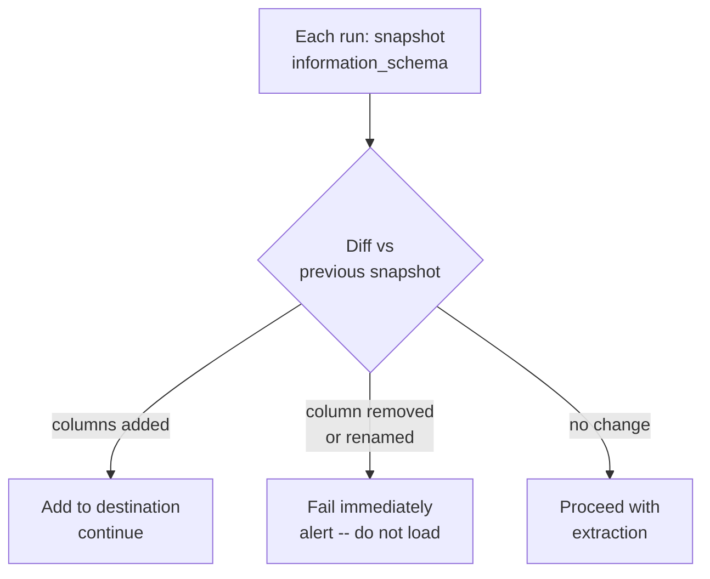

# The Lies Sources Tell

> **One-liner:** A catalog of things you'll be told are true about the source, and why your pipeline can't trust any of them.

Every source system comes with a set of assumptions handed to you by the team that owns it. Some are true. Most are "true until they're not." This chapter is about the ones that will eventually fail -- and what to do when they do.

The lies aren't usually malicious. They're the product of developers who built the application for a use case that didn't include data extraction, stakeholders who describe what *should be true* instead of **what is**, and systems that were designed when the data volume was a hundredth of what it is today. Your pipeline has to survive all of them.

## "The schema is stable"

The most common lie, and the one with the longest tail. Columns get added because a developer needed a new field. Columns get renamed because a product manager decided `cust_flg` should be `is_customer`. Columns get deleted because someone thought "nobody uses this." None of these come with a heads-up to the data team.

Two principles for surviving schema instability:

**Use `SELECT *` at extraction.** You're cloning, not reporting. If the source adds a column, your extraction should pick it up automatically. A `SELECT id, name, email, ...` query is a time bomb -- the moment the source adds a column you're not listing, it silently disappears from your destination.

The detection should happen at the source, before you touch the destination. On each run, snapshot the source schema from `information_schema` and diff it against the snapshot from the previous run (Cached locally or queried on demand, depending on the frequency of update):

```sql
-- source: transactional
-- Pull current schema snapshot before extraction
SELECT
    column_name,
    data_type,
    ordinal_position,
    is_nullable
FROM information_schema.columns
WHERE table_schema = 'public'
  AND table_name = 'customers'
ORDER BY ordinal_position;
```

Your pipeline should store this result after every successful run. On the next run, compare new vs stored: columns present last run but absent now = deletion or rename -- fail immediately, before any data moves. Columns absent last run but present now = addition -- add to the destination and continue.



What the loader does in response to that diff is your schema policy (`evolve`, `freeze`, `discard_row`) -- covered in [[01-foundations-and-archetypes/0104-columnar-destinations|0104-columnar-destinations]]. When it fails, alert it -- see [[06-operating-the-pipeline/0605-alerting-and-notifications|0605-alerting-and-notifications]].

> [!warning] Schema auto-detection isn't a free pass
> BigQuery's `LOAD DATA` with schema auto-detection and Snowflake's `VARIANT` both absorb new columns. But auto-detection can mistype a column (a column with only `"1"` and `"0"` values gets inferred as `BOOL`). And absorbing new columns silently means you won't notice when the column name changed and you now have two columns -- one dead and one alive -- both tracking the same concept.

See [[06-operating-the-pipeline/0609-data-contracts|0609-data-contracts]] for schema contract enforcement patterns.

## "`updated_at` is reliable"

`updated_at` is the most common source of cursor for incremental extraction. It's also the most commonly broken one.

**Only fires on UPDATE, not INSERT.** An `ON UPDATE` trigger or application code that only sets `updated_at` when a row is modified. New rows arrive with `updated_at = NULL`. Your incremental extraction filters `WHERE updated_at > :last_run` and misses every new row forever.

```sql
-- source: transactional
-- Orders with no updated_at -- these will never be picked up by a cursor query
SELECT COUNT(*) AS missing_cursor
FROM orders
WHERE updated_at IS NULL;
```

If this returns anything above zero, your incremental extraction is already incomplete.

**Set by the application, not the database.** Application code that does `UPDATE orders SET ..., updated_at = NOW() WHERE id = :id`. A direct SQL edit from a back-office script, a database migration, or a developer with `psql` open doesn't go through the application layer. Those rows don't get a new `updated_at`. Your pipeline never sees them change.

**The index isn't there.** `updated_at` exists but nobody put an index on it. Your incremental query runs a full table scan on every execution. For a table with 50M rows, that's a multi-second query just to find the 200 rows that changed. On a transactional system under concurrent load, that scan will get you a complaint (or a ban) from the DBA.

> [!tip] Verify before you commit to a cursor
> Before building an incremental extraction on `updated_at`, run three checks: (1) query `WHERE updated_at IS NULL` -- if it returns rows, you need a fallback; (2) run `EXPLAIN` on your cursor query -- confirm it hits the index; (3) if you can -- create a row, wait a minute, then update it and check that `updated_at` changed both times. If any check fails, treat this as an unreliable cursor and plan accordingly.

See [[03-incremental-patterns/0310-create-vs-update-separation|0310-create-vs-update-separation]] for the pattern when `updated_at` only fires on update, and [[04-load-strategies/0406-reliable-loads|0406-reliable-loads]] for fallback strategies.

## "Primary keys are unique and stable"

Three different lies bundled into one: that the PK uniquely identifies a row, that the PK stays the same across the row's lifetime, and that every table even has a PK.

**The business doesn't understand unicity.** This is the most common one. You ask "what's the primary key?" and get "order_id." You build your merge on `order_id`. A week later you start seeing duplicates. Turns out the table stores one row per `(order_id, line_number)` -- the person you asked thinks about orders, not about how the table is structured. Or it's `(product_id, warehouse_id)` for inventory, but they only ever query their own warehouse so they genuinely never noticed. The people closest to the application rarely think in terms of relational keys. Never trust a verbal description of the PK. Run the duplicate check yourself on the actual data.

```sql
-- source: transactional
-- Verify that the claimed PK actually produces unique rows
SELECT id, COUNT(*) AS occurrences
FROM orders
GROUP BY id
HAVING COUNT(*) > 1
ORDER BY occurrences DESC
LIMIT 20;
```

If it returns rows, go back and ask which *combination* of columns is actually unique. Then run the check again on that combination.

**The recycled PK.** Delete a row, insert a new one, and many systems reuse the integer ID. If your destination has the old row and you receive a new row with the same ID, you have a collision -- did the old row change, or is this a completely new entity? In most pipelines you'll upsert it as an update. The old entity's history is gone (which may be exactly what you want, to be fair).

**The key whose semantics changed.** A table that used to have one row per `order_id` gets a `tenant_id` column in a multi-tenant migration. Now uniqueness requires `(tenant_id, order_id)`. The column names didn't change -- the rule for what makes a row unique did. Your pipeline is still merging on `order_id` alone and quietly colliding across tenants.

> [!warning] Nullable columns in merge keys
> A merge key column that allows NULLs is a silent bug. In SQL, `NULL != NULL` -- two rows where the key column is NULL won't match on a JOIN or MERGE. Your upsert might skip them and insert duplicates instead of updating. Check nullability on every column you plan to use as a merge key before you build on it. See [[05-conforming-playbook/0502-synthetic-keys|0502-synthetic-keys]].

**No PK at all.** Some tables were created without a primary key: reporting tables, view-like tables, tables built by BI teams -- or, god help you, by someone in Finance with direct database access. You discover this at extraction time when your upsert pattern has no merge key. Or worse: you don't discover it and insert duplicates on every run.

Run this before you commit to an extraction strategy. If the duplicate check returns rows on a column that was supposed to be unique, your merge key is broken.

> [!danger] Don't trust the DDL
> A `PRIMARY KEY` constraint in the DDL means the database enforces uniqueness. But many tables get their PKs dropped for performance during bulk loads and never re-added. `information_schema.table_constraints` tells you what the DDL says. A query for duplicates tells you what the data is. Check both -- they won't always agree.

See [[05-conforming-playbook/0502-synthetic-keys|0502-synthetic-keys]] for building stable merge keys when the source can't be trusted.

## "Deletes don't happen" / "We use soft deletes"

Every system that "never does hard deletes" does hard deletes. The application layer soft-deletes. The back-office script does a real `DELETE`. The developer debugging a data issue deletes the bad rows directly. The scheduled cleanup job runs every night and deletes pending records older than 90 days, and nobody told the data team.

**Soft deletes that aren't consistently applied.** The `is_active = false` flag works for normal application flows. It doesn't work for the script that directly manipulates `customers` to merge duplicate accounts. Those old accounts just disappear. If your extraction only checks `updated_at`, you'll never see them go.

**The "only open invoices get deleted" rule.** Classic soft rule from the domain model. Posted invoices are supposedly immutable. Then someone runs a year-end cleanup and deletes a batch of incorrectly posted invoices. Your pipeline has them as closed invoices in the destination forever. The discrepancy surfaces at audit time, not at load time; and it's your fault for not noticing.

```sql
-- source: transactional
-- Detect hard deletes by comparing yesterday's extracted IDs to today's source
-- Run on the source before extracting
SELECT COUNT(*) AS rows_in_source_today
FROM invoices;
```

```sql
-- source: columnar
-- Compare to yesterday's destination count for the same scope
SELECT COUNT(DISTINCT invoice_id) AS rows_in_destination_yesterday
FROM stg_invoices
WHERE _extracted_at::DATE = CURRENT_DATE - 1;
```

A drop in the source count with no matching deletes in the destination means hard deletes happened. The only reliable way to detect them is a full count comparison or a full ID set comparison between yesterday's destination and today's source. Incremental extraction on `updated_at` is blind to deletions by design -- deleted rows have no `updated_at` because they no longer exist.

> [!warning] Soft delete flags have their own problems
> `is_active`, `deleted_at`, `status = 'deleted'` -- they all require that every code path removing a record goes through the application layer and sets the flag. Back-office scripts, direct DB access, bulk operations, and third-party integrations often don't. The flag is only as reliable as every write path that touches the table.

See [[03-incremental-patterns/0306-hard-delete-detection|0306-hard-delete-detection]] for detection and propagation patterns.

## "Timestamps have timezones"

The source database uses `TIMESTAMP WITHOUT TIME ZONE` (PostgreSQL) or `DATETIME` (MySQL, SQL Server). The application "knows" it's UTC. The column doesn't say so. Your pipeline reads `2026-03-06 14:00:00`, assumes UTC, and writes it to BigQuery as `2026-03-06 14:00:00 UTC`.

Except the application was deployed in Santiago, Chile. The value was stored as local time. That's `2026-03-06 17:00:00 UTC`. Every timestamp in your destination is off by 3 hours. The business has been making decisions on wrong data for two years. Nobody noticed because the relative order of events was correct and the absolute times were never spot-checked.

The daylight saving version is worse: the offset changes twice a year, so the error is inconsistent. Some rows are off by 3 hours, others by 4, depending on when they were written.

```sql
-- source: transactional
-- PostgreSQL: check whether the column has timezone info
SELECT column_name, data_type, datetime_precision
FROM information_schema.columns
WHERE table_name = 'orders'
  AND data_type IN ('timestamp without time zone', 'timestamp with time zone');
```

| column_name | data_type | datetime_precision |
|---|---|---|
| created_at | timestamp without time zone | 6 |
| updated_at | timestamp without time zone | 6 |

`timestamp without time zone` means the database is storing local time with no context. You need to know the application's intended timezone before you can conform correctly. There's no way to infer it from the data.

> [!danger] BigQuery makes this unforgiving
> BigQuery has no naive timestamp type. Every `TIMESTAMP` is UTC. Load a naive timestamp and BigQuery silently treats it as UTC. If it was stored in local time, every value is wrong -- and there's no way to fix it after the fact without knowing the original timezone and reloading.

See [[05-conforming-playbook/0505-timezone-conforming|0505-timezone-conforming]] for the full timezone conforming playbook.

## "The data is clean"

The most optimistic lie. Data is clean in demos. In production, it's a negotiation.

**Orphaned foreign keys.** `order_lines` rows pointing to an `order_id` that no longer exists. This happens after hard deletes (orders deleted, lines left behind), after migrations (data moved between systems with FK constraints disabled), or after application bugs. Your pipeline loads `order_lines` and the JOIN to `orders` returns NULL. Downstream reports show revenue lines with no associated order.

**Duplicate "unique" values.** The `customers` table is keyed on email in the application layer -- but there's no unique index in the database. Two registrations with the same email land as two rows. Your destination has two customer records with the same email. Every report that uses email as a join key gets doubled.

**Constraint violations that went unnoticed.** Negative quantities in `order_lines`. Statuses that skipped steps (`pending` directly to `shipped`). NULL values in columns that are "never null." These pass through extraction without errors because your pipeline only checks what's there -- it doesn't validate against what should be there.

```sql
-- source: transactional
-- Check orphaned order_lines
SELECT COUNT(*) AS orphaned_lines
FROM order_lines ol
LEFT JOIN orders o ON ol.order_id = o.id
WHERE o.id IS NULL;
```

```sql
-- source: transactional
-- Check duplicate customer emails
SELECT email, COUNT(*) AS occurrences
FROM customers
GROUP BY email
HAVING COUNT(*) > 1
ORDER BY occurrences DESC
LIMIT 10;
```

Run these as pre-extraction quality checks. They won't always block your pipeline -- sometimes you load the dirty data and let downstream handle it -- but you need to know the contamination level before you decide.

> [!info] Conforming is not cleaning
> Your job in ECL is to faithfully clone the source to the destination, not to fix the application's data quality problems. An orphaned foreign key in the source should land as an orphaned foreign key in the destination. If you silently drop those rows, downstream teams are missing data and they don't know it. Load it, flag it, let the business decide what to fix.

This is where [[01-foundations-and-archetypes/0106-hard-rules-soft-rules|0106-hard-rules-soft-rules]] becomes critical. Constraints the database doesn't enforce are soft rules. Your pipeline must survive them being wrong -- but it should also surface when they are wrong, so someone can fix the root cause.

## Related Patterns

- [[01-foundations-and-archetypes/0106-hard-rules-soft-rules|0106-hard-rules-soft-rules]]
- [[04-load-strategies/0406-reliable-loads|0406-reliable-loads]]
- [[03-incremental-patterns/0306-hard-delete-detection|0306-hard-delete-detection]]
- [[03-incremental-patterns/0310-create-vs-update-separation|0310-create-vs-update-separation]]
- [[05-conforming-playbook/0502-synthetic-keys|0502-synthetic-keys]]
- [[05-conforming-playbook/0505-timezone-conforming|0505-timezone-conforming]]
- [[06-operating-the-pipeline/0609-data-contracts|0609-data-contracts]]
- [[06-operating-the-pipeline/0613-duplicate-detection|0613-duplicate-detection]]
