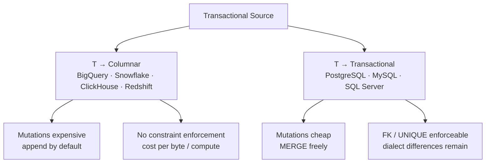

# Corridors

> **One-liner:** Same pattern, different trade-offs. Where the data goes changes how you implement everything.

A corridor is the combination of source type and destination type. The extraction pattern looks the same -- query the source, conform, load -- but the implementation decisions change completely depending on which corridor you're in. Get this wrong early and you'll build a pipeline with the wrong mental model from the start, then spend weeks wondering why your load strategy is bleeding money.

## The Two Corridors

**Transactional → Columnar.** PostgreSQL to BigQuery. SQL Server to Snowflake. MySQL to ClickHouse. This is the primary corridor this book focuses on and the one you'll work in most often. The source is mutable, row-oriented, ACID. The destination is append-optimized, columnar, cost-per-query. The gap between them is wide: everything from type systems to cost models to mutation semantics is different.

**Transactional → Transactional.** PostgreSQL to PostgreSQL. MySQL to SQL Server. An ERP database to a reporting replica. Same class of engine on both ends, often the same dialect. The gap is narrower but not zero -- still have schema drift, cursor problems, and hard deletes. And you now have a destination that actually enforces FK constraints, rejects duplicates, and supports cheap `UPDATE`/`DELETE`. That changes your load strategy significantly.

We don't cover Columnar → Columnar or Columnar → Transactional. The first is rare and usually handled by the analytical platform itself (BigQuery cross-region replication, Snowflake data sharing). The second is unusual enough to be its own project.



## What Changes at the Crossing

The corridor determines your constraints. Getting this wrong means building a pipeline with the wrong mental model from the start.

**Mutation cost.** In a transactional destination, `UPDATE` and `DELETE` are cheap, indexed, and ACID. You can MERGE freely. In a columnar destination, mutations are expensive -- BigQuery rewrites entire partitions, ClickHouse schedules async jobs, Snowflake burns warehouse time. Your load strategy in T→C should minimize mutations. In T→T, you can lean on `INSERT ON CONFLICT` or `MERGE` without the same cost anxiety.

**Constraint enforcement at the destination.** A transactional destination can enforce `PRIMARY KEY`, `UNIQUE`, and `FOREIGN KEY`. If you try to load a duplicate, the database rejects it. You can rely on this as a safety net. A columnar destination won't. BigQuery and Snowflake accept PK/UNIQUE in DDL but don't enforce them. ClickHouse has no unique constraint outside of `ReplacingMergeTree`'s eventual deduplication. In T→C, deduplication is always your problem. In T→T, you can configure the destination to enforce it.

**Cost model.** Transactional destinations cost CPU and IO -- roughly proportional to the rows you touch. Columnar destinations cost bytes scanned (BigQuery) or compute time (Snowflake, Redshift). A badly written conform step in BigQuery that forces a full table scan on every run doesn't just waste time -- it charges you for it, repeatedly, for the lifetime of the pipeline.

**Type system gap.** The wider the gap between source and destination type systems, the more conforming the C has to do. T→T with the same engine (PostgreSQL → PostgreSQL) has almost no type gap. T→C (PostgreSQL → BigQuery) means navigating timezone coercion, decimal precision, JSON handling, and format compatibility. See [[01-foundations-and-archetypes/0104-columnar-destinations|0104-columnar-destinations]] for the full type mapping.

## Where to Process

Every conforming operation -- a CAST, a NULL coalesce, a hash key -- runs *somewhere*. The question is where, and what it costs you.

There are four execution points:

**Source.** The source database does the work inside the extraction query. JOINs for cursor borrowing, CAST for type normalization, CONCAT for synthetic keys.

```sql
-- source: transactional
-- engine: postgresql
-- Conform at source: cast types, synthesize key, inject metadata in the extraction query
SELECT
    order_id::TEXT || '-' || line_number::TEXT AS _source_key,
    order_id,
    line_number,
    quantity::NUMERIC(10,2) AS quantity,
    NOW() AT TIME ZONE 'UTC' AS _extracted_at
FROM order_lines
WHERE updated_at >= :last_run;
```

Free if the source can handle it and you're running at 2am. Dangerous if you're on a busy production ERP at 10am -- you're adding work to someone else's production database, and the DBA will find you.

**Orchestrator / middleware.** Python, Spark, a cloud function. You do the transformation in code between extraction and load. You control it fully, but you're adding infrastructure, memory, and an extra data hop that you pay for. Justified when the source can't express it in SQL, or when volume makes centralized processing necessary.

**Staging area.** Land raw in a staging table or dataset on the destination, then transform there before writing to the final table. Common pattern in BigQuery (stage raw → merge to final). Keeps the extraction fast and simple, but all processing costs are on the destination's meter.

**Destination (directly).** Transform inside the final load query. No staging, no intermediate hop. Works well when the transform is simple and the destination query engine is cheap. In T→T this is often the right call. In T→C, a complex transform in the load SQL can scan more data than necessary and inflate costs.

> [!tip] Push work to whoever's idle
> Source at 2am? Let it do the work. Production ERP at 10am? Extract raw, process downstream. "Cheapest" isn't just infrastructure cost -- it factors in system load and how much the source team will hate you. In T→C, prefer conforming at the source or orchestrator to avoid expensive destination compute. In T→T, the destination is often the cheapest place to process.

## Transactional → Columnar

This is the harder corridor. The full details of the destination are in [[01-foundations-and-archetypes/0104-columnar-destinations|0104-columnar-destinations]], but the strategic implications for the crossing:

**Append by default.** Mutations are expensive. Your instinct to MERGE every changed row is the wrong default. Append raw, deduplicate or materialize downstream. Reserve MERGE for cases where append genuinely doesn't work.

**Partition alignment is your responsibility.** The destination has no FK constraints, no row-level locks, no automatic partition management. You decide how data is physically laid out. Load in partition-aligned batches or you're paying for your own mess on every downstream query.

**Type conforming happens at the crossing.** Naive timestamps, decimal precision, JSON columns -- all of these need explicit handling before data lands. The destination won't reject bad types gracefully; it'll silently coerce them or fail the job. See [[05-conforming-playbook/0503-type-casting-normalization|0503-type-casting-normalization]].

**The cost of mistakes compounds.** A wrong partition strategy, a missing cluster key, an unnecessary full-table scan in your load logic -- these aren't one-time costs. Every downstream query pays for them forever.

## Transactional → Transactional

The narrower corridor. Same class of engine on both ends, but don't let that make you complacent.

**You can use the destination's constraints.** Configure `PRIMARY KEY` and `UNIQUE` on the destination and let the database enforce them. A duplicate load attempt gets rejected at the database level instead of silently creating bad data. This is a genuine advantage over T→C.

**`INSERT ON CONFLICT` / `MERGE` is cheap.** Unlike columnar engines, a transactional destination handles upserts efficiently. You can run them frequently without cost anxiety. This changes your load strategy -- you can afford to be more aggressive with incremental merges.

**Dialect differences still bite.** The source and destination might both be "SQL" but speak it differently. PostgreSQL's `ON CONFLICT DO UPDATE` is not MySQL's `ON DUPLICATE KEY UPDATE` is not SQL Server's `MERGE`. Function names, string handling, date arithmetic, identifier quoting -- all of these differ. See [[08-appendix/0801-sql-dialect-reference|0801-sql-dialect-reference]] for the full comparison.

**You still have all the source problems.** Hard deletes, unreliable `updated_at`, soft rules, schema drift -- none of these go away because the destination is also transactional. You still need to detect deletes, handle cursor failures, and survive schema changes. The destination being "easy" doesn't mean the source got simpler.

> [!info] Most patterns in this book apply to both corridors
> Where the implementation differs, chapters note it explicitly under "By Corridor." When nothing is called out, assume the pattern applies to both.

## Related Patterns

- [[01-foundations-and-archetypes/0103-transactional-sources|0103-transactional-sources]]
- [[01-foundations-and-archetypes/0104-columnar-destinations|0104-columnar-destinations]]
- [[05-conforming-playbook/0503-type-casting-normalization|0503-type-casting-normalization]]
- [[08-appendix/0801-sql-dialect-reference|0801-sql-dialect-reference]]
