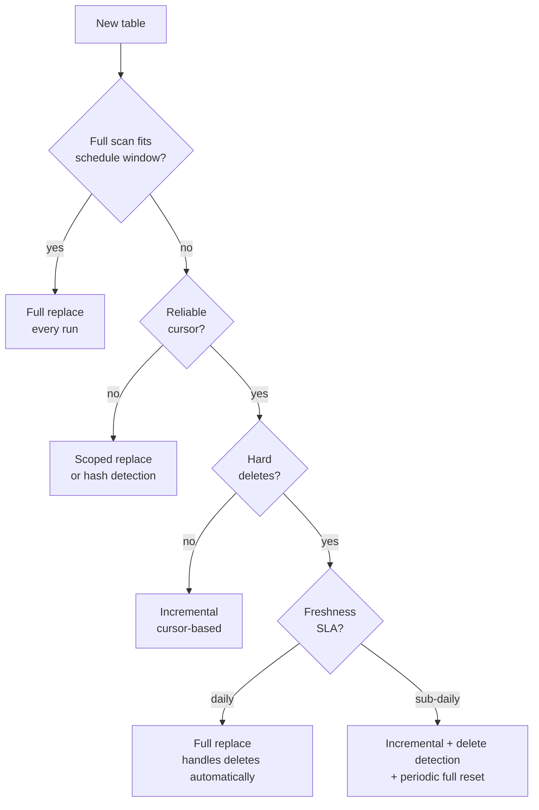

# Purity vs. Freshness

> **One-liner:** The fundamental tradeoff in batch ECL: perfectly stable data requires full replaces at low frequency. Fresher data requires incremental complexity. The right answer depends on the table, the consumer, and the SLA.

Every pipeline decision -- how to extract, how often to run, how to load -- is a position on this tradeoff. Most pipelines take a position without realizing it, and then you inherit someone else's unexamined defaults six months later when something breaks.

## The Two Ends

**Purity** means the destination is an exact clone of the source at a given point in time. No drift, no missed rows, no accumulated damage from soft rule violations or unreliable cursors. A full replace achieves this -- every run resets the world. You pull everything, you replace everything, the destination matches the source exactly as of the extraction timestamp.

**Freshness** means how recently the destination reflects the source. A table refreshed every 15 minutes is fresh. A table refreshed nightly is stale by mid-morning.

The tension between them is structural. Full replace maximizes purity but caps freshness -- you can only refresh as often as a full scan completes. Incremental maximizes freshness but trades purity -- missed rows, unreliable cursors, and accumulated drift are inherent to the approach. Every incremental pipeline carries a purity debt that grows until the next full reset corrects it.

Neither extreme is universally correct. The right point on the spectrum depends on the table, the consumer, and what "fresh enough" actually means.

## Why Full Replace Is the Purity Champion

A full replace has properties that incremental extraction fundamentally can't match:

**It's stateless and idempotent.** Run it twice, same result. No cursor state persisting between runs, no checkpoint files to manage, no accumulated decisions from prior executions. If something goes wrong, rerun -- the destination will be correct.

**It catches everything.** Hard deletes, retroactive corrections, soft rule violations, schema drift, rows that were missed by a prior incremental -- a full replace picks up all of it because it doesn't rely on the source to signal changes. It reads the current state of every row.

**It has no drift accumulation.** An incremental pipeline that misses a row today still has that wrong row tomorrow, and the day after. A full replace that runs tonight corrects everything that was wrong since the last full replace.

The cost is the freshness ceiling. If a full scan of `orders` takes 3 hours, the freshest you can be with a pure full replace strategy is 3 hours behind -- and that's assuming the scan starts the moment the last one ends. For most tables and most businesses, this is completely acceptable. For a handful, it isn't.

## Why Incremental Carries a Purity Debt

Incremental extraction is a performance optimization -- a necessary one when the table is too large to scan completely within the schedule window, but an optimization nonetheless, with all the fragility that implies.

The cost is real and often underestimated:

**Cursor reliability is a soft rule.** The assumption that every write to a row bumps `updated_at` is an expectation, not an enforcement. Bulk scripts bypass it. ORM hooks miss it. Back-office tools don't know it exists. Every row that changes without bumping the cursor is a row your pipeline will never see update. See [[01-foundations-and-archetypes/0106-hard-rules-soft-rules|0106-hard-rules-soft-rules]].

**Hard deletes are invisible.** A deleted row leaves no trace for a cursor-based extraction to find. You need a separate delete detection mechanism -- a full ID comparison, a count reconciliation, a tombstone table -- which adds complexity and its own failure modes. [[03-incremental-patterns/0306-hard-delete-detection|0306-hard-delete-detection]]

**High frequency has a monetary cost.** 288 extractions per day (every 5 minutes) means 288 load jobs, 288 sets of DML operations on the destination, 288 opportunities for partial failures. On BigQuery, that's 288 jobs counting against your DML quota. On Snowflake, that's warehouse time burning through the day. The cost of freshness is real.

**Drift accumulates silently.** A missed row today is still wrong tomorrow. An incremental that has been running for 6 months with a slightly unreliable cursor has 6 months of accumulated drift that nobody has quantified. The destination looks correct -- it has data -- but it doesn't match the source.

## Classifying a Table

How you classify the table determines everything that follows. Work through these in order:

**1. What does the business actually need?** "Real time" almost never means real time. It means "faster than it is now." Press for a concrete number. "I need it every 15 minutes" is different from "I need it with no more than a 15-minute delay" -- and both are different from "I need it when I click refresh." Giving consumers a way to trigger an on-demand extraction can reduce scheduled frequency dramatically, cutting cost without sacrificing the freshness they actually use.

**2. How long does a full scan take?** Measure it. Don't estimate. A 500k-row table on a production ERP at 2am might scan in 4 minutes. The same table at 10am might take 40. If the scan fits comfortably inside your schedule window, full replace is the answer and the conversation is over.

**3. Does it have hard deletes?** If yes and the table is small enough for a full replace, use full replace -- it handles deletes automatically. If it's too large: you need incremental plus a separate delete detection strategy, which is significant added complexity.

**4. Does the source rewrite history?** Retroactive corrections are incompatible with incremental. A pricing table where last quarter's prices get adjusted, an ERP where journal entries get reversed and reposted -- a cursor on `updated_at` misses these entirely. Full replace is the only safe option, regardless of table size.

**5. Is the cursor reliable?** Verify it before committing. Query for NULL `updated_at` values. Run EXPLAIN on the cursor query and confirm it hits an index. Create a row and update it and confirm the timestamp changes both times. If any check fails, the cursor is a soft rule and your incremental will accumulate drift.

| Table type                       | Hard deletes?    | Freshness SLA | Recommendation                               |
| -------------------------------- | ---------------- | ------------- | -------------------------------------------- |
| Dimension / config               | Rare             | Daily         | Full replace every run                       |
| Large mutable (`orders`)         | Soft-delete only | Daily         | Full replace (if scan fits window); else incremental + nightly full |
| Large mutable (`orders`)         | Hard deletes     | Hourly        | Incremental + delete detection + weekly full |
| Append-only (`events`)           | Never            | Sub-hourly    | Incremental append                           |
| Pre-aggregated (`metrics_daily`) | N/A              | Daily         | Partition-level replace                      |
| History-rewriting source         | Frequent         | Daily         | Full replace always                          |

## The Hybrid: Periodic Full + Intraday Incremental

For tables where you need both purity and freshness -- mutable, large, sub-daily SLA -- the hybrid is the answer. Run a full replace nightly to reset purity. Run incremental extractions intraday to deliver freshness.

> [!tip] The incremental doesn't need to be perfect
> It doesn't need to catch hard deletes. It doesn't need to handle retroactive corrections. It doesn't need a lookback window. The nightly full replace will correct everything the incremental missed. Design the intraday incremental to be fast and simple -- a tight cursor window, no delete detection, no complexity -- because it's not the source of truth. The full replace is.

This also means the incremental's failure mode is manageable. If it misses a run, the data is stale by one interval until the next incremental or the nightly full. If it accumulates drift, the nightly full resets it. The incremental is a freshness layer on top of a reliable foundation.

See [[03-incremental-patterns/0302-cursor-based-extraction|0302-cursor-based-extraction]] for how to design the intraday incremental to coexist cleanly with the periodic full.

## The SLA Conversation

Have this conversation before you build anything.

"We need the data in real time" is a starting position, not a requirement. When someone says "real time," they usually mean "faster than it is now." The real question is: what decision does this data inform, and how stale can it be before that decision is wrong? A sales dashboard reviewed at 9am every morning is not harmed by a nightly full replace that completes at 6am. A fraud detection system that needs to act on transactions within minutes is a genuinely different animal -- and also not a batch problem.

Most business SLAs, when pressed to a concrete number, land somewhere between 30 minutes and daily. And most of the time the actual need is "no more than X delay" rather than "updated every X minutes" -- the distinction matters because on-demand extraction (a sensor or manual trigger in your orchestrator) can satisfy the former without the cost of continuous scheduling.

When the SLA genuinely requires sub-hourly continuous refresh: accept it, build for it, and document the purity cost explicitly. The business is choosing freshness over purity. They should understand that the destination may drift, that hard deletes won't be reflected immediately, and that the pipeline complexity -- and the infrastructure cost -- is higher as a result. That's a valid business decision. Make sure it's a conscious one.

> [!tip] Start with full replace and document why you deviated
> The default position is full replace. Every deviation toward incremental should be a documented decision: what made full replace infeasible, what purity tradeoffs were accepted, and what the plan is for correcting drift. If you can't articulate why you need incremental, you probably don't.

## Related Patterns

- [[01-foundations-and-archetypes/0106-hard-rules-soft-rules|0106-hard-rules-soft-rules]]
- [[02-full-replace-patterns/0201-full-scan-strategies|0201-full-scan-strategies]]
- [[02-full-replace-patterns/0204-scoped-full-replace|0204-scoped-full-replace]]
- [[03-incremental-patterns/0302-cursor-based-extraction|0302-cursor-based-extraction]]
