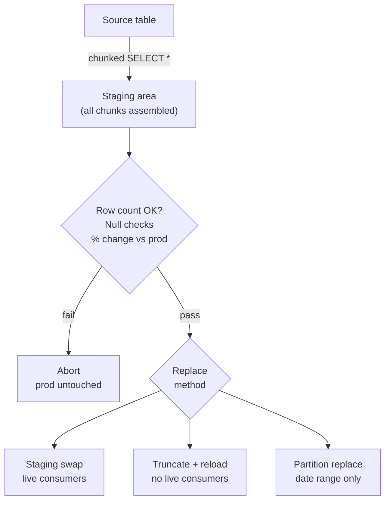

# Full Scan Strategies

> **One-liner:** When incremental isn't worth it -- or isn't possible -- extract everything and replace the destination completely.

Full scan is the simplest pipeline that exists. Extract every row, replace the destination, done. No cursor state to maintain, no missed deletes, no drift accumulation. It resets the world on every run. The engineering community has overcomplicated data pipelines by defaulting to incremental when most tables don't need it. This chapter is about when full scan is the right answer (Which hopefully is all times) -- and how to do it without killing your source database or leaving a window of empty data in production.

## When Full Scan Wins

The decision comes down to one comparison: **full scan cost vs. incremental complexity cost + drift risk**. If the scan is cheap and the table is messy, full scan wins every time.

**The table is small enough.** Dimensions, configuration tables, reference data, lookup tables. What "small enough" means depends on your source database size and how frequently the table is updated -- a 500k-row table on a lightly loaded PostgreSQL replica is different from 500k rows on a production ERP mid-day. The question is whether the source can absorb the scan without impacting application performance, and whether the extraction time fits your schedule window.

**No reliable cursor.** No `updated_at`, no row version, no sequence. You asked the team and they shrugged. You checked `information_schema` and found nothing useful. You can't borrow a cursor from a header table because this is a standalone table with no parent. Without a cursor, incremental extraction is impossible without hashing every row -- which has its own cost and complexity. Full scan is cleaner.

**Hard deletes happen and aren't worth tracking separately.** Incoming payments, cancelled reservations, temporary staging records -- tables where rows get deleted regularly and the deletion is part of the business state you need to reflect. A full scan picks up deletions automatically because the deleted rows simply aren't there when you extract. A cursor-based incremental is blind to deletions by design and requires a separate detection mechanism. If the table is small enough, don't bother.

**The source rewrites history.** Some applications correct past records in bulk. A pricing table where last quarter's prices get retroactively adjusted. An ERP where a journal entry gets reversed and reposted to a prior period. A more problematic DBA who runs UPDATE scripts directly. A cursor on `updated_at` misses rows that were corrected without bumping the timestamp. Full scan doesn't care -- you get the current state of every row, always.

> [!tip] Earn incremental complexity, don't assume it
> Full scan is the default. Incremental is a performance optimization with a cost in complexity, drift risk, and maintenance. Build full scan first. Switch to incremental only when the scan is genuinely too slow or too expensive for your schedule window. See [[01-foundations-and-archetypes/0108-purity-vs-freshness|0108-purity-vs-freshness]].

## The Two Shapes of Full Scan

**Full table, every run.** Extract all rows, replace the destination completely on every execution. The simplest pipeline that exists and the most reliable. No state, no checkpoints, no drift. This should be your default for any table that fits the window.

**Full table, periodic + incremental between.** Run a full scan nightly or weekly to reset state, run incremental extractions intraday to get freshness. The full scan is the safety net that catches everything the incremental misses -- soft rule violations, missed timestamps, retroactive corrections. The incremental is the performance optimization that gives you sub-daily freshness without scanning the whole table every hour. See [[03-incremental-patterns/0301-timestamp-extraction-foundations|0301]] for how to design the incremental so it plays well with the periodic full reset.

## Source Load and Extraction Etiquette

Full scans hit the source harder than incremental extractions. A few rules:

**Schedule during off-peak hours.** 2am, weekends, after the monthly close finishes. Know your source system's busy hours before you set the schedule. On a production ERP, mid-morning is when 200 users are posting invoices and confirming orders. That is not when you want to be scanning `order_lines`.

**Use a read replica when available.** A replica absorbs your scan without touching the primary. Replication lag is a real concern -- you might miss rows committed in the last few seconds -- but for a nightly full scan this is almost never material. Confirm lag with the DBA.

**Chunk large tables.** Never pull millions of rows in a single query. Break the extraction into chunks by PK range and append each chunk before replacing the destination. Chunking reduces peak memory, avoids query timeouts, and makes failures recoverable -- if chunk 47 fails, you retry chunk 47, not the whole table.

**Manual chunking** by PK range:

```sql
-- source: transactional
-- engine: postgresql
-- Chunk 1: rows 1 -- 100000
SELECT * FROM order_lines
WHERE id BETWEEN 1 AND 100000
ORDER BY id;

-- Chunk 2: rows 100001 -- 200000
SELECT * FROM order_lines
WHERE id BETWEEN 100001 AND 200000
ORDER BY id;
```

The chunk size is a tunable parameter -- start at 100k rows and adjust based on query time and memory pressure. Most orchestrators let you parameterize this per asset or per source.

Most database drivers support streaming modes that yield rows incrementally without loading the full result set into memory. SQLAlchemy's `yield_per` does this consistently across every source engine -- the same code works against PostgreSQL, MySQL, SQL Server, and SAP HANA:

```python
# orchestrator: python
# SQLAlchemy yield_per: stream results without loading full result set into memory
with engine.connect() as conn:
    result = conn.execution_options(yield_per=10_000).execute(
        text("SELECT * FROM order_lines ORDER BY id")
    )
    for chunk in result.partitions():
        stage_chunk(chunk)  # append to staging, not to final table
```

> [!warning] Extract everything before replacing at the destination
> If you chunk the extraction and write each chunk directly to the final table, chunk N replaces chunk N-1. You'll end up with only the last chunk in the destination. Extract all chunks to a staging area first, validate, then swap. Always.

See [[06-operating-the-pipeline/0607-source-system-etiquette|0607-source-system-etiquette]] for connection limits, timeout coordination, and DBA communication.

## At the Destination: Replace Strategies

Full replace is not "DELETE everything, INSERT everything." That approach leaves a window where the table is empty, and it's more expensive than necessary on most engines.



**Staging swap.** Load into a staging table, validate, then atomically swap staging to production. Zero downtime -- consumers query the production table and see complete data throughout. Rollback is dropping the staging table without touching prod. This is the recommended approach for any table with live consumers. See [[02-full-replace-patterns/0203-staging-swap|0203-staging-swap]].

**Partition-level replace.** When the table is partitioned by date and you're replacing a specific date range, drop and reload only the affected partitions. Still a full replace per partition -- you extract all rows for those dates and reload completely -- but you don't touch partitions outside the range. See [[02-full-replace-patterns/0202-partition-swap|0202-partition-swap]].

**Truncate + reload.** `TRUNCATE` the table and insert fresh. Simple, but it has a window where the table is empty. Acceptable for overnight runs where no dashboards or queries are running against the table. Never acceptable for tables with intraday consumers.

> [!tip] Use bulk load jobs, not row-by-row inserts
> On every columnar engine, a `LOAD DATA` job or `COPY INTO` from a file is significantly cheaper than a set of `INSERT` statements. BigQuery charges for DML operations; Snowflake burns warehouse time per statement. Load your staging data from Parquet or Avro files, not from repeated inserts. This is especially important at scale -- 10M rows via `LOAD DATA` is one job; 10M rows via `INSERT` is 10M jobs.

## Data Quality Before the Swap

Never swap staging to production without validating first. The full replace pattern is powerful precisely because it resets state -- which means a bad load resets to bad state, with no prior version to fall back on.

**Minimum checks before every swap:**

```sql
-- source: columnar
-- engine: bigquery
-- Run these against the staging table before swapping to production

-- 1. Table is not empty
SELECT COUNT(*) AS row_count FROM stg_order_lines;
-- Fail if row_count = 0

-- 2. Row count is within 10% of yesterday's production count
SELECT
    ABS(staging_count - prod_count) * 1.0 / prod_count AS pct_change
FROM (
    SELECT COUNT(*) AS staging_count FROM stg_order_lines
) s,
(
    SELECT COUNT(*) AS prod_count FROM order_lines
) p;
-- Fail if pct_change > 0.10

-- 3. No NULLs on required columns
SELECT COUNT(*) AS null_order_ids
FROM stg_order_lines
WHERE order_id IS NULL;
-- Fail if null_order_ids > 0
```

A full replace that lands zero rows because of a source connection failure is a production disaster. The table goes empty. Every dashboard shows nothing. Every downstream query breaks. The check `row_count > 0` is the single most important gate in a full replace pipeline.

Most orchestrators support post-load validation hooks or checks that run after the staging load and block the swap if any check fails.

See [[06-operating-the-pipeline/0609-data-contracts|0609-data-contracts]] for formalizing these checks into reusable contracts.

## What Full Scan Doesn't Solve

**Tables too large to scan entirely.** When the full scan takes longer than your schedule window, or when the source can't handle the load at any hour, full scan isn't viable. Options: scope the scan to the current + previous period ([[02-full-replace-patterns/0204-scoped-full-replace|0204-scoped-full-replace]]), or switch to a rolling window ([[02-full-replace-patterns/0205-rolling-window-replace|0205-rolling-window-replace]]).

**Freshness tighter than scan frequency.** If the business needs data every 15 minutes and a full scan takes 2 hours, you need incremental. Part III covers cursor-based extraction, merge patterns, and append strategies for tables that need sub-hourly freshness.

**Source that can't absorb the load.** Some sources are so sensitive that even an off-hours full scan causes problems. Shared multi-tenant SaaS databases, under-resourced ERPs, systems with hard connection limits. In these cases, extract incrementally and accept the complexity cost. It's cheaper than a production incident.

## Related Patterns

- [[02-full-replace-patterns/0202-partition-swap|0202-partition-swap]]
- [[02-full-replace-patterns/0203-staging-swap|0203-staging-swap]]
- [[02-full-replace-patterns/0204-scoped-full-replace|0204-scoped-full-replace]]
- [[03-incremental-patterns/0302-cursor-based-extraction|0302-cursor-based-extraction]]
- [[06-operating-the-pipeline/0607-source-system-etiquette|0607-source-system-etiquette]]
- [[06-operating-the-pipeline/0609-data-contracts|0609-data-contracts]]
- [[01-foundations-and-archetypes/0108-purity-vs-freshness|0108-purity-vs-freshness]]
