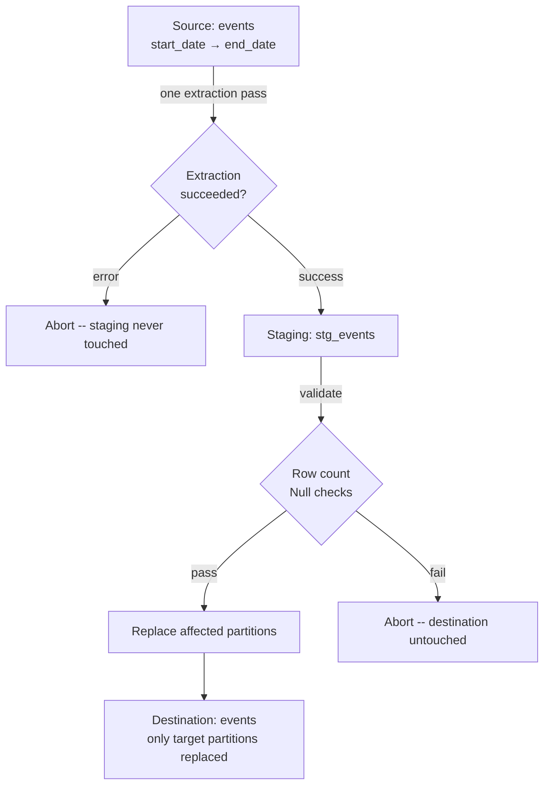

# Partition Swap

> **One-liner:** Replace data at partition granularity -- one partition or thirty, one extraction pass, without touching the rest of the table.

A full table replace is the cleanest option when the table fits the window. When it doesn't -- years of historical events, a `metrics_daily` table going back a decade -- partition swap is the next cleanest. You still extract everything in the target range in one pass, still load to staging, still validate before touching production. The only difference is the destination operation: instead of replacing the entire table, you replace only the partitions that changed.

Rows outside the target range are never touched. The rest of the table stays exactly as it was.

## When to Use It

- The table is partitioned by date and the data is naturally aligned to partition boundaries
- A bounded range needs reloading: yesterday's data was corrected, a backfill covers a month, an upstream pipeline redelivered a week of events
- Full table replace is too expensive -- years of history sit in partitions you have no reason to touch
- `metrics_daily`, `events`, `sessions` -- any table where each partition is a self-contained, replaceable unit

The partition boundary must be meaningful. If your `events` table has rows for `2026-03-07` scattered across multiple partitions because of a timezone mismatch, partition swap will produce incorrect results. See [[05-conforming-playbook/0505-timezone-conforming|0505-timezone-conforming]].

## The Mechanics

One extraction pass covers the full target range:

```sql
-- source: transactional
-- engine: postgresql
-- Extract the complete target range in a single pass
SELECT *
FROM events
WHERE event_date BETWEEN :start_date AND :end_date;
```

Load everything to a staging table on the destination. Validate. Then replace the affected partitions -- all of them, in the same job.



### Extraction Status as the First Gate

Before anything touches staging, the extraction must have completed successfully. A query that returns 0 rows is not an error -- it means the source had no data for that range, and that is correct information. A query that fails with a connection error, a timeout, or an exception is a different outcome entirely.

```python
# orchestrator: python
try:
    rows = extract_events(start_date, end_date)  # raises on connection error, timeout, etc.
    load_to_staging(rows)                         # 0 rows is a valid result here
except Exception as e:
    raise  # propagate -- do not proceed to partition operations
```

If the extraction raised an error, the job fails. Staging is never loaded. No partition is replaced. The data in production stays exactly as it was.

> [!warning] The failure to catch is a silent one
> The dangerous case is an extraction layer that swallows exceptions and returns an empty result set instead of raising. Check your database driver and connection wrapper -- make sure a dropped connection or a query timeout surfaces as an error, not as an empty iterator. If your extraction layer can return 0 rows on failure, you've lost the signal that makes this safe. See [[06-operating-the-pipeline/0610-extraction-status-gates|0610-extraction-status-gates]].

## Atomicity Per Engine

The extraction is always one pass. The destination-side replacement varies by engine.

### Snowflake / Redshift

Load to staging, then DELETE + INSERT in a transaction. Delete the full target range by date bounds -- not by what's in staging:

```sql
-- engine: snowflake / redshift
BEGIN;
DELETE FROM events
WHERE partition_date BETWEEN :start_date AND :end_date;
INSERT INTO events SELECT * FROM stg_events;
COMMIT;
```

Atomic: if the INSERT fails, the DELETE rolls back. Safe to retry.

The DELETE must cover the full target range, not `IN (SELECT DISTINCT partition_date FROM stg)`. If Saturday had 10 rows last run and the source corrected them to Friday, staging has no Saturday rows -- and a DELETE driven by staging would leave the old Saturday data in place. Delete by the declared range; insert whatever staging holds, including nothing for days with no activity.

### BigQuery

MERGE is the wrong answer here. It scans both tables in full and is the slowest, most expensive DML option BigQuery has. Real-world cases of MERGE consuming hours of slot time on large tables are documented. DELETE + INSERT has no transaction wrapper and leaves an empty-partition window between the two statements.

The right approach: load all data to a staging table partitioned by the same column as the destination, then use **partition copy** per partition -- a near-metadata operation that is orders of magnitude faster than any DML:

```bash
# staging must be partitioned by the same column as destination
# then: copy each staging partition to destination
bq cp --write_disposition=WRITE_TRUNCATE \
  project:dataset.stg_events$20260307 \
  project:dataset.events$20260307
```

N partition copies for N partitions, but each copy is fast. The staging load is one job. The partition copies are the loop -- and in BigQuery, copy jobs are near-free in both time and cost compared to DML.

> [!warning] Staging must match destination partition spec
> `bq cp` with a partition decorator requires the source table to be partitioned by the same column and type as the destination. Create staging with `PARTITION BY event_date` -- same as the destination -- before loading.

### ClickHouse

DELETE is an async mutation -- queued, not inline. `ALTER TABLE ... REPLACE PARTITION` is the right mechanism: it atomically swaps the source partition into the destination.

```sql
-- engine: clickhouse
-- For each partition in the target range:
ALTER TABLE events REPLACE PARTITION '2026-03-07' FROM stg_events;
ALTER TABLE events REPLACE PARTITION '2026-03-08' FROM stg_events;
```

Sequential within the job, still one orchestrator run. ClickHouse `REPLACE PARTITION` is fast -- it operates at the partition level without rewriting rows.

## Validation Before Swap

```sql
-- source: columnar
-- engine: bigquery
-- Run against the staging table before any partition operations

-- No NULLs on the partition key
SELECT COUNT(*) AS null_dates
FROM stg_events
WHERE event_date IS NULL;
-- Fail if null_dates > 0
-- A NULL partition key means a row can't be assigned to any partition.
-- On BigQuery, it lands in the __NULL__ partition. On Snowflake/Redshift,
-- it won't be deleted by the BETWEEN range and won't insert into the right place.
```

The partition list for replacement must come from the **target date range you declared**, not from the distinct dates in staging. If you drive the replacement from `SELECT DISTINCT event_date FROM stg`, you'll skip dates that went to zero -- and those partitions will keep their old data.

For Snowflake and Redshift this means the DELETE covers `:start_date` to `:end_date` regardless of what staging contains. For BigQuery, the partition copy loop iterates the declared date range -- for dates with no staging rows, copy an empty partition or explicitly delete the destination partition.

## One Job

From the outside, this is a single pipeline run: one extraction, one staging load, N destination operations. The orchestrator sees one job succeed or fail -- not thirty.

When it fails, you rerun it. The extraction reruns cleanly because it's a bounded range query against the source. The staging load reruns because staging is a throwaway table -- truncate and reload. The partition operations rerun because replacing a partition with the same data produces the same result. There's no accumulated state to worry about, no half-applied changes to untangle. Rerun it and move on.

Compare that to an incremental pipeline that fails mid-run: you're left asking what got written, what didn't, whether the cursor advanced, and whether rerunning will duplicate data. With partition swap, the answer to "what do I do if it fails?" is always the same.

**When staging is already valid.** For large backfills -- 30 partitions, say -- rerunning the full extraction just to retry two failed partition copies is wasteful. If staging is still intact from the previous run, retry only the failed partition operations against the existing staging data. The staging table didn't change; the per-partition operation is independent and safe to rerun in isolation. BigQuery partition copies and ClickHouse `REPLACE PARTITION` both support this cleanly.

For Snowflake and Redshift, the DELETE + INSERT is a single transaction -- it either committed or rolled back entirely. There are no partial partitions to retry. Rerun the full destination step against the existing staging table.

## Partition Alignment Is Your Responsibility

The engine partitions by whatever value is in the partition key column. If that value is wrong -- because of a timezone mismatch, a bulk load that used server time instead of event time, a late-arriving batch processed with today's date -- the row lands in the wrong partition and partition swap will replace the wrong thing.

Conform timezone before determining the partition key, not after. See [[05-conforming-playbook/0505-timezone-conforming|0505-timezone-conforming]].

Late-arriving data adds another dimension: rows for prior dates arriving today belong in their original partition, not today's. Your extraction range must account for this. If yesterday's data is still arriving today, your target range should include yesterday -- and your overlap window should be wide enough to catch stragglers. See [[03-incremental-patterns/0309-late-arriving-data|0309-late-arriving-data]].

## By Corridor

> [!example]- Transactional → Columnar (e.g. PostgreSQL → BigQuery)
> Primary use case. Columnar destinations are built for partitioned loads. One staging load + N partition operations per job. BigQuery partition copy is near-free compared to any DML option.

> [!example]- Transactional → Transactional (e.g. PostgreSQL → PostgreSQL)
> Transactional destinations have no columnar partition concept. Equivalent: `DELETE WHERE partition_key BETWEEN :start AND :end` then bulk INSERT from staging, inside a transaction. Less elegant but achieves the same scoped replace with the same atomicity guarantee.

## Related Patterns

- [[02-full-replace-patterns/0201-full-scan-strategies|0201-full-scan-strategies]]
- [[02-full-replace-patterns/0203-staging-swap|0203-staging-swap]]
- [[03-incremental-patterns/0309-late-arriving-data|0309-late-arriving-data]]
- [[05-conforming-playbook/0505-timezone-conforming|0505-timezone-conforming]]
- [[01-foundations-and-archetypes/0104-columnar-destinations|0104-columnar-destinations]]
- [[06-operating-the-pipeline/0610-extraction-status-gates|0610-extraction-status-gates]]
