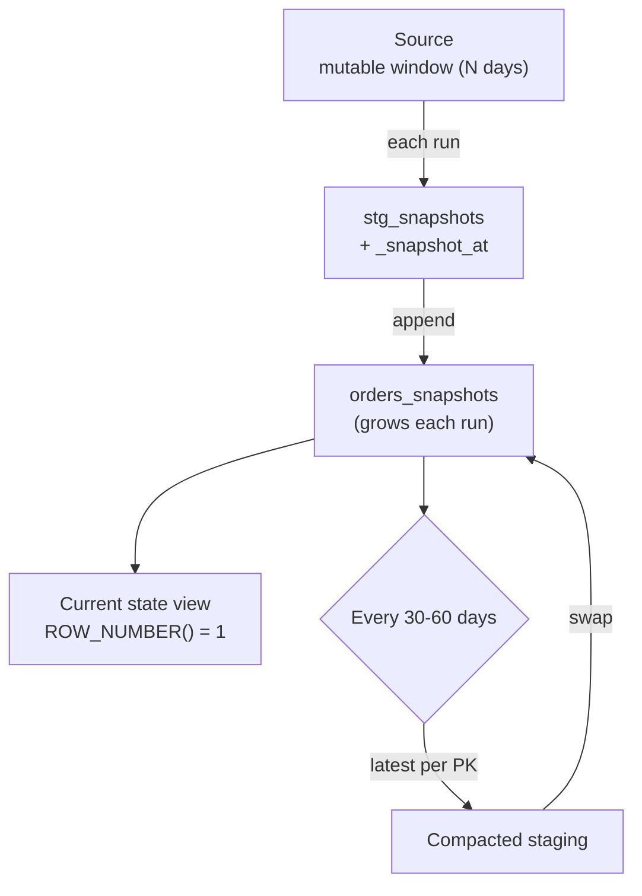

# Snapshot Append

> **One-liner:** Append the full mutable window every run with a `_snapshot_at` timestamp. Current state is `MAX(_snapshot_at)` per PK. Let the columnar engine absorb versions and deduplicate downstream.

External sources -- B2B sales platforms, SaaS reporting APIs, partner data feeds -- hand you SQL access to report tables built for human consumption. The data is correct as of whenever you query it. Figures get revised, disputes get resolved, approvals change amounts. The source has no `updated_at`, no row version, no mechanism to tell you what changed since yesterday.

The pattern for this terrain: extract the mutable window on every run, append every row tagged with `_snapshot_at`, and derive current state downstream from the latest snapshot per key. The destination table accumulates versions. Reads deduplicate.

## The Mutable Window

Every source that rewrites history has a horizon -- the furthest back a correction can reach. "Sales figures finalize after 60 days." "Invoices can be disputed within 90 days." That horizon defines your extraction scope.

Extract from `CURRENT_DATE - N` on every run, where N is wider than the stated horizon. If the business says 60 days, extract 90. The stated horizon is a soft rule -- verify it against actual data before trusting it. See [[01-foundations-and-archetypes/0106-hard-rules-soft-rules|0106-hard-rules-soft-rules]].

Rows outside the mutable window are immutable by definition. They stay in the destination untouched between runs. Only the window gets re-extracted.

## Loading: Append with `_snapshot_at`

Each run appends the full window extract to the destination table. Every row carries `_snapshot_at` -- the timestamp of the extraction that produced it.

```sql
-- source: transactional
-- engine: postgresql
-- Extract the mutable window with snapshot metadata injected
SELECT
    order_id,
    customer_id,
    total_amount,
    status,
    order_date,
    NOW() AT TIME ZONE 'UTC' AS _snapshot_at
FROM orders
WHERE order_date >= CURRENT_DATE - 90;
```

After 30 daily runs on a 1M-row window, the destination table holds 30M rows -- 30 versions of each row, one per snapshot. The latest version per `order_id` is current state. Prior versions are history. In a columnar destination, this is the right trade: ingestion and storage are the cheap operations. Merging is the expensive one.



## Deduplication Strategies

Current state lives at `MAX(_snapshot_at)` per primary key. Two ways to expose it:

**View-based.** A SQL view over the append table selects the latest snapshot per key at read time. Zero post-ECL compute -- always reflects the most recent run.

```sql
-- source: columnar
-- engine: bigquery
-- Current state view: latest snapshot per order, across all history
SELECT * EXCEPT (row_num)
FROM (
    SELECT
        *,
        ROW_NUMBER() OVER (
            PARTITION BY order_id
            ORDER BY _snapshot_at DESC
        ) AS row_num
    FROM `project.dataset.orders_snapshots`
)
WHERE row_num = 1; -- Most recent row using the _snapshot_at ORDER BY.
```

Every consumer query scans all versions within the window to find the latest. For large windows with many daily snapshots, this scan cost accumulates.

**Materialized layer.** A post-ECL step builds a `orders_current` table from the append table after each snapshot load. Consumer queries hit the materialized table -- one row per key, small, fast to scan.

In your orchestrator, this is a downstream task that depends on the snapshot load task -- it rebuilds automatically after each successful run. The append table is the raw log; the materialized table is what analysts and dashboards consume.

> [!tip] Default to materialized for consumer-facing tables
> Views are convenient during development. Once analysts are querying a table daily, the per-query scan cost of a view over 90 days of versions adds up fast. Materialize it and give consumers a clean, cheap table to work with.

## Renormalization: Compacting Storage

The append table grows every run. After 60 daily snapshots of a 1M-row window, you have 60M rows -- and 59M of them are superseded versions carrying no information that the latest snapshot doesn't already contain.

Every 30-60 days, run a compaction job: collapse the append table to one row per PK (the latest `_snapshot_at`), validate, and full-replace the table. Storage drops back to 1M rows. The cycle restarts.

```sql
-- source: columnar
-- engine: bigquery
-- Compaction query: latest snapshot per key, written back as the new append table
SELECT * EXCEPT (row_num)
FROM (
    SELECT
        *,
        ROW_NUMBER() OVER (
            PARTITION BY order_id
            ORDER BY _snapshot_at DESC
        ) AS row_num
    FROM `project.dataset.orders_snapshots`
)
WHERE row_num = 1;
```

Load this result into a staging table, validate row count against the pre-compaction distinct key count, then swap. The append table is now compact. The next day's run appends a fresh snapshot and growth resumes.

Compaction frequency is a cost tradeoff: more frequent compaction means lower storage cost but more compute jobs. For most tables, every 30-60 days is the right cadence.

Compaction runs as a separate scheduled job in your orchestrator -- independent of the daily snapshot task, triggered on a calendar schedule rather than on data arrival.

> [!warning] Compaction erases version history
> After compaction, only the latest snapshot per key survives. If you need a full audit trail of how values changed over time, keep the pre-compaction snapshots in cold storage before swapping. If you only need current state, compaction is safe.

## Relationship to Append-and-Materialize

[[04-load-strategies/0404-append-and-materialize|0404-append-and-materialize]] uses the same append + deduplicate mechanism, but for transactional sources with cursors: each run appends only the rows that changed since the last extraction.

Snapshot append extracts the full mutable window on every run -- cursor-free. The extraction scope is wider, the append volume is higher, but there's no cursor reliability assumption and no missed-row risk. Use snapshot append when the source has no change tracking. Use append-and-materialize when it does.

### By Corridor

> [!example]- Transactional → Columnar (e.g. PostgreSQL → BigQuery)
> Natural fit. Columnar destinations are append-optimized, storage per GB is cheap, and `_snapshot_at` as a partition key bounds scans to the active window. The materialized current-state table is a standard BigQuery scheduled query or a downstream task in your orchestrator.

> [!example]- Transactional → Transactional (e.g. PostgreSQL → PostgreSQL)
> Functional but less natural. Row-oriented destinations pay a higher storage cost for multiple versions per key, and scan-based deduplication is slower. A MERGE-based approach on the destination is worth evaluating if the table is large and the mutation cost is acceptable.

## Related Patterns

- [[02-full-replace-patterns/0205-scoped-full-replace|0205-scoped-full-replace]]
- [[04-load-strategies/0404-append-and-materialize|0404-append-and-materialize]]
- [[05-conforming-playbook/0501-metadata-column-injection|0501-metadata-column-injection]]
- [[07-serving-the-destination/0703-pre-built-views|0703-pre-built-views]]
- [[01-foundations-and-archetypes/0104-columnar-destinations|0104-columnar-destinations]]
