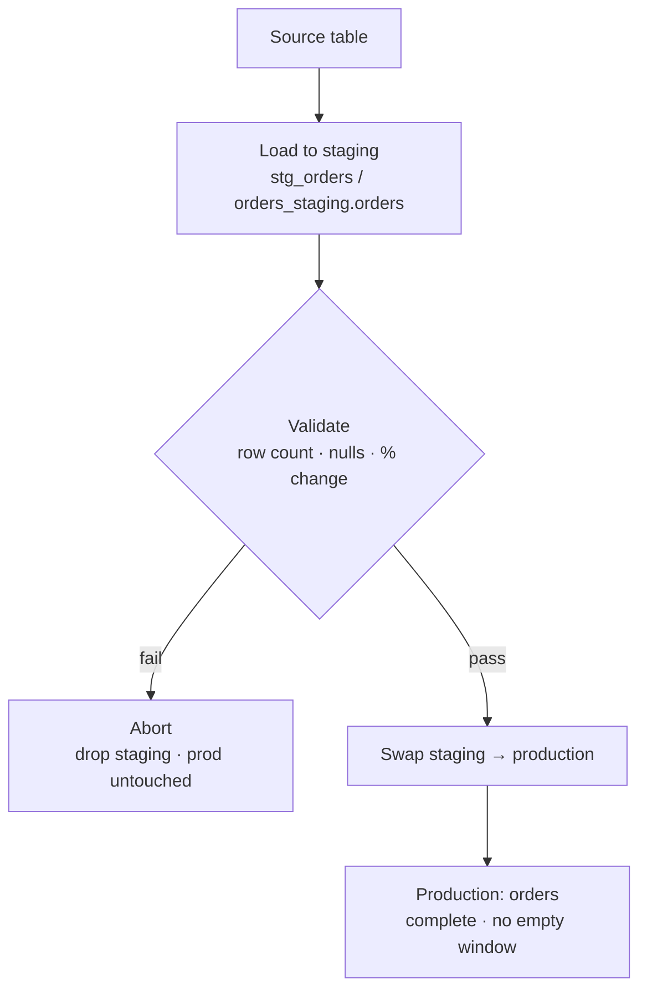

# Staging Swap

> **One-liner:** Load into a staging table, validate, then atomically swap to production. Zero downtime, trivial rollback.

## The Problem

The naive full replace is `TRUNCATE production; INSERT INTO production SELECT * FROM source`. Simple. And it leaves a window where `production` is empty -- any dashboard or query that runs between the TRUNCATE and the INSERT sees nothing. On a table with live consumers, that's an incident.

The second problem: if the load fails halfway through, you're left with a half-loaded production table and no clean way back. You can't replay the INSERT without truncating again, which means another empty window.

Staging swap eliminates both problems. Consumers see complete data throughout. Rollback is dropping the staging table without touching production.

## The Mechanics



Three steps:

**1. Load to staging.** Extract from source and load entirely into the staging table. Production is untouched. If the extraction or load fails at any point, nothing has happened to production.

Two conventions for where staging lives, each with real trade-offs:

|                       | Table prefix<br>`public.stg_orders`         | Parallel schema<br>`orders_staging.orders`          |
| --------------------- | ------------------------------------------- | --------------------------------------------------- |
| Namespace             | Pollutes production schema                  | Clean separation                                    |
| Permissions           | Per-table grants                            | Schema-level grant / revoke                         |
| Cleanup               | Drop tables individually                    | `DROP SCHEMA ... CASCADE`                           |
| Swap complexity       | Simple -- rename within schema              | Harder -- cross-schema move or copy                 |
| Snowflake `SWAP WITH` | Works directly                              | Works across schemas                                |
| PostgreSQL swap       | `RENAME TO` in transaction                  | `SET SCHEMA` + rename -- 3 steps                    |
| BigQuery              | `bq cp` or DDL rename (within same dataset) | `bq cp` only -- `RENAME TO` doesn't cross datasets. |
| ClickHouse            | No difference                               | No difference                                       |

The parallel schema convention is worth it at scale -- permission management alone justifies it when you're running hundreds of tables. But go in with eyes open: the swap step is more involved on PostgreSQL and Redshift, and you'll need to handle it explicitly per engine.

**2. Validate.** Run checks against `stg_orders` before touching production. At minimum: row count > 0, % change vs. production is within threshold, required columns have no NULLs. See [[06-operating-the-pipeline/0609-data-contracts|0609-data-contracts]] for formalizing these as reusable contracts.

**3. Swap.** Atomically replace production with staging. The mechanism varies by engine -- covered below -- but the result is the same: one moment consumers are reading the old data, the next they're reading the new data, with no empty window in between.

## The Swap Operation

The swap must be atomic -- consumers should never see a missing table. Each engine has its own mechanism.

### Snowflake

```sql
-- engine: snowflake
-- Atomic metadata-only swap -- fast regardless of table size
ALTER TABLE stg_orders SWAP WITH orders;
```

`SWAP WITH` is the cleanest option on any engine: metadata-only, instant, truly atomic. One caveat: grants defined on `orders` do **not** carry over after a SWAP -- they follow the table name, not the data. If consumers have been granted access to `orders`, they now have access to the old staging table (renamed to `orders` after the swap). Re-grant after every swap, or use `FUTURE GRANTS` on the schema.

### BigQuery

BigQuery has no native SWAP. In BigQuery, schema = dataset, so the parallel schema convention means `orders_staging.orders` → `orders.orders`.

**Table prefix convention** (`dataset.stg_orders` → `dataset.orders`):

```bash
bq cp --write_disposition=WRITE_TRUNCATE \
  project:dataset.stg_orders \
  project:dataset.orders
```

Or with DDL rename (brief unavailability window between steps):

```sql
-- engine: bigquery
ALTER TABLE `project.dataset.orders` RENAME TO orders_old;
ALTER TABLE `project.dataset.stg_orders` RENAME TO orders;
DROP TABLE IF EXISTS `project.dataset.orders_old`;
```

**Parallel dataset convention** (`orders_staging.orders` → `orders.orders`):

```bash
bq cp --write_disposition=WRITE_TRUNCATE \
  project:orders_staging.orders \
  project:orders.orders
```

`ALTER TABLE RENAME TO` does not cross dataset boundaries -- DDL rename is not an option with parallel datasets. The copy job works in both conventions.

> [!info] BigQuery copy job performance
> Copy jobs are free (no slot consumption, no bytes-scanned charge) for same-region operations. Cross-region copies incur data transfer charges. Google's documentation explicitly notes that copy job duration "might vary significantly across different runs because the underlying storage is managed dynamically" -- there are no guarantees about speed regardless of whether source and destination are in the same dataset or different datasets. Factor this into your schedule window for large tables.

Use the copy job for tables with live consumers. Use DDL rename (same-dataset only) when you control the maintenance window.

### PostgreSQL / Redshift

**Table prefix convention** -- rename within the same schema:

```sql
-- engine: postgresql / redshift
BEGIN;
ALTER TABLE orders RENAME TO orders_old;
ALTER TABLE stg_orders RENAME TO orders;
DROP TABLE orders_old;
COMMIT;
```

**Parallel schema convention** -- move across schemas:

```sql
-- engine: postgresql / redshift
BEGIN;
ALTER TABLE orders RENAME TO orders_old;
ALTER TABLE orders_staging.orders SET SCHEMA public;  -- moves to public schema, keeps name 'orders'
DROP TABLE orders_old;
COMMIT;
```

`SET SCHEMA` moves the table without copying data -- it's a metadata operation, not a rewrite. In both cases, if the transaction rolls back, `orders` is still the original table, unchanged.

### ClickHouse

```sql
-- engine: clickhouse
-- EXCHANGE TABLES is atomic -- no intermediate state
EXCHANGE TABLES stg_orders AND orders;
```

`EXCHANGE TABLES` swaps both table names atomically. After the swap, `stg_orders` contains the old production data -- useful if you want to keep the previous version for a period before dropping it.

## Validation Before Swap

Never skip validation. A staging swap that replaces production with zero rows because of a silent extraction failure is worse than a failed load -- it actively corrupts your destination and every consumer sees empty data.

```sql
-- source: columnar
-- engine: bigquery
-- Run against stg_orders before any swap operation

-- 1. Not empty
SELECT COUNT(*) AS row_count FROM stg_orders;
-- Fail if row_count = 0

-- 2. Within 10% of yesterday's production count
SELECT ABS(s.cnt - p.cnt) * 1.0 / p.cnt AS pct_change
FROM (SELECT COUNT(*) AS cnt FROM stg_orders) s,
     (SELECT COUNT(*) AS cnt FROM orders) p;
-- Fail if pct_change > 0.10

-- 3. No NULLs on merge key
SELECT COUNT(*) AS null_keys FROM stg_orders WHERE order_id IS NULL;
-- Fail if null_keys > 0
```

Most orchestrators let you wire these as post-load checks that gate the swap step. If any check fails, the job stops, staging is left intact for inspection, and production is untouched.

> [!tip] Keep staging around on failure
> Don't drop staging when validation fails. Leave it for debugging -- it's the evidence of what went wrong. Drop it only after the issue is resolved and the next successful run creates a fresh staging table.

## Rollback

There is no rollback step. If validation fails, you abort before the swap. Production never changed. On the next run, staging is recreated from scratch -- it's a throwaway table, not a state you carry forward.

If the swap itself fails mid-operation (rare, but possible on non-atomic engines like BigQuery's DDL rename), check which table exists and which doesn't before deciding how to recover. On atomic engines (Snowflake SWAP, ClickHouse EXCHANGE, PostgreSQL transaction), a failure means the swap didn't happen -- production is still the original.

> [!warning] Don't reuse staging across runs
> Staging tables are throwaway. Truncate or drop and recreate on every run. A staging table left over from a prior failed run contains stale data -- if your validation only checks row count, it might pass against the wrong rows.

## By Corridor

> [!example]- Transactional → Columnar (e.g. PostgreSQL → BigQuery)
> Primary use case for this pattern. Columnar destinations have no cheap in-place UPDATE, so full replace via staging swap is the standard approach for any mutable table that fits the schedule window. On BigQuery, prefer `bq cp` over DDL rename for live tables. On Snowflake, use `SWAP WITH` and re-grant permissions after.

> [!example]- Transactional → Transactional (e.g. PostgreSQL → PostgreSQL)
> Equally valid. The PostgreSQL RENAME-within-transaction approach is clean and atomic. One additional concern: foreign keys referencing the production table. If other tables have FK constraints pointing to `orders`, the rename sequence may fail or temporarily break referential integrity. Disable FK checks or use `CASCADE` options with care before swapping.

## Related Patterns

- [[02-full-replace-patterns/0201-full-scan-strategies|0201-full-scan-strategies]]
- [[02-full-replace-patterns/0202-partition-swap|0202-partition-swap]]
- [[06-operating-the-pipeline/0609-data-contracts|0609-data-contracts]]
- [[06-operating-the-pipeline/0610-extraction-status-gates|0610-extraction-status-gates]]
