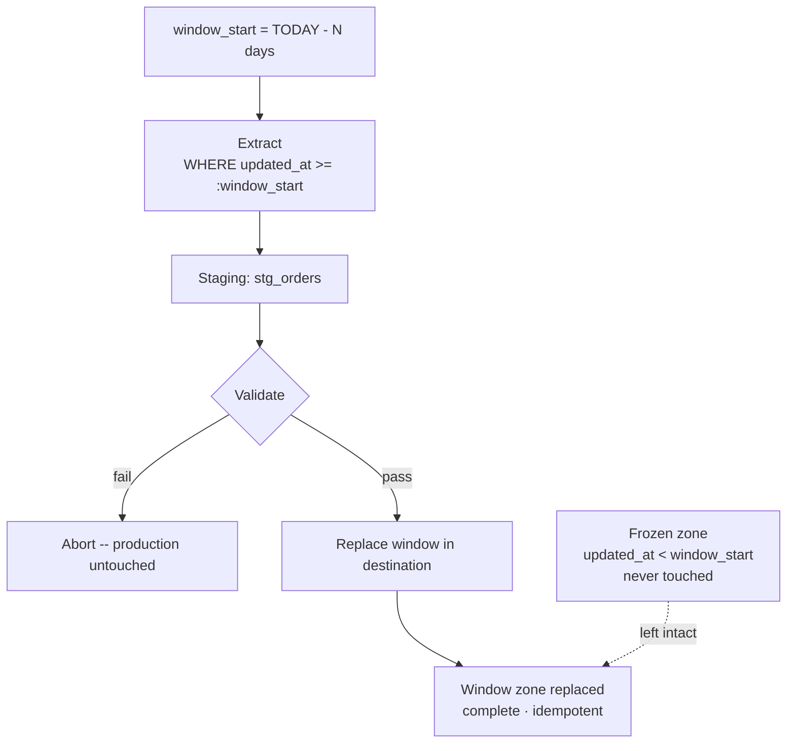

# Rolling Window Replace

> **One-liner:** Drop and reload the last N days every run. The window moves forward with time; everything outside it is frozen.

## The Problem

A full table replace is too expensive. A cursor-based incremental is unreliable or more complexity than the table deserves. But the data changes -- corrections arrive, statuses update, late rows trickle in -- and those changes cluster in a predictable recent window.

Rolling window replace exploits that clustering. Instead of scanning the full table or tracking individual row changes, it defines a fixed-width window anchored to today, does a complete full replace inside that window every run, and leaves everything older untouched. Within the window, the destination is always correct. Outside it, the data is frozen at whenever it last fell inside the window.

## Distinction from Scoped Full Replace

Both patterns maintain a managed zone and a frozen zone. The difference is in how the boundary is defined and what the filter operates on.

[[02-full-replace-patterns/0204-scoped-full-replace|0204]] uses a calendar anchor -- Jan 1 of last year, or a fixed migration date. The boundary is a business date: a fiscal year, a known cutover point. The filter typically operates on `created_at` or `doc_date`. The managed zone grows over the year and resets annually.

Rolling window uses a metadata anchor -- `updated_at` or `created_at` relative to today. The window is always the same width. It advances daily. There's no natural hard boundary like a fiscal year close; N is a judgment call based on how long corrections typically take to arrive in the source.

Rolling window also freezes data more aggressively. A 30-day window freezes anything older than a month. That's a much shorter guarantee than [[02-full-replace-patterns/0204-scoped-full-replace|0204]]'s "everything since last January." This also makes it composable into more stages -- a 7-day daily window, a 90-day weekly window, a yearly scoped replace -- each tier running at the cadence that matches its data's volatility. See [[06-operating-the-pipeline/0608-tiered-freshness|0608-tiered-freshness]].

## The Mechanics



**Extract by `updated_at`.** The filter is on the metadata field that reflects when a row last changed, not when it was created. A 3-year-old order that got its status updated yesterday is inside the 30-day window. A 3-week-old order that hasn't changed is also inside it -- you pull it again regardless, because within the window you replace everything, not just what changed.

```sql
-- source: transactional
-- engine: postgresql
SELECT *
FROM orders
WHERE updated_at >= :window_start;
```

**Replace the window in the destination.** In a transactional destination, delete by PK -- not by `updated_at`. The destination's `updated_at` reflects when the row was last synced, not the current source value. A row updated today in the source still has the old `updated_at` in the destination until you replace it. Deleting by PK covers exactly what was extracted:

```sql
-- engine: postgresql
BEGIN;
DELETE FROM orders WHERE id IN (SELECT id FROM stg_orders);
INSERT INTO orders SELECT * FROM stg_orders;
COMMIT;
```

Or collapse into an upsert:

```sql
-- engine: postgresql
INSERT INTO orders
SELECT * FROM stg_orders
ON CONFLICT (id) DO UPDATE SET
    customer_id = EXCLUDED.customer_id,
    status      = EXCLUDED.status,
    updated_at  = EXCLUDED.updated_at;
```

In a columnar destination, the filter field mismatch creates a real cost problem; see By Corridor below.

## Choosing N

N must be wider than your source system's actual correction window. The relevant question: how long after a record is created can it still receive updates? That varies by table and by source system behavior.

- Too narrow: corrections arriving on day N+1 miss the window and are permanently invisible.
- Too wide: the extraction approaches a full scan and the pattern loses its cost advantage.

A rough starting point is 2x the maximum expected correction lag -- if corrections typically arrive within 7 days, start with 14. Then watch it. Correction windows change when source system behavior changes, and N needs to follow.

> [!warning] N is not set-and-forget
> A new bulk update script in the source, a change in how corrections are posted, a migration that backdates rows -- any of these can push changes outside your current window and you won't know until a reconciliation catches the drift. Review N when anything significant changes upstream. Complement with a periodic full scan (weekly or monthly) to reset accumulated drift in the frozen zone. See [[02-full-replace-patterns/0201-full-scan-strategies|0201]].

## The Assumption You're Making

Every row older than N days is either immutable or stale-by-design. The frozen zone grows continuously -- a row that was last updated 31 days ago is frozen forever in a 30-day window. Unlike [[02-full-replace-patterns/0204-scoped-full-replace|0204]], there's no fiscal year close or business invariant backing this up. N is purely a statistical bet on source behavior.

> [!warning] Document the window for consumers
> Consumers querying this table should know that data older than N days may not reflect current source state. The destination is not a complete mirror -- it's a rolling-correct-within-window, frozen-outside table. Treat this the same as [[02-full-replace-patterns/0204-scoped-full-replace|0204]]'s scope boundary documentation.

## Validation

```sql
-- source: columnar
-- engine: bigquery
SELECT
    MAX(DATE(updated_at)) AS latest_updated,
    COUNT(*)              AS total_rows
FROM stg_orders;
-- Fail if total_rows = 0
-- Fail if latest_updated < CURRENT_DATE
```

Optionally, compare the window row count against the prior run. A large drop in row count (e.g. >20% fewer rows than yesterday's window) likely signals a source issue, not a real change in data volume.
## By Corridor

> [!example]- Transactional → Columnar (e.g. PostgreSQL → BigQuery)
> Columnar destinations should partition by a stable (hopefully unchangeable) business date -- `created_at`, `doc_date`, `event_date`. Never by `updated_at`: a row that gets updated moves to a different partition on each edit, creating duplicates across partition boundaries -- deduplication requires a full table scan to resolve. This means the filter field (`updated_at`) and the partition key are misaligned. An order created two years ago that was updated yesterday lives in a two-year-old partition -- to replace it, you'd need to replace that partition too. Without scanning the whole table, you can't know which historical partitions are affected. The pattern becomes expensive and unpredictable in columnar. Prefer [[02-full-replace-patterns/0204-scoped-full-replace|0204]] for columnar destinations.

> [!example]- Transactional → Transactional (e.g. PostgreSQL → PostgreSQL)
> Natural fit. DELETE by PK from staging, then INSERT -- or upsert with `ON CONFLICT (id) DO UPDATE`. Precise, no partition mismatch, no overshoot. The destination PK constraint is the safety net. See mechanics above for the full SQL.

## Related Patterns

- [[02-full-replace-patterns/0202-partition-swap|0202-partition-swap]] -- execution mechanism for the columnar replacement
- [[02-full-replace-patterns/0204-scoped-full-replace|0204-scoped-full-replace]] -- calendar anchor variant; harder boundary, less aggressive freezing
- [[03-incremental-patterns/0309-late-arriving-data|0309-late-arriving-data]] -- sizing the window for late arrivals
- [[03-incremental-patterns/0302-cursor-based-extraction|0302-cursor-based-extraction]] -- cursor-based equivalent; same intuition, different mechanics
