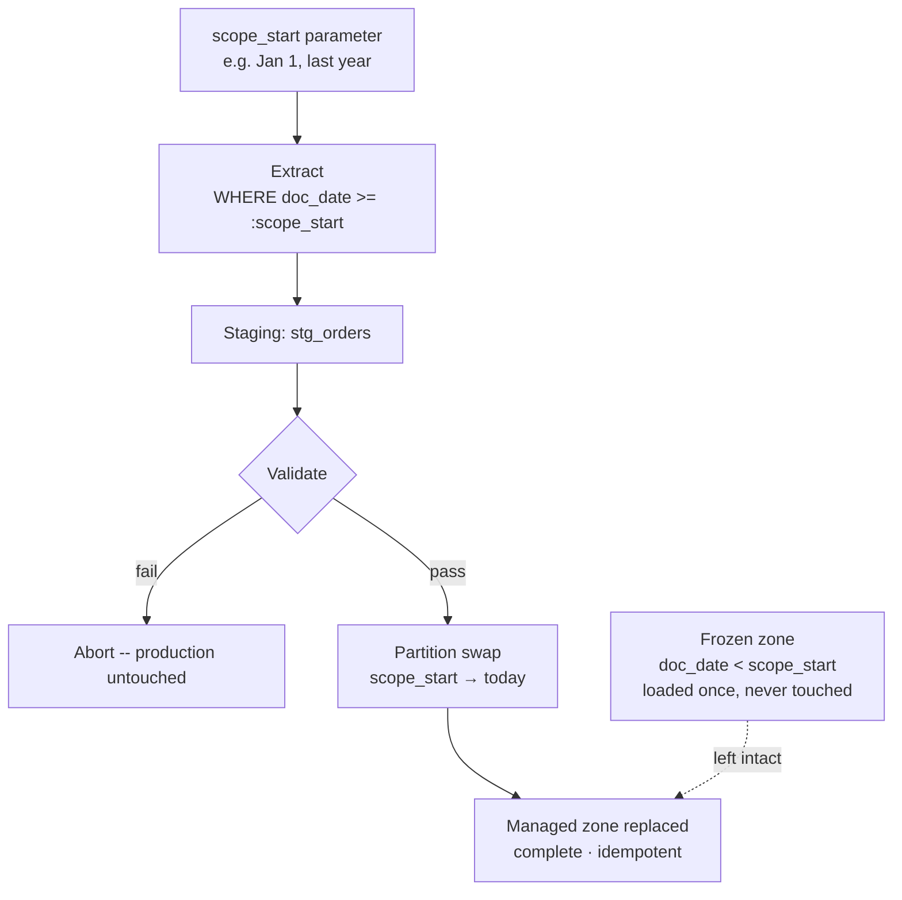
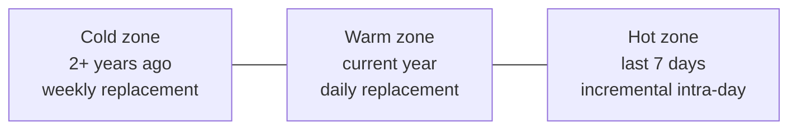

# Scoped Full Replace

> **One-liner:** Declare a scope boundary, apply full-replace semantics inside it, and explicitly freeze everything outside -- so you get idempotent reloads without scanning years of history every run.

## The Problem

A full table replace is the cleanest option available. It resets state, eliminates drift, and gives you a complete, verifiable destination every run. The problem is cost. An `orders` table with five years of history might have 200 million rows. A nightly full reload takes hours and burns slot quota. At some point the cost of purity exceeds its value.

The alternative most people reach for is incremental. That trades one problem for another: cursor management, drift accumulation, delete detection -- the full weight of Part III. For tables where historical rows rarely change, that complexity is never earned.

Scoped full replace is the middle path. Define a boundary and apply full-replace semantics to everything on the right side of it. Rows to the left are frozen: loaded once via a one-time backfill, never touched again. Within the scope, the pipeline runs a complete, idempotent reload every time. Outside the scope, it owns nothing.

## The Mechanics



**Declare the scope.** `scope_start` is a parameter the pipeline receives at runtime, not a constant baked into SQL. Externalizing it lets you widen the scope for backfills without touching extraction logic.

**Extract within scope.** Pull only rows where the scope field falls inside the declared window. The source query is bounded -- no full-table scan.

**Replace the managed zone.** Use partition swap ([[02-full-replace-patterns/0203-partition-swap|0203-partition-swap]]) to replace every partition in `scope_start → today`. The frozen zone is never part of the destination operation.

## Defining the Scope

```sql
-- source: transactional
-- engine: postgresql
-- :scope_start injected by the orchestrator
SELECT *
FROM orders
WHERE created_at >= :scope_start;
```

Three ways to anchor `scope_start`:

| Anchor             | Definition                                             | When to use                                                                                                                         |
| ------------------ | ------------------------------------------------------ | ----------------------------------------------------------------------------------------------------------------------------------- |
| Start of last year | `DATE_TRUNC('year', CURRENT_DATE - INTERVAL '1 year')` | Accounting data with open/closed fiscal years. Year boundaries are natural partition boundaries. Window grows Jan→Dec then resets.  |
| Fixed date         | `'2025-01-01'`                                         | History before that date is known bad, migrated from another system, or simply not needed. Stable until you change it deliberately. |
| Rolling offset     | Last N days                                            | Different pattern -- see [[02-full-replace-patterns/0206-rolling-window-replace|0206-rolling-window-replace]].                     |

The calendar year anchor is particularly useful for transactional systems with formal year-close processes. Once a fiscal year is closed in the source, no document in that year should change. The year boundary is a business invariant backed by a process -- align your scope to it.

### The Field That Defines the Scope

The scope filter doesn't always belong on `created_at`. Some ERP systems define the fiscal year through a document date field that is separate from the record's creation timestamp. In SAP Business One, `DocDate` is the field that places a document in an accounting period -- a document created on December 31 with `DocDate` set to January 5 of the next year belongs to the next year, not the current one. Filtering by `created_at` would put it in the wrong scope.

Use whichever date field your source system uses to assign records to fiscal periods. When in doubt, ask the source system owner, not the DBA.

## The Assumption You're Making

Scoped full replace rests on one explicit bet: **records created before `scope_start` will not change in ways consumers care about.**

| Table           | Fits?      | Why                                                                                                                                                                                                                                                                                                                    |
| --------------- | ---------- | ---------------------------------------------------------------------------------------------------------------------------------------------------------------------------------------------------------------------------------------------------------------------------------------------------------------------- |
| `events`        | Yes        | Append-only. Historical events are immutable by definition.                                                                                                                                                                                                                                                            |
| `metrics_daily` | Yes        | Old dates only change during explicit recalculations. Treat those as one-off backfills.                                                                                                                                                                                                                                |
| `invoices`      | Yes        | Closed invoices are frozen. Open invoices are recent.<br>If this soft rule is broken, there could be some legal trouble.                                                                                                                                                                                               |
| `orders`        | Usually    | Most old orders are done. Verify with the source team whether support can reopen them.                                                                                                                                                                                                                                 |
| `customers`     | No         | A customer created in 2022 can update their email today. Use full scan (see [[02-full-replace-patterns/0201-full-scan-strategies|0201-full-scan-strategies]]).                                                                                                                                                        |
| `products`      | No         | Price changes and schema mutations affect all rows regardless of age. Use full scan.                                                                                                                                                                                                                                   |
| `order_lines`   | Indirectly | No reliable own timestamp. Borrow scope from `orders` via cursor from another table (see [[03-incremental-patterns/0304-cursor-from-another-table|0304-cursor-from-another-table]]) -- if you're scoping `orders` by `created_at >= :scope_start`, you can scope `order_lines` the same way by joining to the parent. |

Dimension tables (`customers`, `products`) change across their full history. The right answer for them is a cheap full scan, not an ever-growing scope.

## Scope Maintenance

**Widening the scope** means moving `scope_start` backwards -- including a year of history that was previously frozen. This is a one-time manual operation: run the pipeline with the new `scope_start` to reload the newly included range. Subsequent nightly runs extract from the wider window automatically.

**Narrowing the scope** is dangerous. Moving `scope_start` forward freezes data that may still need correction. If those rows were corrupted or incomplete in the destination, they are now permanently frozen as-is. Only move `scope_start` forward once you're confident the data you're freezing is correct.

> [!warning] Don't advance the year boundary until Q1 is well underway
> Year-end corrections, late-arriving documents, and accounting adjustments routinely arrive in January and February. The fiscal year may be nominally closed, but the data isn't stable yet. A safe rule: don't advance `scope_start` past a year boundary until at least March or April, and only after confirming with the source team that the prior year is closed in the system, with no pending documents or adjustments expected.

## Validation

Before any destination operation, verify staging is not empty and reaches the expected end of the window. Whether `scope_start` was set correctly is a parameter-level concern -- validate it in your orchestrator, not by interrogating the data boundary, since gaps near the scope edge are legitimate on low-activity days.

```sql
-- source: columnar
-- engine: bigquery
SELECT
    MAX(DATE(created_at)) AS latest_row,
    COUNT(*)              AS total_rows
FROM stg_orders;
-- Fail if total_rows = 0
-- Fail if latest_row < CURRENT_DATE - INTERVAL '1 day'
```

> [!warning] Document the boundary for consumers
> Every consumer of this table is reading data that may not reflect source state for historical rows. Put `scope_start` in your destination table metadata or documentation. "Complete from 2025-01-01 onwards" is essential information. Leaving it implicit is how you get a silent correctness bug six months later.

## Getting Creative

Scoped full replace sets a single boundary: managed vs. frozen. Once you see it as a zone concept, the obvious next step is multiple zones with different replacement cadences -- each tuned to how often that slice of data actually changes.



**Cold zone** (2+ years ago): Data is almost certainly stable. Replace weekly -- one extraction pass covers the full cold range, partition swap replaces those partitions. Cost is low because the source query is bounded and runs once a week.

**Warm zone** (current year including last 7 days): Daily full replace via partition swap, `scope_start → today`. The overlap with the hot zone is intentional -- the nightly warm run is the purity reset for the week. Hard deletes, retroactive corrections, and incremental drift all get wiped. Any row the intraday incremental got wrong is corrected by morning.

**Hot zone** (last 7 days): Intraday incremental runs every hour or few hours, merging only changed rows. It doesn't need delete detection, no lookback window, no complexity -- because the nightly warm replace corrects everything the incremental missed. The incremental is a freshness layer, not the source of truth.

Three pipelines, one table, each running at the cadence that matches the data's volatility. The cold run is cheap and slow. The warm run is the core and the cleanup. The hot run is fast and disposable.

> [!info] Going further
> The building blocks are this pattern, partition swap ([[02-full-replace-patterns/0203-partition-swap|0203]]), and incremental merge ([[04-load-strategies/0403-merge-upsert|0403]]). The hybrid strategy is introduced in [[01-foundations-and-archetypes/0108-purity-vs-freshness|0108]]. For the full architecture -- how to wire the three zones together operationally -- see [[06-operating-the-pipeline/0608-tiered-freshness|0608-tiered-freshness]].

## By Corridor

> [!example]- Transactional → Columnar (e.g. PostgreSQL → BigQuery)
> Natural fit. The frozen zone lives in historical partitions that are never touched. Partition swap handles the managed zone. Ensure `scope_start` aligns with a partition date -- splitting a partition between managed and frozen creates a partial-partition edge case on BigQuery.

> [!example]- Transactional → Transactional (e.g. PostgreSQL → PostgreSQL)
> Same logic, different destination operation: `DELETE FROM orders WHERE created_at >= :scope_start` followed by bulk INSERT from staging, inside a transaction. Rows before `scope_start` are outside the DELETE range and untouched. The same scope documentation requirement applies.

## Related Patterns

- [[02-full-replace-patterns/0203-partition-swap|0203-partition-swap]] -- execution mechanism for the managed zone
- [[02-full-replace-patterns/0201-full-scan-strategies|0201-full-scan-strategies]] -- for dimension tables that don't fit a scope
- [[02-full-replace-patterns/0206-rolling-window-replace|0206-rolling-window-replace]] -- rolling offset instead of calendar anchor
- [[03-incremental-patterns/0304-cursor-from-another-table|0304-cursor-from-another-table]] -- scoping detail tables without their own timestamp
- [[01-foundations-and-archetypes/0108-purity-vs-freshness|0108-purity-vs-freshness]]
