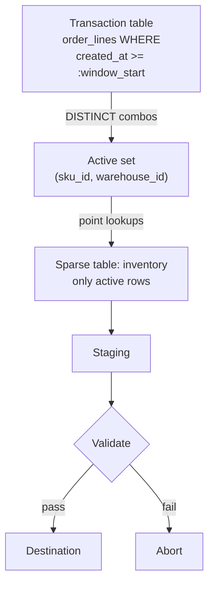

# Activity-Driven Extraction

> **One-liner:** Don't scan the sparse table at all -- use recent transaction history to identify which dimension combinations are active, then extract only those rows.

## The Problem

[[02-full-replace-patterns/0207-sparse-table-extraction|0207]] reduces transfer volume by filtering zeros at extraction. The source still scans the full table -- it just drops most rows before sending them. For a 10-million-row inventory table that's 95% zeros, you're still reading 10 million rows on the source every run and discarding 9.5 million of them. On a busy production ERP at peak hours, that scan may be a problem.

Activity-driven extraction skips the scan entirely. Instead of asking the sparse table "which of your rows are non-zero?", it asks the transaction table "which dimension combinations have been active recently?" -- then pulls only those specific rows from the sparse table. The source reads a few thousand rows instead of millions.

## The Mechanics



**Step 1: get active combos from movements.**

```sql
-- source: transactional
-- engine: postgresql
SELECT DISTINCT
    sku_id,
    warehouse_id
FROM inventory_movements
WHERE created_at >= :window_start;
```

Using `inventory_movements` rather than `order_lines` matters: movements capture every stock change -- sales, manual adjustments, transfers, write-offs. `order_lines` only captures sales. A combo updated through a bulk adjustment script would be invisible to an `order_lines`-based activity filter.

**Step 2: pull only those rows from the sparse table.**

```sql
-- source: transactional
-- engine: postgresql
SELECT
    i.sku_id,
    i.warehouse_id,
    i.on_hand,
    i.on_order
FROM inventory i
JOIN (
    SELECT DISTINCT sku_id, warehouse_id
    FROM inventory_movements
    WHERE created_at >= :window_start
) active USING (sku_id, warehouse_id);
```

The JOIN is preferable to an `IN` clause with tuple values -- tuple `IN` is valid PostgreSQL but not portable across all engines. The JOIN with a subquery or CTE works everywhere and the query planner handles it cleanly when `(sku_id, warehouse_id)` is indexed on both tables.

The source now reads a small slice of the inventory table via index lookups, not a full scan.

## The Assumption

Recent transactions are a reliable proxy for which inventory combinations matter. A combo that had activity in the last N days is worth tracking. A combo with no activity in that window is inactive enough to skip.

This holds for most inventory use cases. It breaks when:

- **Slow movers exist.** A SKU that sells once a quarter won't appear in a 30-day transaction window. It might still have 500 units on hand. If no one queries it, that's fine. If a consumer expects complete on-hand data, it's a blind spot.
- **New combos have no history.** A SKU just added to a warehouse has zero transactions. It won't appear in the active set until its first order.
- **Not all systems log every change to movements.** If a bulk import script updates `inventory` directly without inserting a row into `inventory_movements`, the combo changes but the activity signal doesn't fire. This is a soft rule: "every stock change creates a movement" -- until it doesn't. See [[00-front-matter/0002-domain-model|0002-domain-model]].

## Solving Blind Spots: Tiered Windows

A single activity window can't cover all cases without growing large enough to approach a full scan. The solution is the same as [[06-operating-the-pipeline/0607-tiered-freshness|0607]]: tier the cadences.

- **Daily**: short window (e.g. 30 days) -- catches everything that moved recently, fast and cheap
- **Weekly**: wider window (e.g. 180 days) -- catches slow movers, more expensive but still targeted
- **Monthly**: full scan via [[02-full-replace-patterns/0201-full-scan-strategies|0201]] -- catches everything the activity windows missed, resets any accumulated drift

The monthly full scan is the safety net. It's expensive but infrequent. The daily and weekly runs are fast because their active sets are small. Don't try to size a single window to cover slow movers -- a 365-day window defeats the purpose of the pattern.

> [!tip] The full scan is what makes this safe
> Without a periodic full scan, blind spots accumulate silently. A combo that fell outside all activity windows still exists in the source -- it's just invisible in the destination until the next full scan corrects it. Schedule the full scan, document its cadence, and treat it as load-bearing -- not optional.

## By Corridor

> [!example]- Transactional → Columnar (e.g. any source → BigQuery)
> Columnar destinations don't enforce PKs or maintain useful indexes for point lookups. MERGE is expensive without them. Inventory tables also rarely have a natural partition key -- a stock snapshot has no obvious business date to partition by.
> If the filtered set is small enough after activity-driven extraction, the cleanest option is a full staging swap ([[02-full-replace-patterns/0204-staging-swap|0204]]): replace the entire destination table, which is now small. The monthly full scan runs the same way. The destination stays small because the extraction is always activity-filtered -- the staging swap cost scales with active rows, not total rows.

> [!example]- Transactional → Transactional (e.g. any source → PostgreSQL)
> Natural fit. The destination has a composite PK on `(sku_id, warehouse_id)`. Load staging and upsert:
> ```sql
> -- engine: postgresql
> INSERT INTO inventory
> SELECT * FROM stg_inventory
> ON CONFLICT (sku_id, warehouse_id) DO UPDATE SET
>     on_hand  = EXCLUDED.on_hand,
>     on_order = EXCLUDED.on_order;
> ```
> The index makes this fast. No full destination scan required -- the database resolves each upsert via the PK index.

## Related Patterns

- [[02-full-replace-patterns/0207-sparse-table-extraction|0207-sparse-table-extraction]] -- simpler variant; still scans the sparse table, just filters it
- [[02-full-replace-patterns/0201-full-scan-strategies|0201-full-scan-strategies]] -- periodic reset that catches every blind spot
- [[02-full-replace-patterns/0204-staging-swap|0204-staging-swap]] -- load mechanism for columnar destinations
- [[02-full-replace-patterns/0206-rolling-window-replace|0206-rolling-window-replace]] -- activity window sizing follows the same logic as rolling window N
- [[06-operating-the-pipeline/0607-tiered-freshness|0607-tiered-freshness]] -- tiered cadences applied to the activity window
- [[03-incremental-patterns/0309-late-arriving-data|0309-late-arriving-data]] -- sizing the window for slow movers
