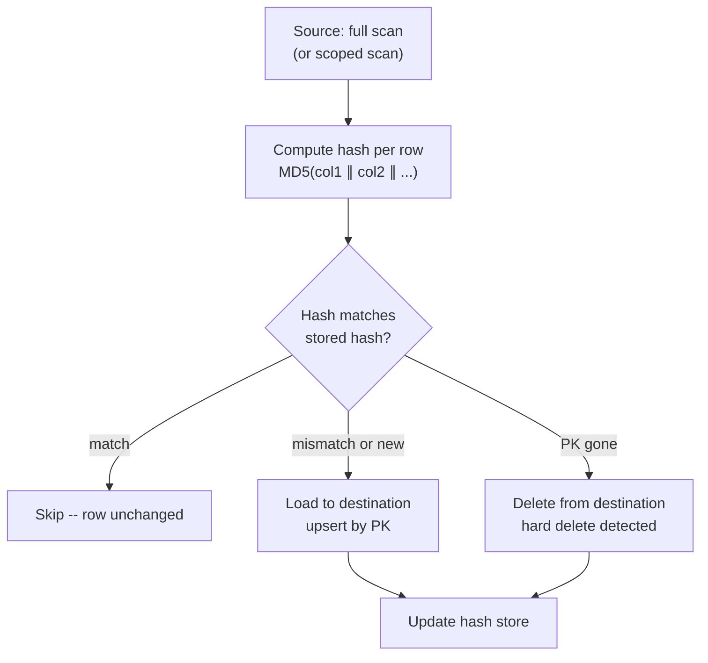

# Hash-Based Change Detection

> **One-liner:** No `updated_at`? Hash the row, compare to the last extraction, load only what changed.

## The Problem

Every incremental pattern in this book assumes the source has a cursor -- an `updated_at`, a sequence, a changelog. When that signal doesn't exist or can't be trusted (see [[01-foundations-and-archetypes/0105-the-lies-sources-tell|0105]]), the standard incremental approach fails silently. You either miss changes or you load everything every run.

A full replace every run is correct but expensive when only a small fraction of rows actually change. A 10-million-row products table where 50 rows change per day doesn't need 10 million destination writes nightly. Hash-based change detection threads the needle: read the full source, but write only the rows that are actually different.

This is a last resort, not a first choice. Reach for it when there is genuinely no cursor and the table is too large or the destination too expensive to justify a full replace on every run.

## The Mechanics



**Hash every source row.** Concatenate all data columns and compute a hash. The hash is a fingerprint of the row's current state.

```sql
-- source: transactional
-- engine: postgresql
SELECT
    id,
    name,
    price,
    category,
    MD5(
        COALESCE(name::text,     '') ||
        COALESCE(price::text,    '') ||
        COALESCE(category::text, '')
    ) AS _source_hash
FROM products;
```

**Compare against stored hashes.** Rows where `_source_hash` differs from the stored value have changed. Rows with no stored hash are new. Rows in the store with no corresponding source row were hard-deleted.

**Load only changed rows.** Write new and changed rows to the destination. Delete rows that disappeared. Skip everything else. On a table where 1% of rows change per run, 99% of destination writes are eliminated.

## Full Source Scan: Avoidable With Scoping

The naive implementation reads every source row to compute hashes -- the same cost as a full replace at source. The win is on the destination side: fewer writes, less DML cost, smaller staging loads.

Combined with [[02-full-replace-patterns/0204-scoped-full-replace|0204]], the source scan shrinks too. Scope the hash comparison to the managed zone -- rows within `scope_start → today`. Frozen history is never read or compared. You get the source-side savings of scoped replace and the destination-side savings of hash filtering in one pipeline.

## Where Hash State Lives

The hash comparison requires storing the previous hash somewhere. Two options with real trade-offs:

**`_source_hash` on the destination table.** The hash travels with the row. Comparison is a JOIN between source hashes and destination hashes: rows where they differ are changed. Simple, no extra infrastructure. The problem on columnar destinations: reading the `_source_hash` column to compare costs money. On BigQuery, that's a full column scan on every run. On Snowflake, it's warehouse compute. The comparison itself has a cost.

**Orchestrator state store.** Persist hashes in the orchestrator's own storage -- a key-value store, a metadata table on a cheap transactional database, or a local file. The destination is never queried for hashes. Comparison happens in the pipeline layer: source hashes vs. stored hashes, entirely outside the destination. More infrastructure to manage, but destination query costs for the comparison step go to zero.

For large columnar destinations where every column scan has a cost, the orchestrator state store pays for itself quickly. For transactional destinations where a column scan is cheap, `_source_hash` on the destination is simpler and sufficient.

## Column Selection and NULL Handling

Hash only source data columns. Exclude injected metadata -- `_extracted_at`, `_batch_id`, `_source_hash` itself. If a metadata column changes but the source data doesn't, you don't want a false positive.

Column order in the concatenation must be fixed and explicit. The hash is order-sensitive: `MD5('ab')` differs from `MD5('ba')`. Define the column order in code, not dynamically from schema introspection -- schema changes can silently reorder columns and invalidate your entire hash store.

NULL handling requires care. A naïve `col1 || col2` in SQL returns NULL if any column is NULL. Use `COALESCE`:

```sql
-- source: transactional
-- engine: ansi
MD5(
    COALESCE(col1::text, '') ||
    COALESCE(col2::text, '') ||
    COALESCE(col3::text, '')
)
```

There's a subtle trap: `COALESCE(col, '')` makes NULL and empty string indistinguishable. If your source distinguishes between them (a name that was never set vs. a name explicitly set to blank), use a separator that can't appear in the data, or encode NULLs explicitly (`COALESCE(col, '\x00')`).

## Hash Function Choice

MD5 is standard, available on every engine, and produces a 32-character string. Collision probability for a data pipeline is negligible -- you'd need billions of rows for even a theoretical concern. MD5 is the right default.

SHA-256 is more collision-resistant and produces 64 characters. Use it if regulatory requirements or security policy prohibit MD5, or if the table contains data where even a theoretical collision is unacceptable. The compute cost difference is minor on modern hardware.

## When to Use It

| Condition | Use hash detection? |
|---|---|
| No `updated_at` or unreliable cursor | Yes -- it's the primary use case |
| < ~1% of rows change per run | Yes -- destination write savings justify the overhead |
| Destination DML is expensive (columnar) | Yes -- hash filtering reduces the write cost significantly |
| Wide table, narrow change set | Yes -- avoid loading hundreds of columns for a handful of changed rows |
| > 10% of rows change per run | No -- overhead exceeds the savings, use full replace |
| Cheap transactional destination | Probably not -- just upsert everything |

## Combining With Scoped Replace

Hash detection and [[02-full-replace-patterns/0204-scoped-full-replace|0204]] compose cleanly. Define `scope_start`, scan only the managed zone at source, compute hashes for those rows, compare against stored hashes, load only changed rows within the scope. Frozen history is never touched.

The frozen zone's hashes don't need to be maintained -- those rows are immutable by definition. If you ever widen the scope backwards, treat the newly included historical rows as "new" (no stored hash) on the first run and load them fully.

## By Corridor

> [!example]- Transactional → Columnar (e.g. PostgreSQL → BigQuery)
> Hash comparison reduces the set of rows you need to write -- but it does not reduce the cost of writing them. On BigQuery, a MERGE that touches 10 rows still rewrites the entire partition containing those rows. On Snowflake, a MERGE still consumes warehouse time proportional to the scan, not the row count. The win from hash detection in columnar is narrowing **which partitions** you touch, not the cost per partition once you do.
>
> The practical approach: after hash comparison, identify which partitions contain changed rows, then use partition swap ([[02-full-replace-patterns/0202-partition-swap|0202]]) to replace only those partitions via staging. You avoid the DML concurrency constraints (BigQuery's 2-concurrent MERGE limit) and replace entire partitions cleanly rather than doing in-place mutations. Reach for MERGE only when the changed rows span too many partitions to swap individually, and accept the cost explicitly.
>
> If using `_source_hash` on the destination for comparison, reading that column on BigQuery costs bytes scanned. For large tables, storing hashes in an orchestrator state store is cheaper.

> [!example]- Transactional → Transactional (e.g. PostgreSQL → PostgreSQL)
> `_source_hash` on the destination is cheap -- a column scan on a transactional DB with an index is fast. Compare via JOIN, upsert changed rows by PK with `ON CONFLICT DO UPDATE`, delete missing PKs. The destination enforces the PK, so the upsert is safe. Simpler than the columnar case.

## Related Patterns

- [[01-foundations-and-archetypes/0105-the-lies-sources-tell|0105-the-lies-sources-tell]] -- broken cursors that make this necessary
- [[03-incremental-patterns/0302-cursor-based-extraction|0302-cursor-based-extraction]] -- the cursor-based alternative when `updated_at` works
- [[05-conforming-playbook/0501-metadata-column-injection|0501-metadata-column-injection]] -- `_source_hash` as a standard metadata column
- [[02-full-replace-patterns/0204-scoped-full-replace|0204-scoped-full-replace]] -- scope the hash comparison to avoid scanning frozen history
