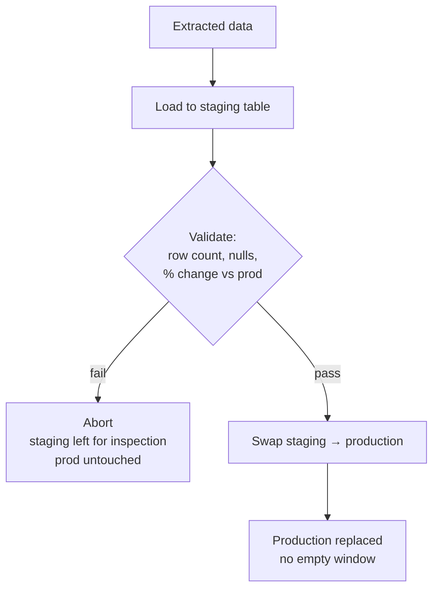

# Full Replace Load

> **One-liner:** Drop and reload. The simplest load strategy and the default -- stateless, idempotent, no merge logic.

---

## The Problem

The extraction patterns in Part II give you a dataset -- full table, scoped range, set of partitions -- and this page covers the destination-side mechanics: how to swap it in.

The naive TRUNCATE + INSERT leaves a window where the table is empty -- bad if anyone's querying it. Safer mechanisms exist, and the choice depends on how much downtime is acceptable and how much validation you want before committing.

---

## Truncate + Insert

```sql
-- destination: transactional
TRUNCATE TABLE orders;
INSERT INTO orders SELECT * FROM stg_orders;
```

The two operations aren't atomic. Between TRUNCATE and INSERT, the table is empty -- any consumer querying `orders` sees zero rows. If the INSERT fails halfway (connection drop, disk full, timeout), you're left with a partially loaded table and no way back, because TRUNCATE is DDL and can't be rolled back.

This works when the load completes in seconds and no consumers query during the load window -- small reference tables, internal staging tables, tables loaded during a maintenance window where dashboards are offline. For anything with live consumers or a load time measured in minutes, use staging swap instead.

> [!warning] TRUNCATE is DDL -- except in PostgreSQL
> In MySQL, SQL Server, BigQuery, and Snowflake, `TRUNCATE` is a DDL statement that commits implicitly and cannot be rolled back. Wrapping `TRUNCATE; INSERT` in a `BEGIN...COMMIT` block does not make it atomic in these engines. PostgreSQL is the exception: `TRUNCATE` is transactional there, so wrapping both in a transaction gives you atomicity for free.

---

## Staging Swap

Load into a staging table, validate, then swap to production. Consumers see complete data throughout -- the old version until the swap, the new version after.



The validation step between load and swap is the key advantage over truncate + insert. If the extraction returned garbage -- zero rows from a silent failure, a schema change that dropped columns, a type mismatch that cast everything to NULL -- you catch it before it reaches production.

The swap mechanism varies by engine: Snowflake has `ALTER TABLE SWAP WITH` (atomic, metadata-only), PostgreSQL uses `ALTER TABLE RENAME` inside a transaction, BigQuery uses `bq cp` or DDL rename. See [[02-full-replace-patterns/0203-staging-swap|0203]] for the per-engine mechanics, including the parallel schema convention for managing staging tables at scale.

---

## Partition Swap

When the table is partitioned and you're replacing a slice -- yesterday's data, last week's events, a backfill of a specific month -- partition swap replaces only the affected partitions while leaving the rest untouched.

```sql
-- destination: snowflake / redshift
BEGIN;
DELETE FROM events
WHERE partition_date BETWEEN :start_date AND :end_date;
INSERT INTO events SELECT * FROM stg_events;
COMMIT;
```

```bash
# destination: bigquery
# Partition copy -- near-metadata operation, near-free
bq cp --write_disposition=WRITE_TRUNCATE \
  project:dataset.stg_events$20260307 \
  project:dataset.events$20260307
```

The cost advantage is proportional to the scope: replacing 7 partitions out of 3,000 touches 0.2% of the table, while a full staging swap rewrites the entire thing. See [[02-full-replace-patterns/0202-partition-swap|0202]] for extraction-side mechanics, per-engine atomicity guarantees, and the partition alignment pitfalls.

---

## DROP vs TRUNCATE vs DELETE

Three ways to clear destination data before loading, each with different behavior:

| Operation | What it removes | DDL or DML | Transactional? | Speed |
|---|---|---|---|---|
| `DROP TABLE` | Schema + data | DDL | No (except PostgreSQL) | Instant -- metadata only |
| `TRUNCATE TABLE` | All rows, keeps schema | DDL | No (except PostgreSQL) | Fast -- no per-row logging |
| `DELETE FROM table` | All rows, keeps schema | DML | Yes | Slow -- logs every row |

`DROP` is used in staging swap workflows: drop the old production table, rename staging into its place. The risk: if the rename fails mid-way, the table vanishes. Wrapping both in a transaction (PostgreSQL, Snowflake, Redshift) eliminates this gap.

`TRUNCATE` is used in truncate + insert workflows. It deallocates storage without logging individual row deletions, which makes it orders of magnitude faster than DELETE on large tables. A 50M-row table that takes 30 minutes to DELETE completes a TRUNCATE in under a second -- the difference is that DELETE generates WAL/redo entries for every row while TRUNCATE resets the storage allocation in one operation.

`DELETE FROM table` (without a WHERE clause) achieves the same result as TRUNCATE but with full transactional semantics -- you can roll it back. The cost is the per-row logging: on a transactional destination, the WAL/redo log grows by the size of the table. On BigQuery, a full-table DELETE rewrites every partition. Use it only when you need the rollback guarantee and the table is small enough that the logging cost is acceptable.

> [!tip] In columnar engines, TRUNCATE and DELETE diverge further
> BigQuery `TRUNCATE` is a metadata operation that resets the table instantly at zero cost. `DELETE FROM table` without a WHERE clause rewrites every partition and charges for bytes scanned. Snowflake `TRUNCATE` reclaims storage immediately (no Time Travel retention); `DELETE` preserves Time Travel history. Choose based on whether you need the recovery window.

---

## Choosing a Mechanism

| Situation | Mechanism |
|---|---|
| Small table, no live consumers, load takes seconds | Truncate + Insert |
| Any table with live consumers or load > 30 seconds | Staging swap |
| Partitioned table, replacing a bounded range | Partition swap |
| PostgreSQL destination, need atomicity with minimal complexity | Truncate + Insert inside a transaction (PostgreSQL-only -- TRUNCATE is transactional there) |

All three are idempotent -- rerunning the same extraction and load produces the same destination state regardless of how many times you run it, with no accumulated state, no cursor, and no merge logic (see [[01-foundations-and-archetypes/0109-idempotency|0109]]). The shared failure mode is loading bad data into production before catching the problem, which only staging swap prevents through its validation step.

---

## By Corridor

> [!example]- Transactional → Columnar (e.g. any source → BigQuery)
> Staging swap is the standard for mutable tables. Partition swap for partitioned tables where only a slice needs replacing. Truncate + insert is viable for small reference tables loaded outside business hours. On BigQuery, prefer `bq cp` over DML for both staging swap and partition swap -- copy jobs are free (no slot consumption, no bytes-scanned charge) for same-region operations.

> [!example]- Transactional → Transactional (e.g. any source → PostgreSQL)
> All three mechanisms work cleanly. PostgreSQL's transactional TRUNCATE makes truncate + insert atomic for free -- a significant advantage over columnar destinations. For staging swap, the `RENAME` approach inside a transaction is atomic and instant. One caveat: foreign keys referencing the production table will break during the rename. Disable FK checks or drop and recreate constraints as part of the swap if other tables reference the target.

---

## Related Patterns

- [[02-full-replace-patterns/0202-partition-swap|0202-partition-swap]] -- per-engine partition swap mechanics, partition alignment, validation
- [[02-full-replace-patterns/0203-staging-swap|0203-staging-swap]] -- per-engine staging swap mechanics, schema conventions, grant handling
- [[01-foundations-and-archetypes/0109-idempotency|0109-idempotency]] -- full replace gets idempotency for free
- [[04-load-strategies/0402-append-only|0402-append-only]] -- when the source is immutable and no replace is needed
- [[04-load-strategies/0403-merge-upsert|0403-merge-upsert]] -- when only changed rows should be loaded, not the full table
- [[04-load-strategies/0406-reliable-loads|0406-reliable-loads]] -- atomicity and failure recovery for loads
- [[06-operating-the-pipeline/0610-extraction-status-gates|0610-extraction-status-gates]] -- gating the load on extraction status to prevent loading 0 rows
