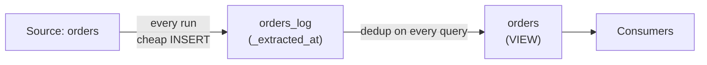
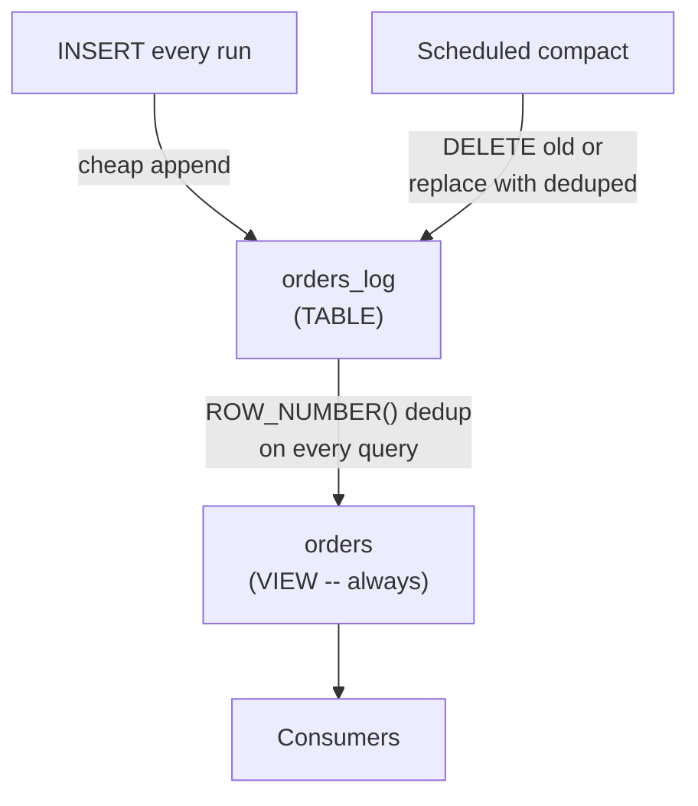

# Append and Materialize

> **One-liner:** Append every extraction as new rows. Deduplicate to current state with a view. Run as often as you want -- the load cost is near zero.

---

## The Problem

MERGE cost in columnar engines scales per run: every execution reads the destination, matches keys, and rewrites the affected partitions. If a single MERGE costs $X$, running it 24 times per day costs $24 \times X$ -- and the cost scales with table size and partition spread -- never batch size (see [[04-load-strategies/0403-merge-upsert|0403]]). This creates a ceiling on extraction frequency: you can only afford to run as often as the MERGE budget allows.

That ceiling directly limits purity. The less often you extract, the longer the destination drifts from the source between runs. Missed corrections, late-arriving data, and accumulated cursor gaps all widen with the interval. Running more often closes the gap -- but MERGE makes running more often expensive.

This pattern removes the per-run cost ceiling by replacing MERGE with a pure append. The load cost drops to near zero regardless of frequency, and the deduplication cost is paid separately -- once, on a schedule you control, decoupled from the extraction cadence.

---

## The Pattern

Every extraction run appends its results to a log table with a metadata column (`_extracted_at` or `_batch_id`) that identifies when the row was loaded:

```sql
-- destination: columnar
INSERT INTO orders_log
SELECT *, CURRENT_TIMESTAMP AS _extracted_at
FROM _stg_orders;
```

A view named `orders` -- the same name consumers would use with any other load strategy -- deduplicates to the latest version:

```sql
-- destination: columnar
CREATE OR REPLACE VIEW orders AS
SELECT *
FROM orders_log
QUALIFY ROW_NUMBER() OVER (PARTITION BY order_id ORDER BY _extracted_at DESC) = 1;
```

Consumers query `orders` and see the current state. The view abstracts the log entirely.



---

## Why This Maximizes Purity

The [[01-foundations-and-archetypes/0108-purity-vs-freshness|0108]] tradeoff frames purity and freshness as opposing forces -- full replace maximizes purity but caps freshness, incremental maximizes freshness but carries purity debt. Append-and-materialize shifts the balance toward both:

**Higher frequency = less drift.** With near-zero load cost, nothing stops you from extracting every 15 minutes instead of every hour. The shorter the interval between extractions, the smaller the window where the destination can diverge from the source -- missed corrections, late-arriving rows, and cursor gaps have less time to accumulate before the next extraction picks them up.

**The log is a temporary buffer.** The append log holds recent extractions until the next materialization compacts it -- a few days or weeks of overlap, scoped to the retention window. For permanent history, see [[02-full-replace-patterns/0202-snapshot-append|0202]]. Keeping the log short is what makes the pattern affordable: storage stays bounded, and the dedup scan stays fast.

**The dedup view absorbs duplicates by design.** Regardless of how many redundant copies sit in the log from overlapping windows, pipeline retries, or stateless extractions, `ROW_NUMBER() OVER (PARTITION BY order_id ORDER BY _extracted_at DESC) = 1` always returns the latest version. Duplicates cost storage until the next compaction, but they never corrupt the current state.

---

## The Duplicate Reality

With a cursor-based extraction ([[03-incremental-patterns/0302-cursor-based-extraction|0302]]), most of the batch is genuinely new or changed rows, and duplicates come from the overlap buffer -- a small fraction of each run.

With a stateless window ([[03-incremental-patterns/0303-stateless-window-extraction|0303]]), the situation inverts. A 7-day window re-extracts 7 days of data on every run, so if the pipeline runs daily, ~6/7 of each batch is rows the destination already has from previous runs -- deliberate duplicates built into the extraction window. The append log grows proportionally to window size × run frequency.

> [!warning] Size the retention policy to the extraction window
> A daily run with a 7-day window appends 7× the window volume to the log per week; after a month without compaction, the log holds ~30× the window volume. If the window is a small slice of the table (say, 7 days of changes on a 5-year table), the log overhead is modest. If the window is large relative to the table -- say, all open invoices at 40% of the table -- the log grows fast. The dedup view handles all of it correctly (the latest `_extracted_at` always wins), but the `ROW_NUMBER()` scan gets heavier with every run. The compaction cycle (covered below) keeps both storage and read cost under control.

---

## The Cost Shift

The cost of reconciling source and destination shifts from load time to read time and storage:

|                          | MERGE (0403)                                           | Append and Materialize                                           |
| ------------------------ | ------------------------------------------------------ | ---------------------------------------------------------------- |
| **Load cost**            | Scales with table size and partition spread, per run   | Near zero -- pure INSERT, per run                                |
| **Query overhead**       | None -- destination is already reconciled at load time | Dedup scan on every query against the view                       |
| **Materialization cost** | N/A                                                    | Full dedup scan, but on your schedule                            |
| **Storage**              | 1× source volume                                       | ~1× source volume after compaction + window size × runs until compaction |

The shift is favorable when extraction frequency matters more than read frequency. If you load 24 times per day but consumers query the current state 4 times per day, paying for 4 dedup scans is cheaper than paying for 24 MERGEs. It's unfavorable when many consumers query `orders` constantly -- the dedup scan runs on every query, and the cost could exceed what the MERGE would have been.

It's usually the case that you want data freshness more frequently than consumption, since most business customers want "New data" whenever they ask for it, but aren't constantly consuming it. More "on demand" than "live".

Compaction (below) is the lever that controls the read-side cost: compact the log regularly and the view's dedup scan stays fast, regardless of extraction frequency.

---

## Compaction

The dedup view runs `ROW_NUMBER()` against the full log on every query. Without compaction, the log grows with every run -- a daily pipeline with a 7-day stateless window adds 7× the window volume per week, and the view's scan grows proportionally. Two strategies for keeping the log small, run as a periodic scheduled job:

```sql
-- destination: columnar
-- Strategy 1: trim by retention window (drops old extractions)
DELETE FROM orders_log
WHERE _extracted_at < CURRENT_DATE - INTERVAL '30 days';
```

```sql
-- destination: columnar
-- Strategy 2: compact to latest-only (one row per key, all extraction history gone)
CREATE OR REPLACE TABLE orders_log AS
SELECT *
FROM orders_log
QUALIFY ROW_NUMBER() OVER (PARTITION BY order_id ORDER BY _extracted_at DESC) = 1;
```



Compaction frequency determines how large the log gets between runs and how heavy the view's dedup scan is at peak -- not how stale the view is. The view always reflects the latest version of every row currently in the log; compaction just controls how much extraction history the log carries.

**Retention window sizing.** The retention window must be longer than the extraction window. A 7-day stateless extraction with a 7-day retention means the oldest batch is dropped just as the next run re-extracts the same rows -- safe, but with zero margin for investigation or replay. A 14-day retention on a 7-day extraction window gives a full week of buffer.

**Compact to latest-only.** Replacing the log with the deduplicated result collapses all versions into the current state, reclaims storage completely, and reduces the view's `ROW_NUMBER()` scan to near-trivial size. The tradeoff is that all extraction history is gone -- for point-in-time reconstruction, see [[02-full-replace-patterns/0202-snapshot-append|0202]].

> [!tip] Partition the log by `_extracted_at` for cheap retention drops
> If you use it as a permanent log storage, `orders_log` partitioned by `_extracted_at` turns retention drops into partition drops -- a metadata operation instead of a full-table DELETE. If you compact to latest-only, rebuild `orders_log` partitioned by a business date (`order_date`) so the view's scan benefits from partition pruning on the dimension consumers actually filter on.

Retention doesn't have to be all-or-nothing. For tables where consumers need recent data at high granularity but historical data at lower granularity -- daily stock snapshots for the last 60 days, monthly thereafter -- a tiered compaction job can compress older entries without erasing them entirely. [[02-full-replace-patterns/0202-snapshot-append|0202]] covers the mechanics under "Tiered Retention."

---

## By Corridor

> [!example]- Transactional → Columnar (e.g. any source → BigQuery)
> This is the primary corridor for this pattern -- columnar engines are where MERGE is expensive and append is cheap. Partition `orders_log` by `_extracted_at` (date) for retention management and cluster by `order_id` for dedup performance. BigQuery storage at ~$0.02/GB/month means the log overhead is affordable when the window is a small fraction of the table, but monitor growth -- a large window on a large table accumulates fast.

> [!example]- Transactional → Transactional (e.g. any source → PostgreSQL)
> Less common here because `INSERT ... ON CONFLICT` is already cheap on transactional engines -- the MERGE cost ceiling that motivates this pattern doesn't exist. Use append-and-materialize on PostgreSQL when the auditing use case justifies the overhead.

---

## Related Patterns

- [[01-foundations-and-archetypes/0108-purity-vs-freshness|0108-purity-vs-freshness]] -- the tradeoff this pattern optimizes: cheaper loads → higher frequency → less drift → more purity
- [[04-load-strategies/0402-append-only|0402-append-only]] -- the simpler case where the source is immutable and no dedup is needed
- [[04-load-strategies/0403-merge-upsert|0403-merge-upsert]] -- the per-run cost ceiling this pattern removes
- [[04-load-strategies/0405-hybrid-append-merge|0405-hybrid-append-merge]] -- append for history + MERGE for current state, when the read-side cost of the dedup view is too high
- [[04-load-strategies/0401-full-replace|0401-full-replace]] -- the full-replace mechanics used when compacting the log to latest-only state
- [[03-incremental-patterns/0303-stateless-window-extraction|0303-stateless-window-extraction]] -- the extraction pattern that produces mostly-duplicate batches by design
- [[05-conforming-playbook/0501-metadata-column-injection|0501-metadata-column-injection]] -- `_extracted_at` and `_batch_id` as the dedup ordering key
