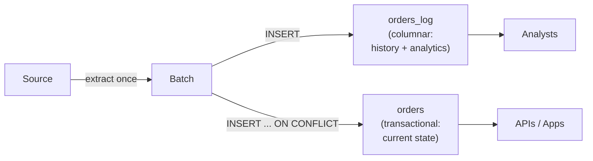

# Hybrid Append-Merge

> **One-liner:** Extract once, load to two engines: append-only log in columnar, current-state table in transactional.

---

## The Problem

The previous load strategies each optimize for one consumer type. [[04-load-strategies/0404-append-and-materialize|0404]] gives you cheap appends and a full extraction log, but every read pays a `ROW_NUMBER()` dedup scan -- fine for analytical queries that run a few times a day, painful for an API that hits the table hundreds of times per minute. [[04-load-strategies/0403-merge-upsert|0403]] gives you a clean current-state table with zero read overhead, but MERGE in columnar engines is expensive per run, which caps your extraction frequency.

If you have consumers on both sides -- analysts who want history and operational systems that need low-latency point queries on current state -- neither pattern alone covers both without a painful tradeoff on the other side.

---

## The Pattern

Extract once. Load the same batch to two destinations in different engines, each playing to its strength:

1. **Columnar** (e.g. BigQuery): append-only log table. Pure INSERT, near-zero load cost. History lives here -- analysts query it, and the dedup view from [[04-load-strategies/0404-append-and-materialize|0404]] gives them current state when they need it. High-volume, low-frequency consumption

2. **Transactional** (e.g. PostgreSQL): current-state table via `INSERT ... ON CONFLICT UPDATE`. Cheap upsert, instant point queries. Operational consumers -- APIs, application backends, services that validate state before acting (e.g. stock check before order confirmation) -- read from here without touching the log. Best for high-frequency, low-volume consumption

The log gives you replay and history; the current table gives you low-latency reads without dedup overhead. Neither destination is redundant because each serves a consumer type the other engine handles poorly.

---

## Why It Only Makes Sense with Two Destinations

On a single columnar engine, adding a current-state table means running a MERGE alongside the append -- you're paying the exact cost of [[04-load-strategies/0403-merge-upsert|0403]] plus the append, which is strictly worse than choosing one or the other. On a single transactional engine, the append log doesn't give you anything that `INSERT ... ON CONFLICT` doesn't already handle cheaply, since transactional engines do upserts and point queries well on the same table.

The pattern earns its complexity only when each destination plays to a different engine's strength. If you don't have two engines in your architecture, use [[04-load-strategies/0404-append-and-materialize|0404]] for columnar or [[04-load-strategies/0403-merge-upsert|0403]] for transactional and stop there.

---

## The Complexity Ceiling

This is the most operationally complex load strategy in this book, and for most pipelines it's the upper bound of what's reasonable. You're maintaining two destinations per table, two sets of failure modes, two retention policies, two schema-evolution policies, and the orchestrator needs to treat the pair as a unit. Every table you add to this pattern doubles the surface area you monitor.

> [!warning] Earn this complexity per table, don't apply it as a default
> Most tables don't have both analytical and operational consumers. Run [[04-load-strategies/0404-append-and-materialize|0404]] or [[04-load-strategies/0403-merge-upsert|0403]] as the default and promote individual tables to 0405 only when a real consumer can't be served by the simpler strategy. If you find yourself putting more than a handful of tables through this pattern, reconsider whether the operational consumers truly need a separate engine or whether a compacted [[04-load-strategies/0404-append-and-materialize|0404]] with a materialization schedule is good enough.

---

## Orchestration

The two writes must be treated as a single pipeline unit. If the append to columnar succeeds but the upsert to transactional fails, the log has a batch that the current-state table doesn't reflect -- consumers see different versions of the truth depending on which engine they query.

**Idempotency on both sides.** The append side is naturally idempotent if combined with the dedup view from [[04-load-strategies/0404-append-and-materialize|0404]] -- duplicate rows in the log don't corrupt the current state. The upsert side is idempotent by design (`INSERT ... ON CONFLICT UPDATE` with the same data produces the same result). A retry of the full pipeline unit is safe as long as both writes use the same batch.

**Failure handling.** If either write fails, the orchestrator should retry the full unit -- not just the failed half. Retrying only the failed side risks the two destinations drifting apart on `_extracted_at` or `_batch_id` if the batch is regenerated between retries.

---

## When to Use This

- You already have both a columnar and a transactional engine in your architecture
- Operational consumers need low-latency point queries on current state (APIs, app backends, validation services) that a dedup view can't serve fast enough
- Analytical consumers need history or replay from the append log
- Without both consumer types, this pattern is overhead: use [[04-load-strategies/0404-append-and-materialize|0404]] for columnar-only, [[04-load-strategies/0403-merge-upsert|0403]] for transactional-only

---

## By Corridor

This pattern is inherently cross-corridor: columnar for the log side, transactional for the current-state side. It doesn't apply within a single corridor -- that's exactly why the simpler patterns exist.

---

## Related Patterns

- [[04-load-strategies/0403-merge-upsert|0403]] -- the upsert mechanic used on the transactional side
- [[04-load-strategies/0404-append-and-materialize|0404]] -- the append + dedup view used on the columnar side
- [[04-load-strategies/0406-reliable-loads|0406]] -- checkpointing and partial failure recovery, especially relevant here where two destinations can fail independently
- [[05-conforming-playbook/0501-metadata-column-injection|0501]] -- `_extracted_at` and `_batch_id` must be consistent across both destinations for the pair to be reconcilable
