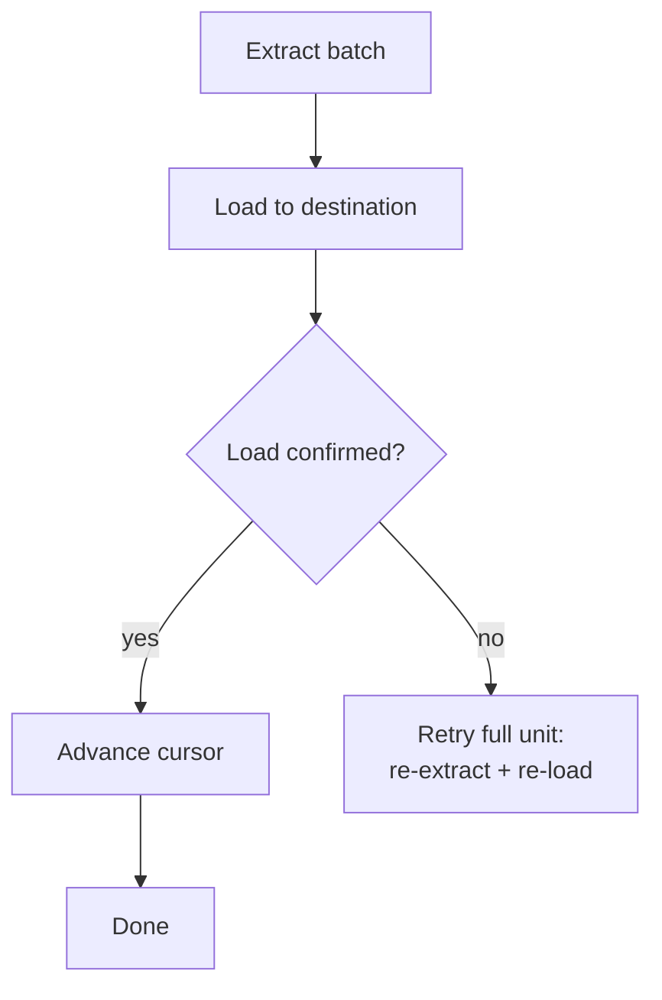

# Reliable Loads

> **One-liner:** Checkpointing, partial failure recovery, idempotent loads. How to make the load step survive failures without losing or duplicating data.

---

## The Problem

A pipeline can die after extraction but before load, mid-load with half the batch written, or after load but before the cursor advances. Each failure point leaves different residue -- a dangling staging table, a partially written partition, a cursor pointing to data the destination never received. The extraction strategy determines what you pulled; this pattern determines whether the destination survives it.

Full replace ([[04-load-strategies/0401-full-replace|0401]]) sidesteps most of this: every run overwrites everything, so there's no residue from a prior failure to clean up. The load is idempotent by construction. The patterns below matter when you're running incremental loads -- [[04-load-strategies/0403-merge-upsert|0403]], [[04-load-strategies/0404-append-and-materialize|0404]], or [[04-load-strategies/0405-hybrid-append-merge|0405]] -- where the destination accumulates state across runs and a bad load can corrupt that state permanently.

---

## Idempotency at the Load Step

A load is idempotent if running it twice with the same batch leaves the destination unchanged. This is the single most important property for reliability -- retries are always safe, and the orchestrator doesn't need to know whether the previous attempt succeeded, partially succeeded, or crashed mid-flight.

**MERGE/upsert ([[04-load-strategies/0403-merge-upsert|0403]])** is naturally idempotent: `INSERT ... ON CONFLICT UPDATE` with the same data produces the same result regardless of how many times it runs. The key match absorbs duplicates, and the update overwrites with identical values.

**Append ([[04-load-strategies/0404-append-and-materialize|0404]])** is idempotent at the view level but not at the table level. A retry appends the same rows again, doubling them in the log -- but the `ROW_NUMBER()` dedup view still returns the correct current state because it picks the latest `_extracted_at` per key. Storage cost goes up, correctness doesn't break. Compaction cleans up the duplicates later.

**Full replace ([[04-load-strategies/0401-full-replace|0401]])** is idempotent by definition: the destination is rebuilt from scratch on every run, so no prior state can interfere.

> [!tip] Test idempotency by running the same load twice
> The simplest validation: run a load, record the destination state, run the exact same load again, compare. If anything changed, the load isn't idempotent and you need to understand why before going to production.

---

## Statelessness

A pipeline that can run on a fresh machine with no local state is valuable -- especially when the orchestrator dies at 2am and you're debugging from a laptop. No local files, no SQLite checkpoint databases, no environment variables from a wrapper script. Just clone, set credentials, run.

Two things break statelessness:

**Local cursor files.** If the high-water mark lives in a local file or an in-memory store, a new machine doesn't know where the last successful run left off. Store the cursor in the destination itself (query `MAX(_extracted_at)` from the target table) or in an external state store that survives machine replacement -- see [[03-incremental-patterns/0302-cursor-based-extraction|0302]] for the tradeoffs.

**Local staging artifacts.** Some pipelines extract to local disk (Parquet files, CSV dumps) before loading. If the machine dies between extraction and load, the artifacts are gone and the cursor may have already advanced past the data they contained. Either re-extract on retry (stateless window via [[03-incremental-patterns/0303-stateless-window-extraction|0303]] handles this naturally) or stage to durable storage (S3, GCS) before advancing any cursor.

> [!warning] "Works on my machine" is not stateless
> If the pipeline depends on a prior run having populated a temp directory, a local SQLite checkpoint database, or an environment variable set by a wrapper script, it will fail on a fresh machine. The test is simple: clone the repo, set credentials, run. If it doesn't work, it's not stateless.

---

## Checkpoint Placement

The checkpoint is when you declare success -- advance the cursor, mark a partition materialized. Where you place it determines what breaks when something fails:

**Before load (gap risk).** The cursor advances, then the load starts. If the load fails, the cursor points past data that was never loaded. The next run starts from the new cursor position and skips the failed batch entirely -- unless the extraction uses a lookback window or overlap buffer (see [[03-incremental-patterns/0303-stateless-window-extraction|0303]]) that covers the gap. Even with lookback, this placement relies on the safety net catching every failure, which is the wrong default.

**After load, before confirmation (reprocessing risk).** The load completes, but the cursor update fails (network error, orchestrator crash). The next run re-extracts and re-loads the same batch. With an idempotent load strategy (MERGE or append + dedup view), this is harmless -- the data lands twice but the destination state is correct. With a non-idempotent load (raw INSERT without dedup), you get duplicates.

**After confirmed load (correct).** The cursor advances only after the destination confirms the load succeeded -- a successful MERGE, a confirmed partition swap, a row count check on the target. This is the safe default: failures before confirmation mean the next run reprocesses the same batch, which is safe if the load is idempotent.

The gap between "load completes" and "cursor advances" is the vulnerability window. Keep it as small as possible -- ideally a single transaction that writes the data and updates the cursor atomically. When that's not possible (columnar engines don't support cross-table transactions), make the load idempotent so the reprocessing path is always safe.

---

## Partial Load Recovery

Not every failure is total. A batch of 10 partitions where 8 succeed and 2 fail leaves the destination in a mixed state: some data is current, some is stale or missing.

**MERGE/upsert recovers naturally.** Re-running the full batch re-applies all 10 partitions; the 8 that already succeeded are overwritten with identical data (idempotent), and the 2 that failed are applied for the first time. No special handling needed, no data loss.

**Append without compaction needs care.** Re-running the full batch appends all 10 partitions again, including the 8 that already landed. The dedup view handles it correctly (latest `_extracted_at` wins), but the log now has duplicate copies of the successful partitions. Not a correctness issue, but it inflates storage and slows the dedup scan until the next compaction.

**Full replace is immune.** The entire destination is rebuilt, so partial state from a prior failure is overwritten completely.

> [!tip] Retry the full batch unless the source can't handle it
> Retrying only the 2 failed partitions introduces complexity: the orchestrator needs to track per-partition success/failure, and the retry batch has a different shape than the original. Reserve per-partition retry for sources that can't afford a second full extraction -- an overloaded transactional database, a rate-limited API, or a query that takes hours to run. If the source can give you the full batch again without pain, re-extract and re-load everything; with an idempotent load strategy, the cost of re-applying the successful partitions is just wasted compute, not a correctness risk.

---

## Orchestrator Integration

Orchestrator retries and backfills interact with cursor state in ways that will surprise you.

**Automatic retries.** Most orchestrators can retry a failed run automatically. If the load is idempotent, automatic retries are safe and you should enable them. If the load is not idempotent (raw INSERT), automatic retries create duplicates -- disable them or fix the load strategy first.

**Backfills.** A backfill replays a date range or partition range, typically to repair corrupted data or to onboard a new table. The backfill should not advance the production cursor -- it's filling in historical data, not moving the pipeline forward. Partition-based orchestrators handle this naturally (each partition has its own materialization status). Cursor-based pipelines need a separate code path that loads the backfill range without touching the high-water mark.

**Concurrent runs.** If the orchestrator allows overlapping runs (a retry starts before the previous attempt finishes), the two runs can race on cursor advancement or produce interleaved writes. Either enforce mutual exclusion (one run at a time per table) or ensure the load is idempotent and the cursor advancement is atomic.

---

## Health Monitoring

A pipeline that fails silently is worse than one that fails loudly. Your orchestrator can tell you when a run fails -- but if the orchestrator itself dies, or a run hangs forever, or a run "succeeds" with 0 rows, nobody gets paged. You find out Monday morning when someone asks why the dashboard is stale.

**Monitor from outside the pipeline.** The destination should be observable independently of the orchestrator. A scheduled query that checks `MAX(_extracted_at)` against the current time and alerts when it exceeds a threshold works regardless of whether the orchestrator is alive. If the orchestrator dies at 2am and the pipeline doesn't run, the freshness check fires at 8am and somebody knows.

**Distinguish "0 rows extracted" from "extraction failed."** A successful run that returns 0 rows is normal for some tables (no changes since last run, empty table) and a red flag for others (a table that always has activity). [[06-operating-the-pipeline/0609-extraction-status-gates|0609]] covers this in detail -- gate the load on extraction status so a silent failure doesn't advance the cursor past a real gap.

**Push, then alert on absence.** After each successful load, push a heartbeat (a row in a monitoring table, a metric to your observability stack, a timestamp in a health-check endpoint). Alert when the heartbeat stops arriving. This catches every failure mode: orchestrator crash, hung run, infrastructure outage, credential expiration -- anything that prevents the pipeline from completing.

---

## By Corridor

> [!example]- Transactional → Columnar
> The cursor-and-confirmation gap is wider here because columnar engines don't support cross-table transactions -- you can't atomically write data and advance a cursor in a single commit. Rely on idempotent loads (MERGE or append + dedup view) so the reprocessing path after a gap is always safe. External freshness monitoring is especially important because columnar loads are often async (BigQuery load jobs, Snowflake COPY INTO) and can fail silently.

> [!example]- Transactional → Transactional
> Transactional engines allow atomic cursor advancement: write the data and update the cursor in the same transaction, making the confirmation gap effectively zero. This is the simplest path to reliable loads -- if you can use it, do. Partial load recovery is also simpler because you can wrap the entire batch in a single transaction and roll back on failure.

---

## Related Patterns

- [[03-incremental-patterns/0302-cursor-based-extraction|0302]] -- cursor storage and advancement, the extraction-side complement to this pattern
- [[03-incremental-patterns/0303-stateless-window-extraction|0303]] -- naturally idempotent and stateless, sidesteps most checkpoint concerns
- [[04-load-strategies/0401-full-replace|0401]] -- idempotent by construction, the baseline that incremental loads need to match
- [[04-load-strategies/0403-merge-upsert|0403]] -- upsert makes partial load recovery and retries natural
- [[04-load-strategies/0404-append-and-materialize|0404]] -- append + dedup view absorbs duplicates from retries
- [[04-load-strategies/0405-hybrid-append-merge|0405]] -- two destinations means two failure surfaces, making reliable loads doubly important
- [[06-operating-the-pipeline/0609-extraction-status-gates|0609]] -- gating loads on extraction status to prevent silent failures
- [[01-foundations-and-archetypes/0109-idempotency|0109]] -- the foundational property that makes everything in this pattern work
