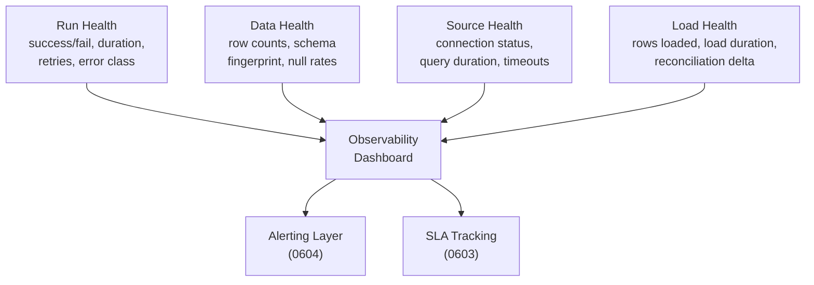

# Monitoring and Observability

> **One-liner:** Row counts tell you the pipeline ran. They don't tell you it ran *well*, or that the data it produced is worth trusting.

## The Problem
- Most pipelines start with a single check: "did it succeed?" That binary covers maybe 40% of what can go wrong
- A pipeline can succeed while producing garbage: schema drifted upstream and the loader silently dropped columns, a query timed out and returned partial results, a full replace that used to take 3 minutes now takes 45 because the table grew 10x
- Without structured observability, you discover problems when a stakeholder asks why the dashboard is wrong -- days after the data broke

## Four Layers of Pipeline Observability

### 1. Run Health
- Important: Success / failure / partial failure status per table
- Important: Execution duration *and its trend* -- a 3-minute job creeping to 30 minutes is a signal even when it still succeeds
- Optional: Error classification: connection timeout, query error, load failure, permission denied
- Optional: Retry count per run -- retries that succeed still indicate instability

### 2. Data Health
- Important: Row count per extraction -- track the trend, not just "nonzero"; a 50% drop is a signal
	- Total rows in destination over time is useful for data growth
	- Rows extracted over time is really useful in incrementals, shows big moments of change (ends of months) where you may want to increase your scanning windows
- Optional: Schema fingerprint: column count, column names, column types; detect drift before it breaks downstream (see [[06-operating-the-pipeline/0608-data-contracts|0608]]) 
- Optional: Null rates on key columns -- a cursor column going NULL is a different failure mode than a description column going NULL
- Important: Freshness: when was this table last successfully loaded? (see [[06-operating-the-pipeline/0603-sla-management|0603]])

### 3. Source Health
- Optional: Connection success/failure per source system
- Important: Query duration at source -- the extraction query isolated from load performance
- Important: Timeout frequency -- queries that hit the threshold even when they eventually return (on retry for example)
- Important and Useful for Sales: Source system load impact: are your queries running during business hours on a system that can't handle it? (see [[06-operating-the-pipeline/0606-source-system-etiquette|0606]]). If you can tell you use less than 1% of the dbs capacity, you can sell it as a great solution

### 4. Load Health
- Redundant?: Bytes written / rows loaded per destination operation
- Important: Load duration, separate from extraction duration
- Optional: Destination-side errors: quota exceeded, permission denied, schema mismatch
- VERY important: Reconciliation delta: source count vs destination count after load (see [[06-operating-the-pipeline/0613-reconciliation-patterns|0613]])

## The Minimum Viable Dashboard

> [!tip] The four numbers you check first every morning
> (1) how many tables failed overnight, (2) which ones are stale beyond their SLA, (3) any row count anomalies, (4) cost per day. Everything else is drill-down.

## The Pattern



## SQL Example

### The Health Table

After every pipeline run, append a row to a health table. One row per table per run, with everything you need to spot problems:

```sql
-- destination: bigquery
-- Schema of the health table. Each pipeline run appends one row per table.
CREATE TABLE health_check.client_table_health (
  timestamp_utc            TIMESTAMP,
  client                   STRING,
  table_id                 STRING,
  source_rows              INT64,
  destination_rows         INT64,
  status                   STRING, -- SUCCESS, FAILED, WARNING (on source != destination)
  extraction_seconds       FLOAT64,
  rows_extracted           INT64,
  normalization_seconds    FLOAT64,
  load_seconds             FLOAT64,
  run_id                   STRING -- id to quickly reference in orchestrator
);
```

The columns that matter most for daily monitoring: `status` (did it work), `source_rows` vs `destination_rows` (is the data complete), and the timing breakdown -- `extraction_seconds`, `normalization_seconds`, `load_seconds` -- which tells you where the time goes when a pipeline slows down. The `run_id` links back to your orchestrator for drill-down.

> [!tip] Break timing into phases
> A single `total_seconds` column hides whether the bottleneck is the source query, the normalization step, or the destination load. Separate columns let you spot which phase is degrading without digging into logs.

If you run multiple pipeline flavors (different source systems, different extractors), each one writes to its own health table. Unify them with a view or a UNION ALL query so monitoring doesn't care which pipeline produced the data.

### Staleness Report

Once the health table exists, staleness is a simple aggregation:

```sql
-- destination: bigquery
SELECT
  client,
  table_id,
  MAX(timestamp_utc) AS last_successful_run,
  TIMESTAMP_DIFF(
    CURRENT_TIMESTAMP(),
    MAX(timestamp_utc),
    HOUR
  ) AS hours_stale
FROM health_check.client_table_health
WHERE status = 'SUCCESS'
GROUP BY client, table_id
HAVING hours_stale > 24
ORDER BY hours_stale DESC
```

## Where Your Orchestrator Fits

### Single Orchestrator
- Every orchestrator already tracks run status, duration, and dependency graphs -- use what's there, add what's missing
- The orchestrator's native health page covers Run Health almost entirely
- Data Health, Source Health, and Load Health are where you'll need to build: post-load checks, validations, metadata queries against the destination. Some orchestrators let you attach custom metadata to each table after a run -- Dagster's custom asset metadata, for example, lets you record extraction duration, row counts, and discrepancy percentage directly on the table and query it from the UI. Others only give you pass/fail. This is a major differentiator when evaluating orchestrators for ECL workloads (see [[08-appendix/0805-orchestrators|Appendix: Orchestrators]]).

### Orchestrator-per-Client (Orchestrator Cluster)
- When each client runs its own orchestrator instance, no single UI gives you the full picture -- you have N dashboards, one per client
- The health table becomes the unified monitoring layer that sits above the orchestrators: every instance appends to the same destination table after each run
- An external API can configure all instances and the health table is where their results converge -- this is where monitoring outside the orchestrator earns its complexity
- Without the health table, "how many tables failed last night" requires opening multiple UIs

## Anti-Pattern

> [!danger] Don't confuse monitoring with alerting
> - Monitoring is the dashboard you look at; alerting is the pager that wakes you up. They share data, but the threshold for "worth recording" is much lower than "worth paging someone" (see [[06-operating-the-pipeline/0604-alerting-and-notifications|0604]])
> - Don't track everything at the same granularity -- per-row metrics on a 100M row table are storage, not observability
> - Don't build a custom monitoring stack when your orchestrator ships with run history, duration, and status out of the box unless you're dealing with more than one orchestrator in the chain (Orchestrator cluster)

## Related Patterns
- [[05-conforming-playbook/0501-metadata-column-injection|0501-metadata-column-injection]] -- `_extracted_at` and `_batch_id` make monitoring queries possible
- [[06-operating-the-pipeline/0602-cost-monitoring|0602-cost-monitoring]] -- cost is a specific monitoring dimension with its own pattern
- [[06-operating-the-pipeline/0603-sla-management|0603-sla-management]] -- freshness SLAs are built on the staleness data tracked here
- [[06-operating-the-pipeline/0604-alerting-and-notifications|0604-alerting-and-notifications]] -- alerting consumes monitoring data; 0601 = what to track, 0604 = what to act on
- [[06-operating-the-pipeline/0606-source-system-etiquette|0606-source-system-etiquette]] -- source health metrics tell you when you're hurting the source
- [[06-operating-the-pipeline/0608-data-contracts|0608-data-contracts]] -- schema fingerprinting feeds contract enforcement
- [[06-operating-the-pipeline/0609-extraction-status-gates|0609-extraction-status-gates]] -- gates are inline monitoring; 0601 is retrospective
- [[06-operating-the-pipeline/0613-reconciliation-patterns|0613-reconciliation-patterns]] -- reconciliation delta is a specific data health metric

## Notes
- **Author prompt -- integrity_summary_job**: You built a reconciliation job that compares source vs destination counts across all clients. Has it ever caught something that would have gone unnoticed otherwise? What was the failure mode? 
	- A client was deleting a TON of rows from invoices before we figured out their invoice table had drafts too. We were leaving a ton of drafts that they did not want to see and we incorporated a daily PK comparison job to delete drafts. 
- **Author prompt -- duration creep**: With ~6500 tables, have you had a table silently grow so large that extraction time started overlapping with the next scheduled run? How did you notice?
	- Absolutely, however it wasn't a problem until our pipelines started crashing, noticed we always were getting failures on the 3PM job specifically, then we noticed the clashing. It was as simple as updating the heavier tables with tiered freshness [[0607-tiered-freshness]]
- **Author prompt -- morning routine**: When you open the Dagster UI in the morning, what's the actual sequence? Failed runs first? Stale assets? Something else?
	- First thing I see in my multi-orch is Orchestrator health, after that, stale assets and after that, row count discrepancies.
- **Author prompt -- false signals**: Any metrics you tracked early on that turned out to be noise -- things that looked like signals but weren't worth monitoring?
	- Row count discrepancies are not a problem if your destination has slightly less than the source. since you count AFTER extracting then loading, most times there will be new rows created between you running the query and finishing the pipeline.

