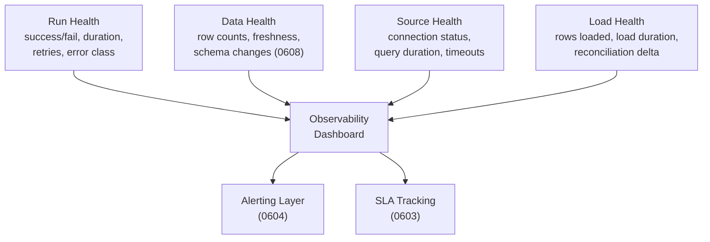

# Monitoring and Observability

> **One-liner:** Row counts tell you the pipeline ran. They don't tell you it ran *well*, or that the data it produced is worth trusting.

## The Problem

Most pipelines start with a single check: did it succeed? That binary signal covers maybe 40% of what can go wrong. A pipeline can succeed while producing garbage -- a query timed out and returned partial results, a full replace that used to take 3 minutes now takes 45 because the table grew 10x, or the source schema changed and the loader silently dropped columns. Every one of these scenarios reports SUCCESS. Every one of them delivers broken data to consumers.

Without structured **observability**, you discover these problems when a stakeholder asks why the dashboard is wrong -- often days after the data actually broke. By that point the blast radius is wide: downstream models have consumed the bad data, reports have been sent, and the person asking is already frustrated. The monitoring pattern in this chapter is about catching those failures before anyone else does, ideally within minutes of the pipeline run that caused them.

The key insight is that you need to track more than pass/fail, but you also need to resist the urge to track everything. Every metric you record has a storage cost and a cognitive cost -- someone has to look at it, and if the dashboard has 40 numbers, nobody looks at any of them carefully. The goal is a small set of raw measurements that cover the important failure modes, from which you can derive everything else.

## When You'll See This

| Signal                                             | Example                                                                                                       |
| -------------------------------------------------- | ------------------------------------------------------------------------------------------------------------- |
| Stakeholder reports stale data before you notice   | "The dashboard hasn't updated since yesterday" and your pipeline shows SUCCESS                                |
| Pipeline succeeds but row counts are wrong         | `orders` usually extracts 450k rows; today it extracted 12k and nobody flagged it                             |
| Gradual performance degradation goes unnoticed     | A 4-minute extraction creeps to 25 minutes over 3 months, then starts overlapping with the next scheduled run |
| Schema changes at source break downstream silently | Source adds a column, loader drops it, downstream query references it, consumer sees NULLs                    |
| Partial failures produce incomplete data           | Half the batch loaded, the other half timed out, destination has rows from two different points in time       |

## Four Layers of Pipeline Observability

Observability breaks into four layers, each covering a different failure mode. You don't need all of them on day one -- Run Health and Data Health cover the critical cases, and the other two earn their place as your pipeline count grows.

### 1. Run Health

The basics: did the pipeline run, did it succeed, and how long did it take? Every orchestrator tracks this natively -- run status, duration, dependency graphs -- so there's rarely anything to build here. What the orchestrator gives you for free is already enough.

The one thing worth adding is trend tracking on duration. A 3-minute job that creeps to 30 minutes is a signal even when it still succeeds, because it tells you the table is growing or the source is degrading before either becomes an emergency. If you're only watching pass/fail, you'll discover the problem when the job starts timing out -- which is too late to fix gracefully.

Retry counts are worth recording if your pipeline retries on transient failures. A job that succeeds on the third retry every day is not healthy -- it's masking an unstable connection or a source system under load.

### 2. Data Health

This is where monitoring earns its keep. Run Health tells you the pipeline executed; Data Health tells you what the pipeline produced.

**Row counts** are the single most useful metric. Track three numbers: `source_rows` (counted at the source before extraction), `rows_extracted` (returned by the extraction query), and `destination_rows` (counted at the destination after load). Each pair tells you something different. On a full replace, `rows_extracted` should equal `destination_rows` -- you pulled N rows and loaded them, so the destination should have N. If it doesn't, something was lost or duplicated during the load. `source_rows` vs `destination_rows` over time is a drift indicator for incremental tables -- if the totals diverge across runs, you're accumulating missed rows or orphaned deletes. A 50% drop in any of the three is a signal worth investigating.

For incremental tables specifically, `rows_extracted` over time is revealing. It shows big moments of change -- month-end closes, batch corrections, seasonal spikes -- where you may want to widen your extraction window or shift the schedule to avoid overlapping with the source system's heaviest period.

> [!tip] Alert on big spikes in `rows_extracted`
> If an incremental that usually returns 2k rows suddenly returns 50k, the source had a large batch operation -- month-end close, bulk import, data migration. That spike means there may be more rows changed than your window caught. Consider triggering a full replace that night to reset state and catch anything the incremental missed.

**Freshness** is the other critical data health metric: when was this table last successfully loaded? The health table records `extracted_at` on every run, so staleness is a simple aggregation -- [[06-operating-the-pipeline/0603-sla-management|0603]] covers the query and the SLA thresholds that give the number meaning.

**Schema fingerprints and null rates** are worth tracking here as changes between runs, but enforcement -- what to do when they change -- belongs in [[06-operating-the-pipeline/0608-data-contracts|0608]].

### 3. Source Health

Source health metrics are less about your pipeline and more about the system you're extracting from. Query duration at the source, isolated from load performance, tells you whether the source database is degrading or whether your extraction query needs tuning. Timeout frequency -- queries that hit the threshold even when they eventually return on retry -- reveals instability before it becomes a failure.

Source system load impact is worth tracking for a less obvious reason: it's a sales tool. If you can demonstrate that your extraction uses less than 1% of the source database's capacity, you can sell the pipeline as a lightweight, non-invasive solution to more technical stakeholders who are nervous about letting you query their production system. See [[06-operating-the-pipeline/0606-source-system-etiquette|0606]] for the full treatment.

### 4. Load Health

Load cost matters more than load duration. Duration tends to be stable for a given table size and load strategy -- it's predictable and boring. Cost is the variable that shifts under your feet: a MERGE on BigQuery at 100k rows costs differently than at 10M, DML pricing changes without warning, and switching from full replace to incremental changes the operation type entirely. Tracking `load_seconds` is still useful for spotting bottlenecks, but if you had to pick one dimension to watch on the load side, it's cost -- and [[06-operating-the-pipeline/0602-cost-monitoring|0602]] covers how to capture and attribute it.

The destination row count after load closes the loop on reconciliation. On a full replace, `destination_rows` should match `rows_extracted` -- if it doesn't, rows were lost or duplicated during the load. On an incremental, tracking `source_rows` vs `destination_rows` over time reveals whether the totals are drifting apart across runs, which is the signal that your incremental is accumulating missed rows or undetected deletes. See [[06-operating-the-pipeline/0613-reconciliation-patterns|0613]] for the full treatment.

## The Morning Routine

Before diving into implementation, it's worth naming what you're actually looking at when you open the dashboard. The sequence matters -- it's a triage, not a survey.

> [!tip] The four numbers you check first
> (1) How many tables failed overnight.
> (2) Which tables are stale beyond their SLA.
> (3) Any row count anomalies -- spikes, drops, or reconciliation deltas above threshold.
> (4) Cost per day. Everything else is drill-down from one of these four.

In a single-orchestrator setup, the orchestrator's native UI covers items 1 and 2 well enough. Items 3 and 4 come from the health table and the cost monitoring layer from [[06-operating-the-pipeline/0602-cost-monitoring|0602]]. In a multi-orchestrator setup, the health table is the only place where all four numbers converge -- which is why it exists.

## The Pattern



The pattern is straightforward: after every pipeline run, append a row to a health table. One row per table per run, with the raw measurements needed to answer the four morning questions. Everything else -- dashboards, alerts, SLA reports -- is a query on top of this table.

### The Health Table

Not every column is equally important. The schema below is ordered by criticality, and the last group is optional depending on how much storage cost you're willing to absorb.

```sql
-- destination: bigquery
-- One row per table per pipeline run. Append-only.
CREATE TABLE health.runs (
  -- == Identity (always needed) ==
  extracted_at             TIMESTAMP,
  client                   STRING,
  table_id                 STRING, -- Make sure its not only table name, but identifier in case you query 2 tables of the same name from different sources.
  run_id                   STRING, -- hopefully links back to orchestrator run

  -- == Critical (the metrics you check every morning) ==
  status                   STRING, -- SUCCESS, FAILED, WARNING
  error_message            STRING, -- raw error on failure, NULL on success
  source_rows              INT64,  -- counted at the source before extraction starts
  destination_rows         INT64,  -- counted at the destination after load completes
  rows_extracted           INT64,  -- rows returned by the extraction query

  -- == Important (phase timing -- where the time goes) ==
  extraction_seconds       FLOAT64,
  normalization_seconds    FLOAT64,
  load_seconds             FLOAT64,
  extraction_strategy      STRING, -- full_replace, incremental, window, etc.

  -- == Nice to have (valuable for debugging, but may be costly at scale) ==
  bytes_extracted          INT64,  -- raw data volume from source
  query_used               STRING, -- the actual extraction query executed
  schema_json              STRING  -- column names + types snapshot, JSON
);
```

> [!warning] Watch the storage cost of the last three columns
> `query_used` and `schema_json` are STRING columns that grow with query complexity and table width. At 6500 tables running 3x daily, that's ~7 million rows per year -- and if each `query_used` averages 2KB, that column alone is 14GB/year before compression. Worth it for debugging, but if cost is really tight, consider storing them in a separate detail table keyed by `run_id` and only joining when you need them. `bytes_extracted` is cheap (INT64) and nearly free to keep.

The guiding principle is **store raw measurements, derive the rest at query time.** Discrepancy percentage, per-row extraction time, average row size, throughput, and total duration are all computable from the columns above and don't need their own storage. A view or a dashboard query handles them.

### Critical Columns

`status` and `error_message` tell you what failed and why without leaving the health table. Without `error_message`, "12 tables failed overnight" sends you digging through orchestrator logs, job UIs, and possibly multiple systems to find out why each one broke. With it, you can triage severity from a single query -- a connection timeout is different from a schema mismatch, and you want to know which you're dealing with before you start investigating.

`source_rows` is counted at the source before extraction starts -- a snapshot of the total at the moment you begin pulling. `destination_rows` is counted at the destination after the load finishes. `rows_extracted` is the number of rows the extraction query actually returned.

The per-run reconciliation check depends on the strategy. On a **full replace**, `rows_extracted` should equal `destination_rows` -- you pulled N rows, loaded N rows, the destination should have N rows. If it doesn't, the load lost or duplicated data. `source_rows` may differ slightly from `rows_extracted` because the source can receive writes between the count and the extraction, but that's transit-time noise, not data loss.

On an **incremental**, the per-run check is less direct -- `rows_extracted` is a window of change, not the full table, so it won't match `destination_rows`. Instead, track `source_rows` vs `destination_rows` across runs: if the totals drift apart over time, the incremental is accumulating missed rows or undetected deletes, and a full replace is overdue. See [[06-operating-the-pipeline/0613-reconciliation-patterns|0613]] for thresholds and recovery.

### Important Columns

The timing breakdown stays as three separate columns -- `extraction_seconds`, `normalization_seconds`, `load_seconds` -- because a single `total_seconds` hides whether the bottleneck is the source query, the conforming step, or the destination load. When a pipeline that used to take 5 minutes starts taking 40, you need to know which phase is degrading without digging into logs. The total is trivially computable from the parts; the parts are not recoverable from the total.

`extraction_strategy` records whether this run was `full_replace`, `incremental`, `window`, or something else. The same table can run different strategies on different schedules -- a nightly full replace for purity, intraday incremental for freshness (see [[06-operating-the-pipeline/0607-tiered-freshness|0607]]). Without this column, 50k `rows_extracted` is ambiguous: perfectly normal on a full replace, possibly alarming on an incremental that usually returns 2k.

### Nice-to-Have Columns

`bytes_extracted` is cheap to store and catches a failure mode that row counts miss entirely: rows getting wider. If `rows_extracted` stays flat but `bytes_extracted` climbs, the source table is gaining columns or existing text columns are growing -- both of which affect extraction time, network transfer, and destination storage cost. Per-row size (`bytes_extracted / rows_extracted`) and throughput (`bytes_extracted / extraction_seconds`) are both derivable.

`query_used` stores the actual extraction query, which implicitly records the cursor value, window boundaries, and any filters applied. When an incremental returns 0 rows, the query tells you whether the cursor was already caught up or stuck. When a full replace suddenly takes 10x longer, the query tells you if someone added a WHERE clause that forced a full scan at source. It's the single most useful debugging column -- and the most expensive to store.

`schema_json` is a JSON snapshot of the column names and types seen during this run. Comparing it to the previous run's snapshot detects schema drift without building a separate fingerprinting system. The policies for what to do when drift is detected -- evolve (accept the change) or freeze (reject the load) -- belong in [[06-operating-the-pipeline/0608-data-contracts|0608]]. Silently discarding columns that don't match is a transformation decision, not a conforming one -- if the source sent it, the destination should have it (see [[04-load-strategies/0403-merge-upsert|0403]]).

### Derived Metrics

None of these need their own column. Build them as a view or compute them in your dashboard:

```sql
-- destination: bigquery
-- View on top of the health table for common derived metrics.
CREATE VIEW health.runs_derived AS
SELECT
  *,
  extraction_seconds + normalization_seconds + load_seconds
    AS total_seconds,
  -- Per-run check: did everything extracted actually land?
  -- Meaningful on full_replace; less useful on incremental.
  SAFE_DIVIDE(rows_extracted - destination_rows, rows_extracted) * 100
    AS load_loss_pct,
  -- Drift check: are source and destination totals diverging?
  -- Track over time for incremental tables.
  SAFE_DIVIDE(source_rows - destination_rows, source_rows) * 100
    AS drift_pct,
  SAFE_DIVIDE(rows_extracted, extraction_seconds)
    AS rows_per_second,
  SAFE_DIVIDE(bytes_extracted, rows_extracted)
    AS avg_row_bytes,
  SAFE_DIVIDE(bytes_extracted, extraction_seconds)
    AS throughput_bytes_per_sec
FROM health.runs;
```

> [!tip] `rows_per_second` is the early warning for source degradation
> On incremental tables, this metric should be roughly stable across runs. If it drops by half, the source query is getting slower per row -- possibly because the cursor column lost its index, or because the table's physical layout changed. A drop in `rows_per_second` with stable `rows_extracted` points at the source; stable `rows_per_second` with a spike in `rows_extracted` points at a data event.

### Staleness Report

Once the health table exists, staleness is a `MAX(extracted_at)` grouped by table -- the query is straightforward enough that [[06-operating-the-pipeline/0603-sla-management|0603]] covers it in full alongside the SLA thresholds that give the number meaning.

## Where Your Orchestrator Fits

### Generating Metadata on Load

The ideal place to capture health metrics is during the load itself -- as part of the pipeline run, not in a separate job that queries the destination afterward. If your orchestrator lets you attach custom metadata to each table after a run (row counts, extraction duration, reconciliation delta, schema fingerprint), that metadata becomes queryable and historically tracked without building anything extra.

This is worth prioritizing when evaluating orchestrators for ECL workloads (see [[08-appendix/0805-orchestrators|Appendix: Orchestrators]]). Dagster's custom asset metadata, for example, lets you record these numbers directly on the asset and query them from the UI -- meaning the health table columns above can be populated as a side effect of the pipeline run rather than requiring a post-hoc collection step. The less you have to build outside the orchestrator, the less you have to maintain.

### Single Orchestrator

Every orchestrator already tracks run status, duration, and dependency graphs. The native health page covers Run Health almost entirely -- don't rebuild what's already there.

Data Health, Source Health, and Load Health are where you'll need to build. Post-load checks, validation queries against the destination, and the health table itself are all additions on top of what the orchestrator provides. Some orchestrators give you rich metadata attachment that covers most of these; others give you pass/fail and nothing else. The health table fills the gap when the orchestrator doesn't.

### Orchestrator-per-Client (Orchestrator Cluster)

When each client runs its own orchestrator instance, no single UI gives you the full picture -- you have N dashboards, one per client, and "how many tables failed last night" requires opening all of them.

The health table becomes the unified monitoring layer that sits above the individual orchestrators. Every instance appends to the same destination table after each run, and the `client` column partitions the data. An external API can configure all instances, but the health table is where their results converge -- and the morning routine described above works against a single `UNION ALL` view rather than N separate UIs. This is where building monitoring outside the orchestrator earns its complexity.

## Tradeoffs

| Pro | Con |
|---|---|
| Catches silent failures that pass/fail misses | Storage cost grows linearly with table count and run frequency |
| Health table provides a single queryable history | Requires discipline to populate on every run, including failures |
| Raw measurements let you derive new metrics without schema changes | STRING columns (`query_used`, `schema_json`) can dominate storage at scale |
| Works across orchestrators in a cluster setup | Adds write latency to every pipeline run (one INSERT per table per run) |

## Anti-Patterns

> [!danger] Don't confuse monitoring with alerting
> Monitoring is the dashboard you look at; alerting is the pager that wakes you up. They share data, but the threshold for "worth recording" is much lower than "worth paging someone." Record everything in the health table. Alert on a carefully tuned subset. See [[06-operating-the-pipeline/0604-alerting-and-notifications|0604]] for how to calibrate the boundary.

> [!danger] Don't track everything at the same granularity
> Per-row metrics on a 100M-row table are storage, not observability. The health table is one row per table per run -- aggregate metrics only. If you need row-level diagnostics, run them ad hoc against the source or destination, not as part of every pipeline run.

> [!danger] Don't build a custom monitoring stack when you don't need one
> If you're running a single orchestrator with 50 tables, the orchestrator's native run history, duration tracking, and status page are probably enough. The health table pattern earns its complexity at scale -- hundreds of tables, multiple pipelines, or a multi-orchestrator cluster where no single UI gives you the full picture. Build monitoring infrastructure in proportion to the monitoring problem you actually have.

## Related Patterns

- [[05-conforming-playbook/0501-metadata-column-injection|0501-metadata-column-injection]] -- `_extracted_at` and `_batch_id` make monitoring queries possible
- [[06-operating-the-pipeline/0602-cost-monitoring|0602-cost-monitoring]] -- cost is a specific monitoring dimension with its own pattern
- [[06-operating-the-pipeline/0603-sla-management|0603-sla-management]] -- freshness SLAs are built on the staleness data tracked here
- [[06-operating-the-pipeline/0604-alerting-and-notifications|0604-alerting-and-notifications]] -- alerting consumes monitoring data; 0601 = what to track, 0604 = what to act on
- [[06-operating-the-pipeline/0606-source-system-etiquette|0606-source-system-etiquette]] -- source health metrics tell you when you're hurting the source
- [[06-operating-the-pipeline/0608-data-contracts|0608-data-contracts]] -- schema fingerprinting and null rate enforcement
- [[06-operating-the-pipeline/0609-extraction-status-gates|0609-extraction-status-gates]] -- gates are inline monitoring; 0601 is retrospective
- [[06-operating-the-pipeline/0613-reconciliation-patterns|0613-reconciliation-patterns]] -- reconciliation delta is a specific data health metric

## Notes

- A client was deleting a huge number of rows from `invoices` before we figured out their invoice table had draft invoices that got hard-deleted regularly. We were leaving stale drafts in the destination that the client did not want to see. We added a daily PK comparison job to detect and remove them -- a failure mode that row count monitoring alone would not have caught, because the total count stayed roughly stable while the composition of the rows was wrong.
- Duration creep is real and sneaky. We had a table silently grow large enough that its extraction started overlapping with the next scheduled run. It wasn't a problem until pipelines started crashing -- we kept getting failures on the 3 PM job specifically, and only when we looked at the timing overlap did we connect the cause. The fix was straightforward: move the heavy tables to a less frequent schedule with [[06-operating-the-pipeline/0607-tiered-freshness|0607-tiered-freshness]]. But we only found it because the health table showed extraction duration trending upward for weeks before the crash.
- `source_rows` vs `rows_extracted` will often differ slightly on tables that receive steady writes, because the source gets new rows between the count and the extraction. This is transit-time noise, not a problem. The per-run integrity check that matters is `rows_extracted` vs `destination_rows` on full replaces -- if those two don't match, something was lost during the load. For incremental tables, `source_rows` vs `destination_rows` trending apart over runs is the real drift signal, but even there, set your threshold above the noise floor -- a 0.1% discrepancy on a busy table is normal.
