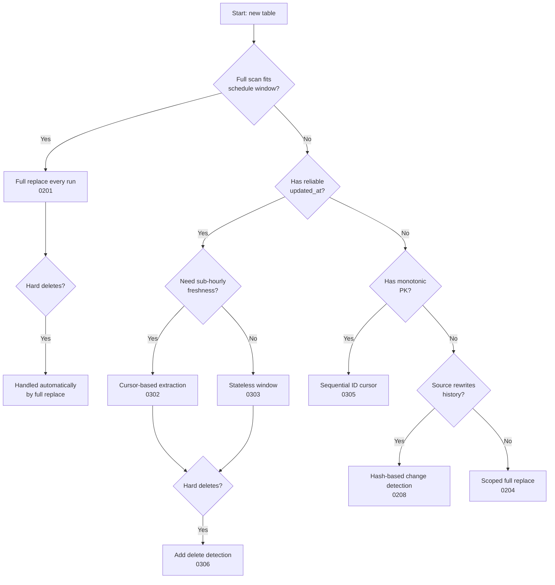
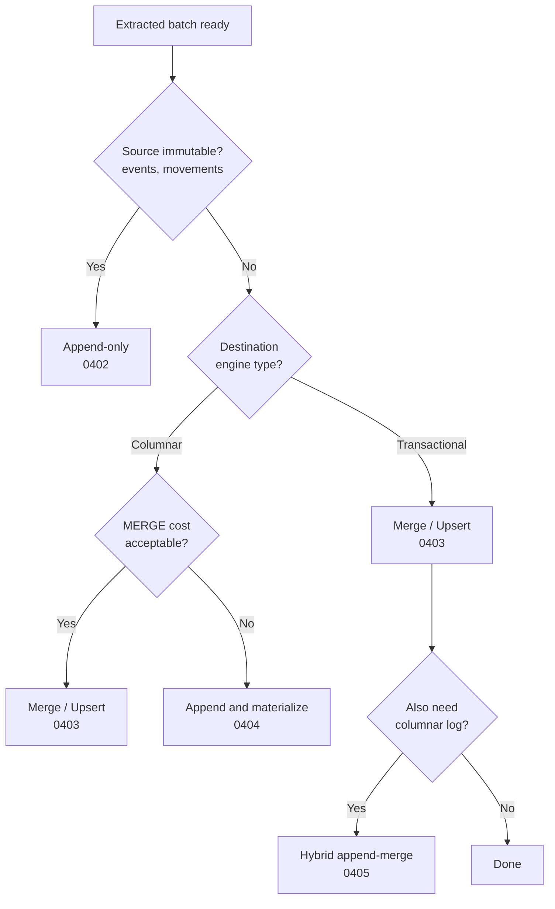
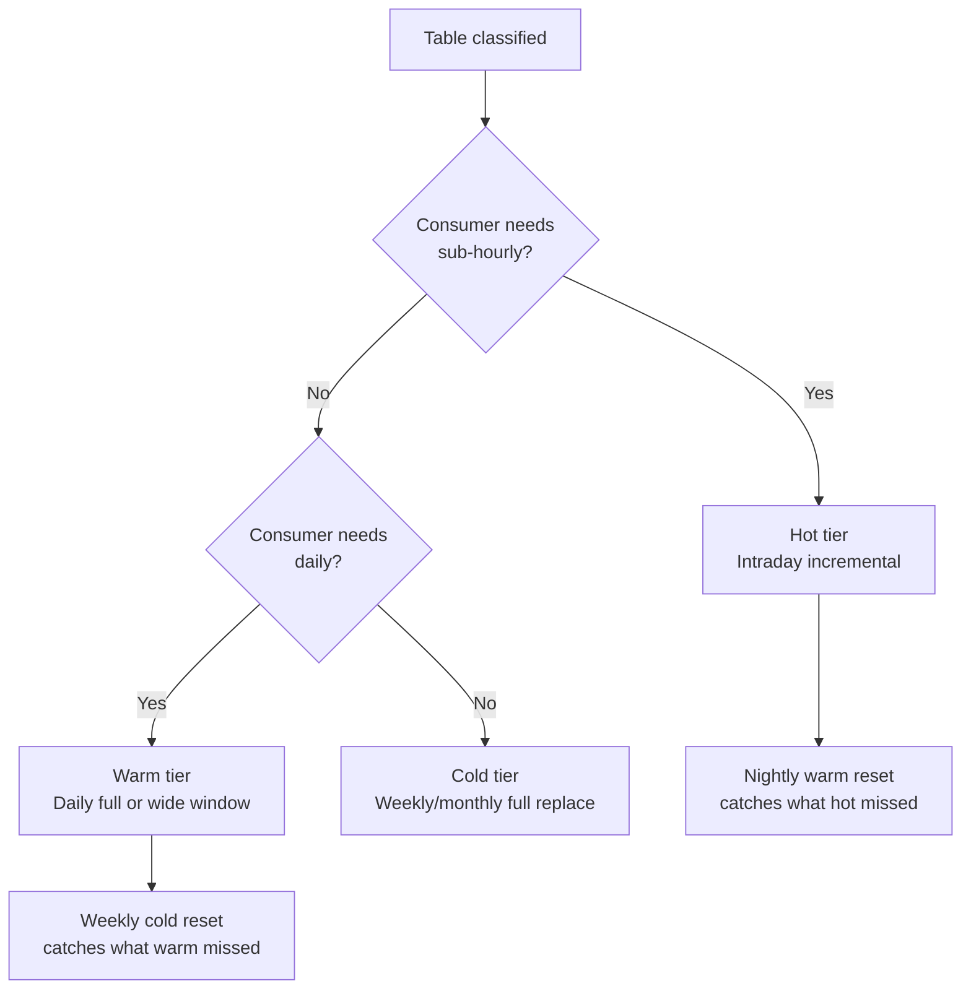

# Decision Flowchart

Three decisions drive every ECL pipeline: how to extract, how to load, and how often to refresh. These flowcharts walk through each one, then map every table in the domain model to its recommended pattern combination.

## Extraction Strategy

The default path is the shortest: if the table fits a full scan, use full replace and stop thinking. Every branch to the right adds complexity that should be earned, not assumed.

## Load Strategy

On transactional destinations, MERGE is cheap -- use it by default. On columnar destinations, append-and-materialize avoids the per-run MERGE cost and shifts deduplication to read time or a scheduled compaction job.

## Freshness Tier

See [[06-operating-the-pipeline/0608-tiered-freshness|0608]] for the full framework.

## Domain Model Mapping

Every table in the domain model mapped to its recommended extraction, load, and freshness pattern:

| Table | Extraction | Load | Freshness | Why |
|---|---|---|---|---|
| `orders` | Stateless window 7d ([[03-incremental-patterns/0303-stateless-window-extraction\|0303]]) | Append-and-materialize ([[04-load-strategies/0404-append-and-materialize\|0404]]) | Hot + warm nightly reset | `updated_at` unreliable, hard deletes unlikely, high mutation rate |
| `order_lines` | Cursor from header ([[03-incremental-patterns/0304-cursor-from-another-table\|0304]]) | Same as `orders` | Same schedule as `orders` | No own timestamp, borrows from `orders` |
| `customers` | Full replace ([[02-full-replace-patterns/0201-full-scan-strategies\|0201]]) | Full replace ([[04-load-strategies/0401-full-replace\|0401]]) | Warm (daily) | Dimension table, changes across full history, small enough to scan |
| `products` | Full replace ([[02-full-replace-patterns/0201-full-scan-strategies\|0201]]) | Full replace ([[04-load-strategies/0401-full-replace\|0401]]) | Warm (daily) | Schema mutates, full replace catches everything |
| `invoices` | Open/closed split ([[03-incremental-patterns/0307-open-closed-documents\|0307]]) | Merge ([[04-load-strategies/0403-merge-upsert\|0403]]) | Hot for open, cold for closed | Hard deletes on open invoices, closed invoices frozen |
| `invoice_lines` | Open/closed from header ([[03-incremental-patterns/0307-open-closed-documents\|0307]]) + detail handling ([[03-incremental-patterns/0308-detail-without-timestamp\|0308]]) | Same as `invoices` | Same schedule as `invoices` | Independent status changes, hard deletes not just cascade |
| `events` | Sequential ID cursor ([[03-incremental-patterns/0305-sequential-id-cursor\|0305]]) | Append-only ([[04-load-strategies/0402-append-only\|0402]]) | Hot | Append-only, partitioned by date, never updated |
| `sessions` | Sequential ID or `created_at` cursor | Append-only ([[04-load-strategies/0402-append-only\|0402]]) | Hot | Late-arriving events need wider window ([[03-incremental-patterns/0309-late-arriving-data\|0309]]) |
| `metrics_daily` | Scoped full replace ([[02-full-replace-patterns/0204-scoped-full-replace\|0204]]) | Partition swap ([[02-full-replace-patterns/0202-partition-swap\|0202]]) | Warm (daily) | Pre-aggregated, overwritten daily, partition-aligned |
| `inventory` | Activity-driven ([[02-full-replace-patterns/0207-activity-driven-extraction\|0207]]) | Staging swap ([[02-full-replace-patterns/0203-staging-swap\|0203]]) | Warm (daily) + monthly full | Sparse cross-product, activity-filtered extraction |
| `inventory_movements` | Sequential ID cursor ([[03-incremental-patterns/0305-sequential-id-cursor\|0305]]) | Append-only ([[04-load-strategies/0402-append-only\|0402]]) | Hot | Append-only activity log |

> [!tip] This table is a starting point
> The recommended combination depends on the source system, the destination engine, and the consumer's SLA. A `customers` table with 500 rows doesn't need the same treatment as one with 5 million. Use the flowcharts to classify, then adjust based on what you learn about the source during the first few weeks of extraction.
