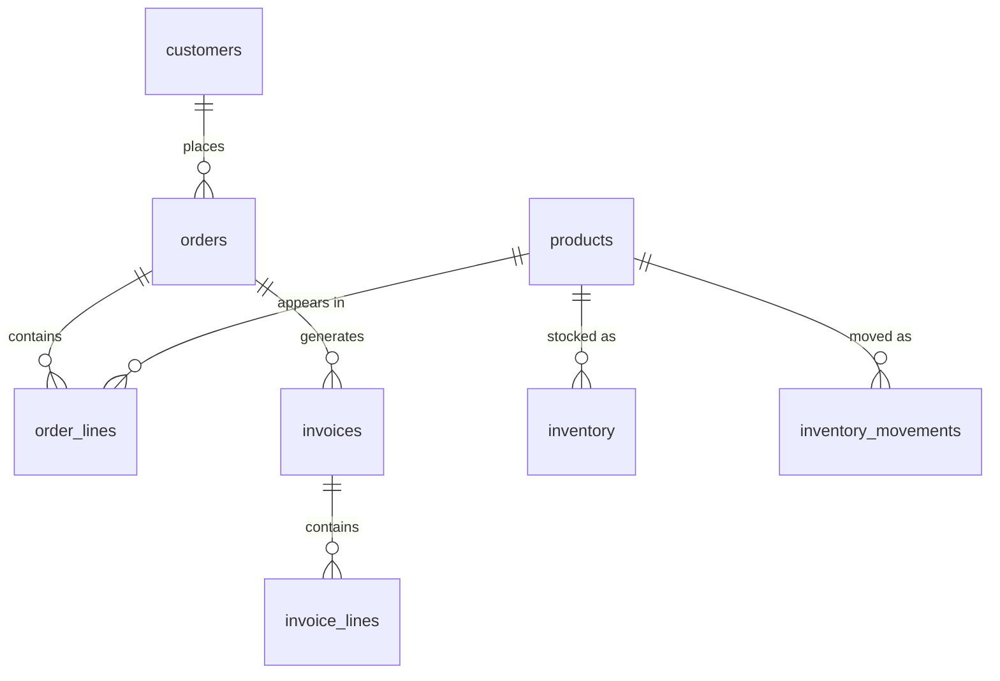

# Domain Model Quick Reference

Condensed reference for the shared fictional schema used in every SQL example. For the full description, ERD, and soft rule explanations, see [[00-front-matter/0002-domain-model|0002]].

## Tables at a Glance

| Table | PK | Key columns | ECL role | Primary patterns |
|---|---|---|---|---|
| `orders` | `id` | `customer_id`, `status`, `created_at`, `updated_at` | Broken cursor showcase | 0301, 0303, 0310 |
| `order_lines` | `id` | `order_id`, `product_id`, `quantity`, `unit_price` | Detail with no timestamp | 0304, 0308 |
| `customers` | `id` | `name`, `email`, `is_active` | Soft-delete dimension | 0201, 0106 |
| `products` | `id` | `name`, `price` | Schema drift case | 0201, 0105, 0209 |
| `invoices` | `id` | `order_id`, `status`, `total_amount`, `created_at`, `updated_at` | Open/closed + hard deletes | 0306, 0307 |
| `invoice_lines` | `id` | `invoice_id`, `description`, `amount`, `status` | Independent detail lifecycle | 0308, 0306 |
| `events` | `event_id` | `event_type`, `event_date`, `payload` | Append-only, partitioned | 0305, 0402 |
| `sessions` | (implicit) | `session_id`, `user_id`, `start_time` | Late-arriving data | 0309 |
| `metrics_daily` | (composite) | `metric_date`, `metric_name`, `value` | Pre-aggregated, partition-replace | 0202, 0204 |
| `inventory` | (`sku_id`, `warehouse_id`) | `on_hand`, `on_order` | Sparse cross-product | 0206, 0207 |
| `inventory_movements` | `id` | `sku_id`, `warehouse_id`, `movement_type`, `quantity`, `created_at` | Activity signal, append-only | 0207, 0402, 0706 |

## Soft Rules

Every "always true" business rule in the domain model is a soft rule -- none have a database constraint enforcing them.

| Table | Soft rule | How it breaks |
|---|---|---|
| `orders` | "Always has at least one line" | UI bug creates empty order |
| `orders` | "Status goes `pending` -> `confirmed` -> `shipped`" | Support resets manually |
| `order_lines` | "Quantities are always positive" | Return entered as `-1` |
| `invoices` | "Only open invoices get deleted" | Year-end cleanup script |
| `invoice_lines` | "Line status always matches header" | One line disputed independently |
| `customers` | "Emails are unique" | Duplicate registration, no unique index |
| `inventory` | "`on_hand` is always >= 0" | Write-off creates negative balance |
| `inventory_movements` | "Every stock change creates a movement" | Bulk import bypasses movement log |

See [[01-foundations-and-archetypes/0106-hard-rules-soft-rules|0106]] for why these matter and how your pipeline should handle violations.

## Relationships

`events`, `sessions`, and `metrics_daily` have no foreign keys into the schema above. `inventory` and `inventory_movements` connect to `products` via `sku_id` but have no `warehouses` table -- `warehouse_id` is a plain integer key.
