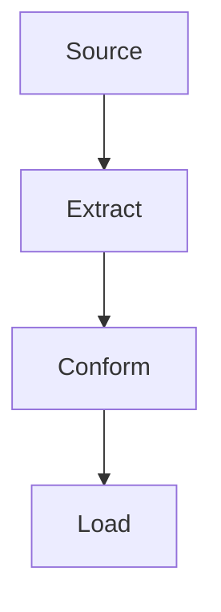

# {{title}}

> **One-liner:** {{A single sentence that explains when you'd reach for this pattern.}}

## The Problem

{{2-3 paragraphs max. What goes wrong? Why does the naive approach fail? Real-world scenario.}}

## When You'll See This

| Signal | Example |
|---|---|
| {{symptom}} | {{concrete example}} |
| {{symptom}} | {{concrete example}} |

## The Pattern



{{Explanation of the approach. Be direct.}}

### SQL Example

```sql
-- source: transactional | columnar
-- engine: ansi | bigquery | postgresql | mysql | sqlserver
{{SQL code here}}
```

> [!tip] Why this works
> {{Brief explanation of the key insight in the SQL}}

### By Corridor

> [!example]- Transactional → Columnar (e.g. PostgreSQL → BigQuery)
> {{How this pattern plays out when landing in a columnar destination. DML quotas, scan costs, partition strategy, etc.}}
> ```sql
> -- engine: bigquery
> {{Destination-specific SQL}}
> ```

> [!example]- Transactional → Transactional (e.g. PostgreSQL → PostgreSQL)
> {{How this pattern plays out when cloning between transactional engines. INSERT ON CONFLICT, triggers, FK constraints, etc.}}
> ```sql
> -- engine: postgresql
> {{Destination-specific SQL}}
> ```

## Tradeoffs

| Pro | Con |
|---|---|
| {{benefit}} | {{cost}} |
| {{benefit}} | {{cost}} |

## Anti-Pattern

> [!danger] Don't do this
> {{What the naive or wrong approach looks like, and why it breaks}}

```sql
-- ❌ This will bite you
{{Bad SQL example}}
```

## Related Patterns

- [[{{related-pattern-1}}]]
- [[{{related-pattern-2}}]]

## Notes

{{Space for the author's war stories, edge cases, open questions}}
